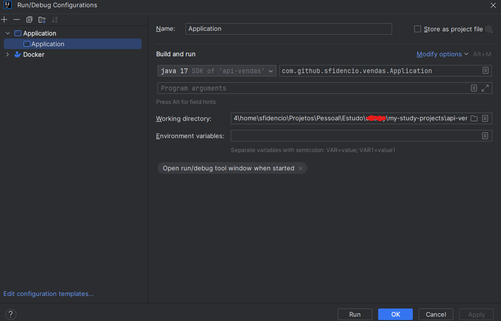

# api-vendas

> [!IMPORTANT]
> TODO List -  (non-functional requirements and functional requirements)
> + [x] Implementar validação do nome do cliente usando Regex, apenas para exemplo.
> + [x] Implementar o estudo do dataType BigDecimal, para exemplificar como usar.
> + [x] Implementar alguns testes unitários utilizando JUnit 5. (O correto é tentar cobrir o máximo possível de
    cenários, mas como o foco é apenas estudo, vamos implementar apenas alguns testes unitários, para exemplificar).
> + [x] Implementar exemplo de AOP (Aspect Oriented Programming), para exemplificar como `logar` os parametros de
    entrada e após o retorno de execução de um método, logico que isso é apenas um exemplo de uso.
> + [ ] Implementar integração com ChatGPT3, para exemplificar como consumir uma API externa.
> + [x] Implementar integração com API de CEP, para exemplificar como consumir uma API externa.
> + [x] Implementar Scheduler com Spring, para exemplificar como agendar tarefas.
    >

- Procure pela classe `CancelaPedidoOldScheduler.java` para entender como implementamos o Scheduler.

> + [ ] Implementar - Evoluir o entendimento sobre implementação do  `spring-boot-starter-hateoas`. No final deste guia
    temos um excelente artigo sobre o assunto.
> + [ ] Implementar migration flyway, para exemplificar como usar.
> + [x] Implementar para fins de estudo o MapStruct e ModelMapper, e tambem testes com jackson-databind/gson, para
    exemplificar como usar.
> + [x] implementar lombok, para exemplificar como usar.
> + [x] Implementar api fake com wiremock, para exemplificar como usar.
> + [ ] Implementar integração com com travis-ci, inserindo as badges de cobertura de código e build.
> + [ ] Implementar springboot-actuator e springboot-admin

> Informações Gerais

> [!CAUTION]
> Este projeto é apenas para estudo, não deve ser usado em produção, a menos que você saiba o que esta fazendo e faça os
> ajustes necessários.

> [!CAUTION]
> Anotações de personalização das páginas do Swagger, foi implementado apenas na funcionalidade de Clientes, ou seja,
> apenas na classe ClienteController.java, no entanto, é possível implementar em todas as classes de controller, basta
> seguir o exemplo da classe ClienteController.java.

> [!CAUTION]
> Exemplos de utilização do `redis-cache`, foi implementado apenas na funcionalidade de Clientes, ou seja, apenas na
> classe ClienteController.java, no entanto, é possível implementar em todas as classes de controller, basta seguir o
> exemplo da classe ClienteController.java, e as dicas de uso do `redis-cache` ao longo desta documentação.

> [!WARNING]
> Não estamos utilizando o ResponseEntity<T>  para retornar os dados, pois o Spring já faz isso por nós automaticamente.

> [!TIP]
> Para executar a aplicação diretamente na IDE (IntelliJ IDEA), basta executar a classe Application.java, que esta no
> pacote `br.com.sfidencio.api.vendas`, conforme imagem abaixo:



> [!TIP]
> Executando o perfil de desenvolvimento, o banco de dados utilizado é o H2(InMemory), logo é uma dependência satisfeita
> e que sobe junto com a aplicação, todavia, para as dependências redis e mongo, é necessário subir os containers
> manualmente, ou seja, via docker, conforme descrito abaixo.

+ Para subir o container do redis, execute o comando abaixo:
+ ```bash
  docker run --rm -d --name redis -p 6379:6379 redis
  ```
+ Para subir o container do mongo, execute o comando abaixo:
+ ```bash
  docker run --rm -d --name mongo -p 27017:27017 mongo
  ```

> [!TIP]
> Corrigindo erro "Share is only supported for boot loader classes because bootstrap classpath has been appended" no
> IntelliJ IDEA, na execução dos testes unitários:


> [!TIP]
> Usando junit5 no springboot 3, basta adicionar a dependencia abaixo no pom.xml:
> + https://howtodoinjava.com/spring-boot/junit-with-spring-boot/

> [!TIP]
> Executando `junit 5` sem springboot, basta adicionar a dependencia abaixo no pom.xml:
> ```xml
> <dependency>
>   <groupId>org.junit.jupiter</groupId>
>   <artifactId>junit-jupiter-engine</artifactId>
>  <version>5.8.1</version>
>  <scope>test</scope>
> </dependency>
> ```

> [!IMPORTANT]
> Índice

- [Guia explicativo de como executar o projeto localmente](#guia-explicativo-de-como-executar-o-projeto-localmente)
- [Guia explicativo de como dockerizar o projeto em seguinda executá-lo localmente sem o docker-compose](#guia-explicativo-de-como-dockerizar-o-projeto-em-seguinda-executa-lo-localmente-sem-o-docker-compose)
- [Guia explicando como dockerizar o projeto em seguinda executá-lo localmente com o docker-compose](#guia-explicando-como-dockerizar-o-projeto-em-seguinda-executa-lo-localmente-com-o-docker-compose)
- [Spring com Redis](#spring-com-redis)
- [Configurando Banner do Spring](#configurando-banner-do-spring)
- [Implementando Multi-Stage Build no Docker](#implementando-multi-stage-build-no-docker)
- [Implementando Swagger](#implementando-swagger)
- [Implementando MongoDB no projeto](#implementando-mongodb-no-projeto)
- [Entendendo os padrões de regex](#entendendo-os-padrões-de-regex)
- [Explorando o uso do dataType BigDecimal](#explorando-o-uso-do-datatype-bigdecimal)
- [Explorando RestTemplate](#explorando-resttemplate)
- [Implementando AOP](#implementando-aop)
- [Implementando testes unitários](#implementando-testes-unitários)
- [Referências gerais do projeto](#referências-gerais-do-projeto)
- [Explorando o lombok](#explorando-o-lombok)
- [Explorando o MapStruct](#explorando-o-mapstruct)
- [Explorando o ModelMapper](#explorando-o-modelmapper)
- [Explorando o jackson-databind](#explorando-o-jackson-databind)
- [Explorando o gson](#explorando-o-gson)
- [Explorando o wiremock](#explorando-o-wiremock)
- [Explorando mockserver](#explorando-mockserver)


> Este projeto aborda os seguintes tópicos:

- Requisitos (MVP)
    - Cadastro de Clientes
    - Cadastro de Produtos
    - Registro de Pedidos
    - Cancelamento de Pedidos
- Tecnologias Utilizadas
    - Java 17
    - Spring Boot
    - PostgreSQL
    - H2 Database
    - Lombok
    - JPA/Hibernate
    - JdbcTemplate
    - Docker
    - Git
    - Abordagens/Boas Práticas
    - DTO Pattern + Record Pattern (new feature do Java 17)
    - Domain Driven Design
    - Testes Unitários
    - Clean Code
    - Paginação de Resultados com Spring Data JPA
    - HATEOAS
    - Swagger
    - Banner do Spring
    - Tratamento de Erros
    - Segurança
    - Cache com Redis
    - Versionamento de API
    - Documentação de API com Swagger
    - Uso do @JsonManagedReference e @JsonBackReference para evitar recursividade infinita em relacionamentos
      bidirecionais.

# Dicas e macetes

> [!IMPORTANT]
> Visualizar dependências de uma lib no maven:

```bash
mvn dependency:tree
```

# Guia explicativo de como executar o projeto localmente

> [!WARNING]
> Certifique-se de que o Java 17 esteja instalado e configurado na sua máquina local, apache-maven, git, docker e etc.
> Por padrão, o projeto está configurado para executar o perfil de desenvolvimento, ou seja, o banco de dados H2 será
> utilizado.

### Abra o terminal e execute o comando abaixo para clonar o projeto:

```bash
git clone git@github.com:sfidencio/my-study-projects.git
```

### Acessando o diretório raiz do projeto:

```
cd api-vendas
```

#### Limpando e instalando dependências, bem como o artefato final, ou seja, o .jar:

```bash
mvn clean install
```

#### Executando o projeto:

```bash
mvn spring-boot:run
```

> [!IMPORTANT]
> Caso tenha executado com sucesso a aplicação, deverá aparecer a seguinte mensagem -> Started Application in 2.11
> seconds (process running for 2.3)

> [!IMPORTANT]
> As coleções do postman, estão na pasta `collections`, na raiz do projeto. Basta realizar a importação no postman.

### Realizando teste de cadastro de cliente via curl:

```bash
curl -kvs http://localhost:8080/base/v1/api/clientes/salvar --data '{"nome":"Fulano","cpf":"41909644099", "email":"fulano@gmail.com" }' -H "Content-Type: application/json"  -X POST
```

### Consultando cliente via curl:

```bash
curl -kvs http://localhost:8080/base/v1/api/clientes/consulta/1 -H "Content-Type: application/json"  -X GET
```

> [!IMPORTANT]
> Pronto, agora abra o projeto no IntelliJ IDEA e divirta-se!

# Guia explicativo de como dockerizar o projeto em seguinda executa-lo localmente sem o docker-compose

### Criando arquivo Dockerfile e o arquivo docker-compose.yml

> [!IMPORTANT]
> Atualizamos o Dockerfile-api-vendas, para não precisar mais executar o comando `mvn clean install` manualmente, pois
> esse processo é feito automaticamente pelo docker, conforme descrito abaixo.


> [!IMPORTANT]
> Optamos por configurar o Multi-Stage Build no Docker, pois o build é feito em duas etapas, sendo a primeira etapa,
> responsavel por gerar o artefato final, ou seja, o .jar, e a segunda etapa, responsavel por gerar a imagem final, ou
> seja, a imagem que será usada para subir o container.
> A diferença entre o build sem multi-stage, é que o build com multi-stage gera uma imagem menor, pois o build é feito
> em duas etapas, sendo a primeira etapa, responsavel por gerar o artefato final, ou seja, o .jar, e a segunda etapa,
> responsavel por gerar a imagem final, ou seja, a imagem que será usada para subir o container.
> O arquivo Dockerfile-api-vendas, sem o multi-stage, esta na pasta docker/default, na raiz do projeto.

> Esse arquivo construirá imagem customizada para a aplicação api-vendas, gerando um .jar.

> Dockerfile-api-vendas

```dockerfile
#Stage 1
FROM maven:3-openjdk-17 AS stage1
LABEL authors="sebastiaofidencio"
ENV MAVEN_OPTS="-XX:+TieredCompilation -XX:TieredStopAtLevel=1"
WORKDIR /app
COPY pom.xml .
RUN mvn dependency:go-offline -B
COPY ./src ./src
RUN mvn clean package -DskipTests

#Stage 2
FROM openjdk:17-alpine as stage2

RUN apk add --no-cache bash \
    && apk add --no-cache curl \
    && apk add --no-cache iputils \
    && apk add --no-cache vim \
    && apk add --no-cache htop
WORKDIR /app
COPY --from=stage1 /app/target/*.jar /app/app.jar
CMD ["java","-Dspring.profiles.active=production", "-jar", "app.jar"]
```

> Dockerfile-redis

> Esse arquivo construirá imagem customizada para o redis, que será usado para cache.

```dockerfile
FROM redis:alpine
LABEL authors="sebastiaofidencio"
RUN apk add --no-cache bash \
    && apk add --no-cache curl \
    && apk add --no-cache iputils
COPY ../redis.conf /usr/local/etc/redis/redis.conf
CMD [ "redis-server", "/usr/local/etc/redis/redis.conf" ]
```

### Acesse o diretório raiz do projeto(root), via terminal, e execute o comando abaixo para criar a imagem customizada

> [!WARNING]
> Onde está `sfidencio` deverá ser substituído pelo seu usuário do dockerhub, e pressupondo que você já tenha uma conta
> no docker hub e tenha feito login previamente.
> Caso não tenha feito login o comando e `docker login` e informe seu usuário e senha.

```bash
docker build -f docker/Dockerfile-api-vendas-multi-stage --platform linux/amd64 -t sfidencio/api-vendas:latest .
```

### Executando imagem customizada em primeiro plano ou "attached" no terminal "-it", visto que a opcao "-rm" remove o container ao finalizar

```bash
docker run --rm -it --name myapp -p 8080:8080 sfidencio/api-vendas:latest
```

### Executando imagem customizada em background "-d", visto que a opcao "-rm" remove o container ao finalizar

```bash
docker run --rm -d --name myapp -p 8080:8080 sfidencio/api-vendas:latest
```

> [!TIP]
> Caso seja necessario verificar os logs do container, execute o comando abaixo:

```bash
docker logs myapp
```

> [!TIP]
> Caso seja necessario parar o container, execute o comando abaixo:

```bash
docker stop myapp
```

### Acessando aplicação - Cadastrando Cliente

```bash
curl -kvs http://localhost:8080/base/v1/api/clientes/salvar --data '{"nome":"Fulano","cpf":"41909644099", "email":"fulano@gmail.com" }' -H "Content-Type: application/json"  -X POST
```

### Acessando aplicação - Consultado cliente com id-> 1

```bash
curl -kvs http://localhost:8080/base/v1/api/clientes/consulta/1 -H "Content-Type: application/json"  -X GET
```

### Acessando aplicação - Listando todos Clientes Cadastrados

```bash
curl -kvs http://localhost:8080/base/v1/api/clientes/consulta-todos-clientes -H "Content-Type: application/json"  -X GET
```

### Acessando container caso seja necessário

```bash
docker exec -it myapp sh
```

# Guia explicando como dockerizar o projeto em seguinda executa-lo localmente com o docker-compose

> [!IMPORTANT]
> Executar sempre um `mvn clean install`, pois o docker-compose irá criar a imagem customizada e subir o container, e se
> não tivermos o .jar, o container não sobe.

> [!IMPORTANT]
> Nesse cenario, o docker-compose.yml deverá estar na raiz do projeto, ou seja, no mesmo diretório onde está o
> Dockerfile.

> [!IMPORTANT]
> Vamos subir o banco de dados postgres e a aplicação em containers, isso implica que teremos que mudar o profile
> de `development` para `production`, pois a aplicação não estará mais usando o banco de dados H2, mas sim o postgres.
> Altere o Dockerfile na linha `-Dspring.profiles.active=development` para `-Dspring.profiles.active=production`.

> [!TIP]
> Observe que estamos usando variaveis de ambiente no arquivo docker-compose.yml, ou seja, as variaveis de ambiente são
> passadas para a aplicação via docker-compose.yml, e a aplicação as recebe via System.getenv("
> NOME_DA_VARIAVEL_DE_AMBIENTE") ou @Value("${NOME_DA_VARIAVEL_DE_AMBIENTE}") ou dentro do arquivo application.yaml ou
> application.properties no seguinte formato(Exemplo apenas): `spring.datasource.url=${SPRING_DATASOURCE_URL}`.

> docker-compose.yml

> [!TIP]
> Fique atento quanto a configuração das variaveis de ambiente, as mais importantes foram externalizadas no
> docker-compose.yml. Essas variaveis são "injetadas" no conteiner em execução, e recuperadas via application.yaml ou
> application.properties. Observe a seção environment do arquivo docker-compose.yml, e a seção environment do arquivo
> docker-compose.yaml.

```yaml
version: '3.7'
services:
  db:
    image: postgres:13-alpine
    container_name: postgres
    networks:
      - api-vendas-network
    restart: always
    environment:
      POSTGRES_USER: postgres
      POSTGRES_PASSWORD: postgres@@
      POSTGRES_DB: api-vendas
    ports:
      - "5432:5432"
    volumes:
      - postgres-data:/var/lib/postgresql/data #docker named volumes
  app:
    image: api-vendas:latest
    platform: linux/amd64
    container_name: api-vendas
    networks:
      - api-vendas-network
    #build: . #default build context quando tempos apenas o Dockerfile
    build:
      context: .
      dockerfile: docker/Dockerfile-api-vendas-multi-stage
    ports:
      - "8080:8080"
    depends_on:
      - redis
      - db
      - mongo
    environment:
      SPRING_DATASOURCE_URL: jdbc:postgresql://postgres:5432/api-vendas
      SPRING_DATASOURCE_USERNAME: postgres
      SPRING_DATASOURCE_PASSWORD: postgres@@
      SPRING_JPA_HIBERNATE_DDL_AUTO: update
      REDIS_HOST: redis
      REDIS_PORT: 6379
      MONGO_DB_HOST: mongo
      MONGO_DB_PORT: 27017
  #No redis nao iremos criar volume pois nao precisamos persistir os dados a principio
  redis: #https://cloudinfrastructureservices.co.uk/run-redis-with-docker-compose/
    image: redis:latest
    platform: linux/amd64
    networks:
      - api-vendas-network
    build:
      context: .
      dockerfile: docker/Dockerfile-redis
    #command: ["redis-server", "--protected-mode", "no"]
    container_name: redis
    restart: always
    ports:
      - "6379:6379"
  mongo:
    image: mongo:latest
    platform: linux/amd64
    networks:
      - api-vendas-network
    container_name: mongo
    restart: always
    ports:
      - "27017:27017"
    volumes:
      - mongo-data:/data/db #docker named volumes

networks:
  api-vendas-network:
    driver: bridge

#Entenda o funcionamento do volumes no docker-compose
#https://devopscell.com/docker/docker-compose/volumes/2018/01/16/volumes-in-docker-compose.html
#E possivel utilizar Docker host mounted volumes ou Docker named volumes

volumes:
  postgres-data:
    driver: local
  mongo-data:
    driver: local
```

> [!TIP]
> Observe bem a estrutura do arquivo docker-compose.yml, pois é muito importante para o funcionamento correto do
> projeto.


> [!TIP]
> O arquivo docker-compose.yml é composto por 3 seções, sendo elas: services, networks e volumes.


> [!TIP]
> A seção services é composta por 2 serviços, sendo eles: db e app.


> [!TIP]
> A seção networks é composta por 1 rede, sendo ela: myapp. A aplicação e o banco de dados estarão na mesma rede.


> [!TIP]
> O parâmetro `depends_on` é muito importante, pois ele garante que o banco de dados esteja no ar antes da aplicação
> subir.


> [!TIP]
> A seção volumes é composta por 1 volume, sendo ele: `postgres-data`. Esse volume é responsável por persistir os dados
> do banco de dados postgres, pois o container é efêmero(imutável), ou seja, se o container for derrubado, os dados
> serão
> perdidos, logo a gravação dos dados é feita no volume, que esta "fora" do container.

> [!TIP]
> O volume é criado automaticamente pelo docker-compose, caso não exista.

> [!TIP]
> Assim como .gitignore, o .dockerignore é muito importante, pois ele é responsável por ignorar arquivos e diretórios
> que não devem ser copiados para dentro do container, ou seja, o .dockerignore é responsável por otimizar o build da
> imagem, pois ele não copia arquivos e diretórios desnecessários para dentro do container.

### Subindo aplicação no docker localmente usando docker-compose aliado ao Dockerfile, em background "-d"

```bash
sudo docker-compose up --build -d
```

ou

```bash
sudo docker compose up --build -d
```

> Após subir os conteinerers, via docker-compose.


> [!WARNING]
> Repita os testes de cadastro de clientes, consulta e listagem via curl, conforme descrito acima, pois o banco de dados
> H2 não será mais utilizado, mas sim o postgres.

### Parando containers

```bash
sudo docker-compose down
```

ou

```bash
sudo docker compose down
```

# Spring com Redis

## Tutorial basico de como usar o Redis via CLI

> [!IMPORTANT]
> Para executar o redis standalone via docker, execute o comando abaixo:

```bash
docker run --rm -d --name redis -p 6379:6379 redis
```

> Acesse o container do Redis

```bash
docker exec -it redis bash
```

> Execute o comando abaixo para acessar o Redis CLI (Dentro do Container)

```bash
redis-cli
```

> [!WARNING]
> Todos comandos abaixo devem ser executados dentro do redis-cli.
> Teste Redis

```bash
ping
```

> Visualizar todas as chaves

```bash
KEYS *
```

> Visualizar valor da chave

```bash
GET <chave>
```

> Incluir chave e valor

```bash
SET <chave> <valor>
```

> Excluir chave

```bash
DEL <chave>
```

> Caso queira limpar o Redis, execute o comando abaixo:

```bash
FLUSHALL
```

> [!WARNING]
> Ate aqui, usamos do redis-cli.

## Algumas observações quanto a utilização do Redis no Spring

> [!IMPORTANT]
> Na classe Application.java, temos um exemplo, via `CommandLineRunner`, de como realizar operacoes basicas no Redis,
> utilizando a classe Helper, `RedisTemplate`.

> [!TIP]
> Para utilizar o Redis no Spring, precisamos adicionar a dependencia abaixo no pom.xml:

```xml

<dependency>
    <groupId>org.springframework.boot</groupId>
    <artifactId>spring-boot-starter-data-redis</artifactId>
    <version>x.y.z</version>
</dependency>
```

> [!TIP]
> As principais configurações de `bootstrap` do Redis, estão no arquivo application.yaml ou application.properties, e na
> classe RedisConfig.java.

```java

@Configuration
@EnableRedisRepositories
public class RedisConfig {
    @Value("${myapp.cache.ttl:60}")
    private long ttl;

    @Bean
    public RedisCacheConfiguration cacheConfiguration() {
        return RedisCacheConfiguration
                .defaultCacheConfig()
                .entryTtl(Duration.ofDays(1)) //Aqui TTL global
                .disableCachingNullValues() //desabilita cache de valores nulos
                .serializeValuesWith(RedisSerializationContext.SerializationPair.fromSerializer(new GenericJackson2JsonRedisSerializer()));
    }

    @Bean
    public RedisCacheManagerBuilderCustomizer redisCacheManagerBuilderCustomizer() {
        return builder -> builder
                .withCacheConfiguration("produto", RedisCacheConfiguration.defaultCacheConfig().entryTtl(Duration.ofSeconds(this.ttl)))
                .withCacheConfiguration("cliente", RedisCacheConfiguration.defaultCacheConfig().entryTtl(Duration.ofSeconds(this.ttl)))
                .withCacheConfiguration("pedido", RedisCacheConfiguration.defaultCacheConfig().entryTtl(Duration.ofSeconds(this.ttl)));
    }
}
```

> [!TIP]
> Observem que estamos usando o `GenericJackson2JsonRedisSerializer`, para serializar os dados em json, pois o Redis não
> aceita serializar objetos em java, apenas em json.

> [!TIP]
> Estamos defindo o TTL global em 1 dia, e para cada cache, estamos definindo um TTL especifico, ou seja, o TTL global é
> sobrescrito pelo TTL especifico de cada cache. Essa configuração, é recuperada quando informamos a
> anotação `@Cacheable`
> o atributo `cacheName`, exemplo: `@Cacheable(cacheNames = "produto")`.

> [!TIP]
> Vale ressaltar que o valor default do cache esta sendo definido via SPEL(Spring Expression Language), ou seja, estamos
> recuperando o valor da variavel de ambiente `myapp.cache.ttl`, caso não exista, o valor default é 60
> segundos/minutos/horas, vai depender da unidade de medida que você definir no Duration.ofSeconds(this.ttl).

> [!TIP]
> Vale ressaltar que, o redis pode ser utilizado via `@Annotations`, ou via `RedisTemplate`, ou via `RedisRepository`,
> enfim, existem varias formas de utilizar o Redis no Spring. No entanto, a mais usual é via `@Annonations`, pois não
> precisamos manipular o `RedisTemplate` diretamente, ou seja, o Spring faz isso por nós, todavia, temos um exemplo de
> como utilizar o `RedisTemplate` na classe principal da aplicação, ou seja, na classe `Application.java`, temos um
> exemplo, via `CommandLineRunner`, de como realizar operacões basicas no Redis, utilizando a classe
> Helper, `RedisTemplate`.

> [!TIP]
> Para configurar banner do spring, acesse o link abaixo:
> https://devops.datenkollektiv.de/banner.txt/index.html
> Basta, copiar o banner e colar no arquivo application.yaml ou application.properties, conforme exemplo abaixo:
> application.yaml

```yaml
spring:
  application:
    name: api-vendas
  banner:
    charset: UTF-8
    location: classpath:banner.txt
```

# Implementando Swagger

## Guia explicativo de como implementar o Swagger no projeto

> [!IMPORTANT]
> Para implementar o Swagger, basta adionarmos a dependencia abaixo no pom.xml:

```xml
      <!--Enable Swagger-->
<dependency>
    <groupId>org.springdoc</groupId>
    <artifactId>springdoc-openapi-starter-webmvc-ui</artifactId>
    <version>x.y.z</version>
</dependency>
```

> [!IMPORTANT]
> Em seguinda, basta acessarmos a url abaixo para visualizar a documentação da API:
> http://localhost:8080/base/swagger-ui.html


> [!IMPORTANT]
> Se não utilizarmos nenhuma das configurações descritas abaixos, o Swagger irá documentar todos os endpoints da
> aplicação, inclusive os endpoints do Spring Boot Actuator, ou seja, endpoints de monitoramento da aplicação.

> [!TIP]
> Algumas `@Annotations` básicas do Swagger para **personalizar** a documentação da API:
> + `@Tag` -> Usado para agrupar endpoints, ou seja, agrupar endpoints por funcionalidade.
> + `@Operation` -> Usado para descrever o endpoint, ou seja, descrever o que o endpoint faz.
> + `@Parameter` -> Usado para descrever os parametros do endpoint, ou seja, descrever o que cada parametro faz.
> + `@ApiResponse` -> Usado para descrever o retorno do endpoint, ou seja, descrever o que o endpoint retorna.
> + `@ApiResponses` -> Usado para descrever os possiveis retornos do endpoint, ou seja, descrever o que o endpoint pode
    retornar.

# Implementando MongoDB no projeto

## Guia explicativo de como implementar  o MongoDB no projeto

> [!IMPORTANT]
> Para implementar o MongoDB, basta adionarmos a dependencia abaixo no pom.xml:

```xml
        <!--MongoDB-->
<dependency>
    <groupId>org.springframework.boot</groupId>
    <artifactId>spring-boot-starter-data-mongodb</artifactId>
    <version>x.y.z</version>
</dependency>
```

> [!IMPORTANT]
> Configuração do MongoDB no arquivo application.yaml ou application.properties:

```yaml
spring:
  data:
    mongodb:
      uri: mongodb://localhost:27017/api-vendas
```

> Executando o MongoDB via docker:

```bash
docker run --rm -d --name mongo -p 27017:27017 mongo
```

> Cadastrando cliente Vip (MongoDB) via curl:

```bash
curl -kvs http://localhost:8080/base/v1/api/clientes/salva-cliente-vip --data '{nome":"Fulano","cpf":"41909644099", "email":"fulano@gmail.com" }' -H "Content-Type: application/json"  -X POST
```

> Consultando todos os clientes VIP (MongoDB) via curl:

```bash
curl -kvs http://localhost:8080/base/v1/api/clientes/consulta-todos-clientes-vip -H "Content-Type: application/json"  -X GET
```

> Acessando o container do MongoDB

```bash
docker exec -it mongodb bash
```

> Acessando o mongoDB via CLI (Dentro do Container)

```bash
mongosh
```

> Visualizar todas as bases de dados

```bash
show dbs
```

> Visualizar todas as coleções

```bash
show collections
```

> Consultando cliente Vip (MongoDB) via CLI (Dentro do Container)

```bash
use api-vendas
db.cliente.find()
```

> Apagando base de dados api-vendas (MongoDB) via CLI (Dentro do Container)

```bash
use api-vendas
db.dropDatabase()
```

> Apagando todos os dados da coleção clientesVIP (MongoDB) via CLI (Dentro do Container)
> [!WARNING]
> DeprecationWarning: Collection.remove() is deprecated. Use deleteOne, deleteMany, findOneAndDelete, or bulkWrite.

```bash
db.cliente.remove({})
```

ou

```bash
db.cliente.deleteMany()
```

> Mapeando entidade Cliente para o MongoDB

```java
import org.springframework.data.mongodb.core.mapping.FieldType;
import org.springframework.data.mongodb.core.mapping.MongoId;

@Document(collection = "cliente")
public record ClienteVIP(@MongoId(FieldType.OBJECT_ID) String id, String nome, String cpf, String email) {
}
```

> Criando repositorio para o MongoDB

```java

@Repository
public interface ClienteVIPRepository extends MongoRepository<ClienteVIP, String> {
}
```

> Exemplo de como salvar cliente Vip (MongoDB) via repositorio

```java

@Bean("executarTesteMongoDB")
public CommandLineRunner executarTesteMongoDB(@Autowired ClienteVIPRespository clienteVIPRespository) {
    return args -> {
        //Esse codigo apaga todos registros existens na coleção `cliente`    
        if (clienteVIPRespository.count() > 0) clienteVIPRespository.deleteAll();

        //Realizamos o cadastro, e posteriormente a consulta de todos os clientes cadastrados
        var fulano = new ClienteVIP(null, "fulano", "12345678901", "fulano@gmail");
        var beltrano = new ClienteVIP(null, "beltrano", "12345678901", "beltrano@gmail");
        var list = List.of(fulano, beltrano);
        clienteVIPRespository.saveAll(list);
        System.out.println(clienteVIPRespository.findAll());
    };
}
```

> Para excluir registros via repositorio, basta usar o metodo deleteById, conforme exemplo abaixo:

```java
public void excluirClienteVIP(String id) {
    clienteVIPRespository.deleteById("id");
}
```

> [!TIP]
> Temos um exemplo de utilização do mongodb com springboot, agora caso queira implementar as demais funcionalidades de
> exclusão, atualização e consulta, basta seguir o exemplo acima, e consultar a documentação do spring data mongodb, os
> links descritos no final deste documento.

### Implementando Multi-Stage Build no Docker

> [!TIP]
> Para implementar o multi-stage build no docker, "mineramos" informações dos links abaixo:
> A diferença entre o build sem multi-stage, é que o build com multi-stage gera uma imagem menor, pois o build é feito
> em duas etapas, sendo a primeira etapa, responsavel por gerar o artefato final, ou seja, o .jar, e a segunda etapa,
> responsavel por gerar a imagem final, ou seja, a imagem que será usada para subir o container.

> Explorando o multi-stage build do docker: (Implementado no projeto depois)
> + https://ionutbanu.medium.com/build-spring-boot-docker-image-using-multi-stage-dockerfile-2-13b9f1e89393
> + https://www.harness.io/blog/how-to-create-multi-stage-docker-builds-with-harness-continuous-delivery
> + https://docs.docker.com/develop/develop-images/multistage-build/
> + https://mailslurp.medium.com/faster-java-containers-with-docker-multi-stage-builds-cc63e056e546
> + https://www.harness.io/blog/how-to-create-multi-stage-docker-builds-with-harness-continuous-delivery
> + https://ionutbanu.medium.com/build-spring-boot-docker-image-using-multi-stage-dockerfile-2-13b9f1e89393

> Explorando o dockerignore:
> + https://shisho.dev/blog/posts/how-to-use-dockerignore/

### Entendendo os padrões de regex:

> + https://www.regular-expressions.info/posixbrackets.html
> + https://regex101.com/
    >

+ Temos aqui um excelente site par validar nossas expressões regulares.

```text 
Os padrões de regex são sequências de caracteres que definem um conjunto de regras para procurar, validar ou manipular strings de texto. Eles são compostos por uma combinação de caracteres literais (que correspondem a si mesmos) e metacaracteres (símbolos especiais que representam classes de caracteres, quantificadores, âncoras, entre outros). Aqui estão alguns dos padrões mais comuns de regex:
Caracteres Literais: São os caracteres que correspondem a si mesmos. Por exemplo, o padrão "abc" corresponderá à sequência de caracteres "abc" em uma string.

Metacaracteres:

. (ponto): Corresponde a qualquer caractere, exceto quebras de linha.
\d: Corresponde a qualquer dígito de 0 a 9.
\w: Corresponde a qualquer caractere alfanumérico (letras, números e sublinhados).
\s: Corresponde a qualquer espaço em branco (espaço, tabulação, quebra de linha, etc.).
\b: Corresponde a uma fronteira de palavra.
^: Âncora que corresponde ao início de uma string.
$: Âncora que corresponde ao final de uma string.
[]: Define uma classe de caracteres, correspondendo a qualquer caractere dentro dos colchetes.
|: Operador lógico "ou", correspondendo a um padrão ou outro.
Quantificadores:

*: Corresponde a zero ou mais ocorrências do padrão anterior.
+: Corresponde a uma ou mais ocorrências do padrão anterior.
?: Corresponde a zero ou uma ocorrência do padrão anterior.
{n}: Corresponde exatamente a n ocorrências do padrão anterior.
{n,}: Corresponde a pelo menos n ocorrências do padrão anterior.
{n,m}: Corresponde a pelo menos n e no máximo m ocorrências do padrão anterior.
Grupos e Captura:

(): Define um grupo de captura, permitindo que você extraia partes específicas de uma correspondência.
Estes são apenas alguns exemplos de padrões de regex. Expressões regulares podem se tornar bastante complexas e poderosas, permitindo a criação de padrões altamente específicos para manipulação de texto. É importante estudar e praticar para se tornar proficientes no uso de regex.
```

> Exemplo de implementação de Regex usando teste unitário - validando o ddd do telefone:

```java

/*
 *Deveria permitir numero telefone cujo ddd possua dois digitos apenas
 * ^ -> Inicio da expressão
 * ( -> Inicio do grupo de captura
 * \\( -> Caractere de escape para o parenteses
 * [\\d]{2} -> Qualquer digito de 0 a 9, e o quantificador {2} que indica que o digito pode aparecer duas vezes
 * \\) -> Caractere de escape para o parenteses
 * \\s -> Caractere de escape para o espaço
 * ) -> Fim do grupo de captura
 *
 * [\\d]{5} -> Qualquer digito de 0 a 9, e o quantificador {5} que indica que o digito pode aparecer cinco vezes
 * - -> Caractere de escape para o hifen
 * [\\d]{4} -> Qualquer digito de 0 a 9, e o quantificador {4} que indica que o digito pode aparecer quatro vezes
 * $ -> Fim da expressão
 */
@Test
void deveria_permitir_numero_telefone_cujo_ddd_possua_dois_digitos_apenas_e_espaco_entre_ddd_e_telefone() {
    final var pattern3 = "^(\\([\\d]{2}\\)\\s)[\\d]{5}-[\\d]{4}";
    final var matcher = Pattern.compile(pattern3);
    //Caso queria validar espaço entre o ddd e o numero do telefone, basta adicionar o \\s, conforme exemplo abaixo:
    Assertions.assertTrue(matcher.matcher("(11) 99999-9999").matches());
}
```  

> [!TIP]
> Exemplo de implementação de Regex via teste unitário:
> + Verifique o arquivo RegexTest.java, na pasta test, na raiz do projeto.
> + Verifique a classe Cliente.java, na pasta model, na raiz do projeto, especificamente no campo nome. Estamos
    utilizando anotação do pacote javax.validation.constraints, com a anotação @Pattern.

> Exemplo
> ```java
> @Pattern(regexp = "^[A-Za-z\\s]+$", message = "Nome deve conter apenas letras")
> private final String nome;
> ```

### Explorando o uso do dataType BigDecimal:

> + https://www.baeldung.com/java-bigdecimal-biginteger
> + https://docs.oracle.com/javase/8/docs/api/java/math/BigDecimal.html

> + Verifique o arquivo ExplorandoBigDecimal.java, na pasta test, na raiz do projeto.

### Explorando RestTemplate:

> + https://www.baeldung.com/rest-template
> + Consultando CEP via API externa:

> [!IMPORTANT]
> + Basta analisar as classes/interfaces CEP.java, CEPService.java, CEPController.java, CEPControllerImp.java.

> + A url de acionamento do endpoint é: http://localhost:8080/base/v1/api/cep/consulta/{cep}, onde {cep} é o cep que
    desejamos consultar.
> + Vai retornar algo do tipo

```json
{
  "cep": "01001-000",
  "logradouro": "Praça da Sé",
  "complemento": "lado ímpar",
  "bairro": "Sé",
  "localidade": "São Paulo",
  "uf": "SP",
  "ibge": "3550308",
  "gia": "1004",
  "ddd": "11",
  "siafi": "7107"
}
```

### Implementando AOP:

> Para implementar o AOP, basta adionarmos a dependencia abaixo no pom.xml:

```xml
        <!--AOP-->
<dependency>
    <groupId>org.springframework.boot</groupId>
    <artifactId>spring-boot-starter-aop</artifactId>
    <version>x.y.z</version>
</dependency>
```

+ Criamos uma classe de Log, chamada `LogAspect.java`, no pacote `infra.log`, na raiz do projeto, e adicionamos a
  anotação `@Aspect` na classe, e a anotação `@EnableAspectJAutoProxy` na classe `AspectLog.java`, no
  pacote `infra.log`.
+ A classe `LogAspect.java`, é responsavel por interceptar todas as chamadas aos endpoints da aplicação, e gerar um log
  de entrada e saida.
+ Utilizamos a anotação `@AfterReturning`, para interceptar o retorno dos endpoints, e gerar o log de saida, pois é
  possivel interceptar o retorno da chamada do método, e manipular o retorno, ou seja, é possivel alterar o retorno do
  método, ou simplesmente gerar um log de saida.
+ Utilizamos a anotação `@Before`, para interceptar a entrada dos endpoints, e gerar o log de entrada.
+ Temos anotação `@Pointcut`, para definir o ponto de corte, ou seja, o ponto onde o AOP irá interceptar as chamadas aos
  endpoints.
+ Utilizamos a classe  `JoinPoint`, para recuperar informações sobre o ponto de corte, ou seja, o ponto onde o AOP irá
  interceptar as chamadas aos endpoints.
+ Observe atentamente as expressões regulares, pois elas são responsaveis por definir o ponto de corte, ou seja, o ponto
  onde o AOP irá interceptar as chamadas aos endpoints.
+ Dicas e macetes sobre AOP:
    + https://www.amitph.com/spring-aop-before-advice/
    + https://www.naiyerasif.com/post/2020/09/13/logging-methods-with-aspectj-in-a-spring-application/

> [!WARNING]
> Lembre-se que o AOP intercepta não só metódos de endpoints, mas também metódos de classes de serviços, ou seja,
> qualquer metódo que seja publico e que esteja anotado com `@Pointcut`, será interceptado pelo AOP. Em nossos exemplos
> não utilizamos a anotação `@Pointcut`, mas é possivel utiliza-la, e definir o ponto de corte, ou seja, o ponto onde o
> AOP irá interceptar as chamadas aos endpoints. Preferimos utilizar expressões regulares, e não poluir as classes com
> anotações do AOP.

> [!TIP]
> Ao subir a aplicação, iremos notar que o AOP intercepta todas as chamadas aos endpoints, e gera um log de entrada e
> saida, conforme exemplo abaixo:

```text
2023-12-15T02:38:35.050-03:00  INFO 54421 --- [nio-8080-exec-1] c.g.s.vendas.infra.config.log.LogAspect  : Depois da execução do método List com.github.sfidencio.vendas.api.controller.imp.ClienteControllerImp.consultarTodos() com o resultado [ClienteResponse[id=1, nome=Fulano., cpf=71509956085, email=cliente2@gmail.com, pedidos=null], ClienteResponse[id=2, nome=Ciclano., cpf=71509956085, email=cliente2@gmail.com, pedidos=null], ClienteResponse[id=3, nome=Ciclano., cpf=71509956085, email=cliente2@gmail.com, pedidos=null], ClienteResponse[id=4, nome=Ciclano., cpf=71509956085, email=cliente2@gmail.com, pedidos=null]]

 ```   

### Implementando testes unitários:

> + https://howtodoinjava.com/spring-boot2/testing/spring-boot-mockito-junit-example/
> + https://www.baeldung.com/mockito-junit-5-extension


> Dependências SpringBoot3 + Junit5 + Mockito + MockMvc:

```xml
<!--SpringBoot3 + Junit5 + Mockito + MockMvc-->
<!--Dependency tests in spring-->
<dependencies>
    <dependency>
        <groupId>org.springframework.boot</groupId>
        <artifactId>spring-boot-starter-test</artifactId>
        <scope>test</scope>
    </dependency>

    <dependency>
        <groupId>org.junit.jupiter</groupId>
        <artifactId>junit-jupiter-api</artifactId>
        <version>5.8.1</version>
        <scope>test</scope>
    </dependency>

    <dependency>
        <groupId>org.junit.jupiter</groupId>
        <artifactId>junit-jupiter-engine</artifactId>
        <version>5.8.1</version>
        <scope>test</scope>
    </dependency>
</dependencies>
```

> Exemplo de teste unitário com `mockito` e `junit5` sem subir o contexto do spring:

```java

@ExtendWith(MockitoExtension.class)
class ClienteControllerImpTest {
    @Mock
    private ClienteService clienteService;
    @InjectMocks
    private ClienteControllerImp clienteControllerImp;

    @Test
    void deveria_cadastrar_cliente() {
        final var clienteRequest = new ClienteRequest("Fulano", "71509956085", "fulano@gmail.com");
        final var clienteResponse = new ClienteResponse(1L, "Fulano", "71509956085", "fulano@gmail.com");
        when(clienteService.cadastrarCliente(any(ClienteRequest.class))).thenReturn(clienteResponse);
        final var response = clienteControllerImp.cadastrarCliente(clienteRequest);
        assertEquals(clienteResponse, response);
    }
}
```

> Exemplo de teste unitário com `mockito` e `junit5` subindo o contexto do spring:

> [!TIP]
> A anotação `@SpringBootTest` é responsavel por subir o contexto do spring, ou seja, subir a aplicação, e a
> anotação `@MockBean` é responsavel por criar um mock do bean, ou seja, criar um mock do serviço, pois não queremos
> testar o serviço, mas sim o controller, logo, precisamos criar um mock do serviço, para que o controller possa ser
> testado de forma isolada. Com uso dessa anotação, ele já encapsula o `@ExtendWith(MockitoExtension.class)`, ou seja,
> não
> precisamos mais usar o `@ExtendWith(MockitoExtension.class)`, pois o `@SpringBootTest` já encapsula
> o `@ExtendWith(SpringExtension.class)`.

> [!TIP]
> É possivel também mockar beans do spring, ou seja, criar mocks de beans do spring, para isso, basta usar a
> anotação `@MockBean`, conforme exemplo abaixo:

```java

@MockBean
private ClienteService clienteService;
```

> [!TIP]
> Subindo teste mockado sem o spring, ou seja, sem subir o contexto do spring:

```java

@ExtendWith(MockitoExtension.class)
class ClienteControllerImpTest {
    @Mock
    private ClienteService clienteService;
    @InjectMocks
    private ClienteControllerImp clienteControllerImp;

    @Test
    void deveria_cadastrar_cliente() {
        final var clienteRequest = new ClienteRequest("Fulano", "71509956085", "fulano@gmail.com");
        final var clienteResponse = new ClienteResponse(1L, "Fulano", "71509956085", "fulano@gmail.com");
        when(clienteService.cadastrarCliente(any(ClienteRequest.class))).thenReturn(clienteResponse);
        final var response = clienteControllerImp.cadastrarCliente(clienteRequest);
        assertEquals(clienteResponse, response);
    }
}
```

### Teste de integração:

> + Testando camada de serviço com banco de dados H2:

```java
package com.github.sfidencio.vendas.domain.service.imp.integration;

import com.github.sfidencio.vendas.api.dto.ClienteRequest;
import com.github.sfidencio.vendas.domain.service.ClienteService;
import com.github.sfidencio.vendas.infra.config.exceptions.NotFoundException;
import org.junit.jupiter.api.Assertions;
import org.junit.jupiter.api.Order;
import org.junit.jupiter.api.Test;
import org.springframework.beans.factory.annotation.Autowired;
import org.springframework.boot.test.context.SpringBootTest;
import org.springframework.test.annotation.Rollback;
import org.springframework.test.context.ActiveProfiles;

@SpringBootTest
@Rollback(false)
@ActiveProfiles("test")
class ClienteServiceImpTest {

    @Autowired
    private ClienteService clienteService;


    @Test
    @Order(0)
    void deveria_cadastrar_cliente_com_sucesso() throws NotFoundException {
        this.clienteService.salvar(new ClienteRequest(null, "Joao Carlos.", "79681821076", "fulano@gmail.com"));
    }

    @Test
    @Order(1)
    void deveria_alterar_cliente_cadastrado() throws NotFoundException {
        this.clienteService.alterar(new ClienteRequest(1, "Joao Pedro", "79681821076", "fulano@gmail.com"), 1);
        var cliente = this.clienteService.buscarClienteEPedidos(1);
        Assertions.assertEquals("Joao Pedro", cliente.nome());
    }

}
```

> + Testando controller com banco de dados H2 e subindo as dependencias do spring utilizando testcontainers:

> [!IMPORTANT]
> MockMvc é uma estrutura de teste de unidade que simula o comportamento de um servlet, permitindo que você teste controladores em um ambiente isolado, sem a necessidade de iniciar um servidor real. RestAssured, por outro lado, é uma estrutura de teste de integração que permite testar APIs RESTful de forma fácil e legível. Enquanto o MockMvc é mais adequado para testar controladores e componentes específicos do Spring MVC, o RestAssured é mais voltado para testar APIs RESTful e suas respostas. Em resumo, o MockMvc é mais adequado para testes de unidade de componentes específicos, enquanto o RestAssured é mais adequado para testes de integração de APIs RESTful.


### Explorando o lombok
>+https://projectlombok.org
>+https://www.baeldung.com/lombok-with-annotations

>[!TIP]
>Uso uso do @With para gerar automaticamente um construtor imutável para a classe:

```java
import lombok.With;

public class Pessoa {
    @With
    private String nome;
    @With
    private int idade;
}
```

ou

```java

@With
public record ClienteRequest(String nome, String cpf, String email) {
}
```

> [!TIP]
> Uso uso do @Value para gerar automaticamente um construtor imutável para a classe, trata-se de uma variante de @Data

```java
import lombok.Value;

@Value
public class Pessoa {
    private String nome;
    private int idade;
}


public class Application {
    public static void main(String[] args) {
        var pessoa = Pessoa("João", 30);
        System.out.println(pessoa.getNome()); // Retorna "João"
    }
}


```

```java
//Uso do @Getter e @Setter para gerar automaticamente os métodos getters e setters para os campos de uma classe:

import lombok.Getter;
import lombok.Setter;

public class Pessoa {
    @Getter
    @Setter
    private String nome;
    @Getter
    @Setter
    private int idade;
}

//Uso do @AllArgsConstructor para gerar automaticamente um construtor que recebe todos os campos da classe como parâmetros:
import lombok.AllArgsConstructor;

@AllArgsConstructor
public class Pessoa {
    private String nome;
    private int idade;
}

//Uso do @NoArgsConstructor para gerar automaticamente um construtor sem parâmetros:
import lombok.NoArgsConstructor;

@NoArgsConstructor
public class Pessoa {
    private String nome;
    private int idade;
}

//Uso do @Data para gerar automaticamente os métodos getters, setters, equals, hashCode e toString para todos os campos da classe:
        
import lombok.Data;

@Data
public class Pessoa {
    private String nome;
    private int idade;
}

//Uso do @Builder para gerar automaticamente um padrão de construção fluente para a classe:
import lombok.Builder;

@Builder
public class Pessoa {
    private String nome;
    private int idade;
}

//Estes são alguns exemplos de como usar as anotações do Lombok em diferentes cenários. É importante notar que o Lombok pode ser uma ferramenta poderosa para reduzir a quantidade de código boilerplate em uma aplicação Java.
//Claro! Aqui estão algumas opções avançadas do Lombok com exemplos detalhados de uso:
//Uso do @Builder com padrão de construção personalizado:
import lombok.Builder;
import lombok.Singular;
import java.util.List;

@Builder
public class Pessoa {
    private String nome;
    private int idade;
    @Singular
    private List<String> habilidades;
}

//Uso
Pessoa pessoa = Pessoa.builder()
        .nome("João")
        .idade(30)
        .habilidade("Java")
        .habilidade("SQL")
        .build();

//Neste exemplo, o @Builder é usado para gerar um padrão de construção fluente para a classe Pessoa. O uso de @Singular com a lista de habilidades permite adicionar elementos à lista individualmente.

//Uso do @EqualsAndHashCode com opções personalizadas:
import lombok.EqualsAndHashCode;

@EqualsAndHashCode(of = {"nome", "idade"})
public class Pessoa {
    private String nome;
    private int idade;
}

//Uso
Pessoa pessoa1 = new Pessoa("João", 30);
Pessoa pessoa2 = new Pessoa("Maria", 25);
System.out.

println(pessoa1.equals(pessoa2)); // Retorna false

//Neste exemplo, o @EqualsAndHashCode é usado para gerar automaticamente os métodos equals() e hashCode() com base nos campos "nome" e "idade" da classe Pessoa.
//Uso do @ToString com opções personalizadas:
        import lombok.ToString;

@ToString(exclude = "idade")
public class Pessoa {
    private String nome;
    private int idade;
}


//Uso
Pessoa pessoa = new Pessoa("João", 30);
System.out.

println(pessoa); // Retorna "Pessoa(nome=João)"

//Neste exemplo, o @ToString é usado para gerar automaticamente o método toString() para a classe Pessoa, excluindo o campo "idade" da representação gerada.
//Uso do @Cleanup para fechar recursos automaticamente:

import lombok.Cleanup;
import java.io .*;

public class ExemploCleanup {
    public void lerArquivo(String nomeArquivo) throws IOException {
        @Cleanup FileReader reader = new FileReader(nomeArquivo);
        BufferedReader br = new BufferedReader(reader);
        String linha;
        while ((linha = br.readLine()) != null) {
            System.out.println(linha);
        }
    }
}

//Neste exemplo, o @Cleanup é usado para fechar automaticamente o recurso FileReader após o uso, evitando a necessidade de chamar explicitamente o método close().
//Estas são algumas das opções avançadas do Lombok com exemplos detalhados de uso. Elas podem ser úteis para personalizar o comportamento das anotações e simplificar o código.


```

### Explorando o MapStruct

> + https://mapstruct.org/
> + https://www.baeldung.com/mapstruct
> + https://www.baeldung.com/mapstruct-null-values-mapping

> [!TIP]
> O MapStruct é uma biblioteca Java que gera automaticamente código de mapeamento entre objetos Java. Ele analisa suas
> classes e interfaces para determinar como eles se relacionam entre si e gera um código de mapeamento para converter um
> objeto em outro. O MapStruct é uma alternativa ao BeanUtils.copyProperties() e ao Apache Commons BeanUtils, que são
> usados para copiar propriedades de um objeto para outro.

```java
//Exemplo de uso do MapStruct:

import org.mapstruct.Mapper;
import org.mapstruct.Mapping;
import org.mapstruct.factory.Mappers;

@Mapper(componentModel = "spring")
//Permite o spring injetar automaticamente a implementação do mapper, nao sendo necessario instanciar manualmente
public interface ClienteMapper {
    //Instanciando manualmente
    //ClienteMapper INSTANCE = Mappers.getMapper(ClienteMapper.class);

    @Mapping(target = "nome", source = "nome")
    @Mapping(target = "cpf", source = "cpf")
    @Mapping(target = "email", source = "email")
    ClienteResponse toResponse(Cliente cliente);
}

public class Application {
    public static void main(String[] args) {
        var cliente = new Cliente("João", "12345678901", "fulano@gmail.com");
        var clienteResponse = ClienteMapper.INSTANCE.toResponse(cliente);
        System.out.println(clienteResponse.getNome()); // Retorna "João"

```

### Explorando o ModelMapper

> + https://modelmapper.org/
> + https://www.baeldung.com/entity-to-and-from-dto-for-a-java-spring-application
> + https://www.baeldung.com/entity-to-and-from-dto-for-a-java-spring-application#2-using-modelmapper

> [!TIP]
> O ModelMapper é uma biblioteca Java que mapeia objetos de um tipo para um tipo diferente. Ele analisa suas classes e
> interfaces para determinar como eles se relacionam entre si e gera um código de mapeamento para converter um objeto em
> outro. O ModelMapper é uma alternativa ao BeanUtils.copyProperties() e ao Apache Commons BeanUtils, que são usados
> para
> copiar propriedades de um objeto para outro.

> [!TIP]
> Adicionando a dependencia do ModelMapper no pom.xml:

```xml
        <!--ModelMapper-->
<dependency>
    <groupId>org.modelmapper</groupId>
    <artifactId>modelmapper</artifactId>
    <version>x.y.z</version>
</dependency>
```

```java
//Exemplo de uso do ModelMapper:

import org.modelmapper.ModelMapper;

public class Application {
    public static void main(String[] args) {
        var modelMapper = new ModelMapper();
        var cliente = new Cliente("João", "12345678901", "fulano@gmail.com");
        var clienteResponse = modelMapper.map(cliente, ClienteResponse.class);
        System.out.println(clienteResponse.getNome()); // Retorna "João"
    }
}
```

### Explorando o jackson-databind

> + https://www.baeldung.com/jackson-object-mapper-tutorial
> + https://www.baeldung.com/jackson-serialize-dates
> + https://www.baeldung.com/jackson-serialize-enums
> + https://www.baeldung.com/jackson-serialize-field-custom-criteria
> + https://www.baeldung.com/jackson-serialize-dates


> [!TIP]
> O jackson-databind é uma biblioteca Java que mapeia objetos de um tipo para um tipo diferente. Ele analisa suas
> classes e interfaces para determinar como eles se relacionam entre si e gera um código de mapeamento para converter um
> objeto em outro. O jackson-databind é uma alternativa ao BeanUtils.copyProperties() e ao Apache Commons BeanUtils, que
> são usados para copiar propriedades de um objeto para outro.

> [!TIP]
> Adicionando a dependencia do jackson-databind no pom.xml:

```xml
        <!--jackson-databind-->
<dependency>
    <groupId>com.fasterxml.jackson.core</groupId>
    <artifactId>jackson-databind</artifactId>
    <version>x.y.z</version>
</dependency>
```

```java
//Exemplo de uso do jackson-databind:

import com.fasterxml.jackson.databind.ObjectMapper;

public class Application {
    public static void main(String[] args) {
        var objectMapper = new ObjectMapper();
        var cliente = new Cliente("João", "12345678901", "fulano@gmail.com");
        var clienteResponse = objectMapper.writeValueAsString(cliente);
        System.out.println(clienteResponse);
    }
}
```

> [!TIP]
> Retorna string no formato json:

```json
{
  "nome": "João",
  "cpf": "12345678901",
  "email": "fulano@gmail.com"
}

```

> [!TIP]
> Parseando json para objeto:

```java
import com.fasterxml.jackson.databind.ObjectMapper;

public class Application {
    public static void main(String[] args) throws JsonProcessingException {
        String clienteResponse = "{\"nome\":\"João\",\"cpf\":\"12345678901\",\"email\":\"fulano@gmail.com\"}";
        var clienteResponse2 = objectMapper.readValue(clienteResponse, Cliente.class);
        System.out.println(clienteResponse2.getNome());
    }
}
```

### Explorando o gson

> + https://www.baeldung.com/gson
> + https://www.baeldung.com/gson-optional
> + https://www.baeldung.com/gson-serialize-nulls
> + https://www.baeldung.com/gson-serialize-enums
> + https://www.baeldung.com/gson-serialize-field-custom-criteria

> [!TIP]
> O gson é uma biblioteca Java que mapeia objetos de um tipo para um tipo diferente. Ele analisa suas classes e
> interfaces para determinar como eles se relacionam entre si e gera um código de mapeamento para converter um objeto em
> outro. O gson é uma alternativa ao BeanUtils.copyProperties() e ao Apache Commons BeanUtils, que são usados para copiar
> propriedades de um objeto para outro.

> [!TIP]
> Adicionando a dependencia do gson no pom.xml:

```xml
        <!--gson-->
<dependency>
    <groupId>com.google.code.gson</groupId>
    <artifactId>gson</artifactId>
    <version>x.y.z</version>
</dependency>
```

```java
//Exemplo de uso do gson:

import com.google.gson.Gson;

public class Application {
    public static void main(String[] args) {
        var gson = new Gson();
        var cliente = new Cliente("João", "12345678901", "fulano@gmail.com");
        var clienteResponse = gson.toJson(cliente);
        System.out.println(clienteResponse);
    }
}
```

> [!TIP]
> Retorna string no formato json:

```json
{
  "nome": "João",
  "cpf": "12345678901",
  "email": "fulano@gmal.com"
}
```

> [!TIP]
> Parseando json para objeto:

```java
import com.google.gson.Gson;

public class Application {
    public static void main(String[] args) {
        var gson = new Gson();
        String clienteResponse = "{\"nome\":\"João\",\"cpf\":\"12345678901\",\"email\":\"fulano@gmail.com\"}";
        var clienteResponse2 = gson.fromJson(clienteResponse, Cliente.class);
        System.out.println(clienteResponse2.getNome());
    }
}
```

### Explorando wiremock

> + https://www.baeldung.com/introduction-to-wiremock
> + https://www.baeldung.com/wiremock-stubbing
> + https://www.baeldung.com/wiremock-verify-calls
> + https://www.wiremock.org/docs/getting-started/

> [!TIP]
> O wiremock é uma biblica Java que permite simular chamadas a API's externas, ou seja, podemos simular chamadas a
> API's.

> [!TIP]
> Adicionando a dependencia do wiremock no pom.xml:

```xml
        <!--wiremock-->
<dependency>
    <groupId>com.github.tomakehurst</groupId>
    <artifactId>wiremock</artifactId>
    <version>x.y.z</version>
</dependency>
```

```java
//Exemplo de uso do wiremock:

import com.github.tomakehurst.wiremock.WireMockServer;
import com.github.tomakehurst.wiremock.client.WireMock;
import com.github.tomakehurst.wiremock.core.WireMockConfiguration;
import org.junit.jupiter.api.AfterEach;
import org.junit.jupiter.api.BeforeEach;
import org.junit.jupiter.api.Test;
import org.springframework.http.HttpStatus;
import org.springframework.http.MediaType;
import org.springframework.web.reactive.function.client.WebClient;
import reactor.core.publisher.Mono;

import static com.github.tomakehurst.wiremock.client.WireMock.*;

class CEPServiceImpTest {

    private WireMockServer wireMockServer;

    @BeforeEach
    void setUp() {
        this.wireMockServer = new WireMockServer(WireMockConfiguration.options().port(8089));
        this.wireMockServer.start();
        WireMock.configureFor("localhost", 8089);
    }

    @AfterEach
    void tearDown() {
        this.wireMockServer.stop();
    }

    @Test
    void deveria_consultar_cep_com_sucesso() {
        final var cep = "01001-000";
        final var body = "{\"cep\": \"01001-000\",\"logradouro\": \"Praça da Sé\",\"complemento\": \"lado ímpar\",\"bairro\": \"Sé\",\"localidade\": \"São Paulo\",\"uf\": \"SP\",\"ibge\": \"3550308\",\"gia\": \"1004\",\"ddd\": \"11\",\"siafi\": \"7107\"}";
        stubFor(get(urlEqualTo("/ws/" + cep + "/json/"))
                .willReturn(aResponse()
                        .withStatus(HttpStatus.OK.value())
                        .withHeader("Content-Type", MediaType.APPLICATION_JSON_VALUE)
                        .withBody(body)));
        final var webClient = WebClient.create("http://localhost:8089/ws");
        final var response = webClient.get()
                .uri("/{cep}/json/", cep)
                .retrieve
                .bodyToMono(String.class)
                .block();
        System.out.println(response);
    }
}
```

### Explorando mockserver
> + https://www.baeldung.com/mockserver
> + https://www.baeldung.com/mockserver-verify-calls
> + https://www.mock-server.com/mock_server/running_mock_server.html

> [!TIP]
> O mockserver é uma biblica Java que permite simular chamadas a API's externas, ou seja, podemos simular chamadas a API's. O mockserver é uma alternativa ao wiremock.

> [!TIP]
> Adicionando a dependencia do mockserver no pom.xml:

```xml
        <!--mockserver-->
<dependency>
    <groupId>org.mock-server</groupId>
    <artifactId>mockserver-netty</artifactId>
    <version>x.y.z</version>
</dependency>
```

```java
//Exemplo de uso do mockserver:

import org.junit.jupiter.api.AfterEach;
import org.junit.jupiter.api.BeforeEach;
import org.junit.jupiter.api.Test;
import org.mockserver.client.MockServerClient;
import org.mockserver.integration.ClientAndServer;
import org.mockserver.model.HttpRequest;
import org.mockserver.model.HttpResponse;
import org.mockserver.model.MediaType;
import org.springframework.http.HttpStatus;
import org.springframework.http.MediaType;
import org.springframework.web.reactive.function.client.WebClient;
import reactor.core.publisher.Mono;

import static org.mockserver.model.HttpRequest.request;
import static org.mockserver.model.HttpResponse.response;

class CEPServiceImpTest {

    private ClientAndServer mockServer;

    @BeforeEach
    void setUp() {
        this.mockServer = ClientAndServer.startClientAndServer(8089);
    }

    @AfterEach
    void tearDown() {
        this.mockServer.stop();
    }

    @Test
    void deveria_consultar_cep_com_sucesso() {
        final var cep = "01001-000";
        final var body = "{\"cep\": \"01001-000\",\"logradouro\": \"Praça da Sé\",\"complemento\": \"lado ímpar\",\"bairro\": \"Sé\",\"localidade\": \"São Paulo\",\"uf\": \"SP\",\"ibge\": \"3550308\",\"gia\": \"1004\",\"ddd\": \"11\",\"siafi\": \"7107\"}";
        this.mockServer.when(request().withMethod("GET").withPath("/ws/" + cep + "/json/"))
                .respond(response().withStatusCode(HttpStatus.OK.value()).withHeader("Content-Type", MediaType.APPLICATION_JSON_VALUE).withBody(body));
        final var webClient = WebClient.create("http://localhost:8089/ws");
        final var response = webClient.get()
                .uri("/{cep}/json/", cep)
                .retrieve()
                .bodyToMono(String.class)
                .block();
        System.out.println(response);
    }
}
```


> [!TIP]
> No modelMapper, não precisamos criar uma interface, como no MapStruct, basta instanciar o modelMapper, e usar o método
> map, conforme exemplo acima. Ele usa reflection para fazer o mapeamento, ou seja, ele analisa suas classes e interfaces
> para determinar como eles se relacionam entre si e gera um código de mapeamento para converter um objeto em outro.

### Referências gerais do projeto

> [!IMPORTANT]
> Referências utilizadas em todo o projeto:

> Tutoriais e cursos gratuitos:

+ https://www.alura.com.br
+ https://tpbabparn.medium.com/spring-boot-3-1-integrated-docker-compose-on-development-environment-spring-webflux-example-1ddcbfe052f
+ https://springhow.com/spring-boot-and-postgres-using-docker-compose/
+ https://www.baeldung.com/ops/docker-compose-links-depends-on
+ https://www.baeldung.com/spring-boot-docker-start-with-profile
+ https://blog.devgenius.io/how-to-handle-constraint-violation-exception-using-controlleradvice-in-spring-boot-2f61147d19de
+ https://reflectoring.io/bean-validation-with-spring-boot/
+ https://www.javadevjournal.com/spring-boot/spring-custom-validation-message-source/
+ https://www.baeldung.com/spring-valid-vs-validated
+ https://salithachathuranga94.medium.com/validation-and-exception-handling-in-spring-boot-51597b580ffd
+ https://www.udemy.com/user/dougllas-sousa/
+ https://pt.stackoverflow.com/questions/207188/depend%C3%AAncia-circular-em-api-rest-com-spring-boot
+ https://medium.com/@seonggil/creating-a-maturity-level-3-rest-api-with-hateoas-fcd76d1b2db9
+ https://www.baeldung.com/spring-custom-validation-message-source
+ https://reflectoring.io/bean-validation-with-spring-boot/
+ https://medium.com/yildiztech/decoding-i18n-challenges-in-spring-boot-3-exploring-internationalization-895a4ac627df
+ https://medium.com/@seonggil/creating-a-maturity-level-3-rest-api-with-hateoas-fcd76d1b2db9 (**Implementing HATEOAS
  **)
+ https://www.baeldung.com/spring-data-jpa-pagination-sorting
+ https://docs.spring.io/spring-data/jpa/docs/current/reference/html/#jpa.query-methods
+ https://spring.io/guides/gs/accessing-data-jpa/
+ https://spring.io
+ https://hibernate.org
+ https://docs.oracle.com/en/java/javase/17/docs/api/java.base/java/lang/record.html

> Referências utilizadas para implementar o cache com Redis:

+ https://www.baeldung.com/spring-boot-redis-cache
+ https://www.digitalocean.com/community/tutorials/spring-boot-redis-cache
+ https://www.bezkoder.com/spring-boot-redis-cache-example/
+ https://redis.io/docs/connect/cli/
+ https://premika-17.medium.com/implementing-redis-in-spring-boot-3d2756e5ab69
+ https://medium.com/javarevisited/classcast-exception-when-using-redis-and-springboot-frameworks-in-conjunction-ea132dd0d7ea
+ https://stackoverflow.com/questions/74557099/how-to-delete-all-data-from-redis-using-redistemplate-in-java
+ https://www.baeldung.com/spring-boot-evict-cache (Limpando o cache de várias formas)
+ https://medium.com/@aedemirsen/cache-structure-in-spring-boot-projects-with-redis-2c5751bca9eb

> Guia sobre utilização do Banner do Spring:

+ https://devops.datenkollektiv.de/banner.txt/index.html

> Guia sobre configuração do redis no docker:

+ https://cloudinfrastructureservices.co.uk/run-redis-with-docker-compose/ (Configuração mais completa)
+ https://medium.com/nerd-for-tech/setting-up-a-standalone-redis-instance-2721a7318037
+ https://zomro.com/blog/faq/301-kak-ustanovit-redis-v-docker
+ https://devopscell.com/docker/docker-compose/volumes/2018/01/16/volumes-in-docker-compose.html
+ https://stackoverflow.com/questions/57528077/docker-compose-with-name-other-than-dockerfile

> Guia sobre implementação do Swagger:

+ https://www.baeldung.com/swagger-2-documentation-for-spring-rest-api
+ [Guia Implementação Swagger com Springboot 3](https://medium.com/@f.s.a.kuzman/using-swagger-3-in-spring-boot-3-c11a483ea6dc#id_token=eyJhbGciOiJSUzI1NiIsImtpZCI6IjBhZDFmZWM3ODUwNGY0NDdiYWU2NWJjZjVhZmFlZGI2NWVlYzllODEiLCJ0eXAiOiJKV1QifQ.eyJpc3MiOiJodHRwczovL2FjY291bnRzLmdvb2dsZS5jb20iLCJhenAiOiIyMTYyOTYwMzU4MzQtazFrNnFlMDYwczJ0cDJhMmphbTRsamRjbXMwMHN0dGcuYXBwcy5nb29nbGV1c2VyY29udGVudC5jb20iLCJhdWQiOiIyMTYyOTYwMzU4MzQtazFrNnFlMDYwczJ0cDJhMmphbTRsamRjbXMwMHN0dGcuYXBwcy5nb29nbGV1c2VyY29udGVudC5jb20iLCJzdWIiOiIxMTYyMjM2MzYyOTQ3MzM2MjE0ODUiLCJlbWFpbCI6InNmaWRlbmNpb0BnbWFpbC5jb20iLCJlbWFpbF92ZXJpZmllZCI6dHJ1ZSwibmJmIjoxNzAyMzM5MDE1LCJuYW1lIjoiU2ViYXN0acOjbyBGaWTDqm5jaW8iLCJwaWN0dXJlIjoiaHR0cHM6Ly9saDMuZ29vZ2xldXNlcmNvbnRlbnQuY29tL2EvQUNnOG9jSzVGM2MycUJFbDFIT2xsOVYtUWkxRzRMOE1FcEQ0MWN2MnNYdzRUX3d1NkxTTT1zOTYtYyIsImdpdmVuX25hbWUiOiJTZWJhc3Rpw6NvIiwiZmFtaWx5X25hbWUiOiJGaWTDqm5jaW8iLCJsb2NhbGUiOiJwdC1CUiIsImlhdCI6MTcwMjMzOTMxNSwiZXhwIjoxNzAyMzQyOTE1LCJqdGkiOiI2M2Q0MGE1ZGM5ZDcwYzVmYmUxZGFmMmE5ZGM2ODJhZWU2ZTEyZjE5In0.p2Jpb1_zl-GfPki_m_hz8Xz4jsJxMxgS8wNM7ajqHPvgQq2ecGr8T8u2n5ZlbLh7LCDPxK3X9RY6CRCDp5uXqEZB2fdJ3-N9rvce4XDkSrzw90Qm_J2PPohOBLSY3EtbV3AOmeX8piWg-hxSzSBdUZI9SSomf0mJgPPv4EopfUQnqS7kISllewhs_JAKD6O_VYUbfy_jcmMMsHDzUQCem_4dBgn0d7r3DJE3snYzBtmzCqQuLih5ioiBB_g7MRQ-4SbfMyOwhwubKD96QV9VJxGpHoxvOTbYZKKhebg0vycHL--H0woaWLrgGcw0ajaPxeZLzuDutEw1b-YuaZPAJg)

> Guia sobre implementação do MongoDB junto com o Spring:

+ https://www.mongodb.com/compatibility/spring-boot
+ https://docs.spring.io/spring-data/mongodb/reference/index.html

> Guia sobre implementação de validações usando Regex aliado com @Valid:

+ https://docs.oracle.com/javase/7/docs/api/java/util/regex/Pattern.html
+ https://www.baeldung.com/java-regex-validate-phone-numbers
+ https://www.javatpoint.com/spring-mvc-regular-expression-validation
