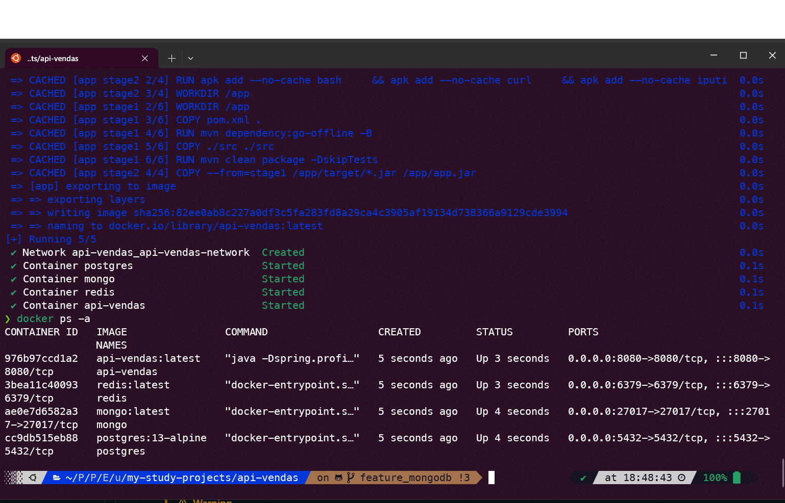

# api-vendas

>[!IMPORTANT] 
> Tarefas a serem implementadas:
> + [ ] Implementar validação do nome do cliente usando Regex, apenas para exemplo.
> + [ ] Implementar alguns testes unitários utilizando JUnit 5. (O correto é tentar cobrir o máximo possível de cenários, mas como o foco é apenas estudo, vamos implementar apenas alguns testes unitários, para exemplificar).


> Informações Gerais

>[!CAUTION]
> Este projeto é apenas para estudo, não deve ser usado em produção, a menos que você saiba o que esta fazendo e faça os ajustes necessários.

>[!CAUTION]
> Anotações de personalização das páginas do Swagger, foi implementado apenas na funcionalidade de Clientes, ou seja, apenas na classe ClienteController.java, no entanto, é possível implementar em todas as classes de controller, basta seguir o exemplo da classe ClienteController.java.

>[!CAUTION]
> Exemplos de utilização do `redis-cache`, foi implementado apenas na funcionalidade de Clientes, ou seja, apenas na classe ClienteController.java, no entanto, é possível implementar em todas as classes de controller, basta seguir o exemplo da classe ClienteController.java, e as dicas de uso do `redis-cache` ao longo desta documentação.

>[!WARNING]
>Não estamos utilizando o ResponseEntity<T>  para retornar os dados, pois o Spring já faz isso por nós automaticamente.

>[!TIP]
>Para executar a aplicação diretamente na IDE (IntelliJ IDEA), basta executar a classe Application.java, que esta no pacote `br.com.sfidencio.api.vendas`, conforme imagem abaixo:
>


>[!TIP] 
>Executando o perfil de desenvolvimento, o banco de dados utilizado é o H2(InMemory), logo é uma dependência satisfeita e que sobe junto com a aplicação, todavia, para as dependências redis e mongo, é necessário subir os containers manualmente, ou seja, via docker, conforme descrito abaixo.

+ Para subir o container do redis, execute o comando abaixo:
+ ```bash
  docker run --rm -d --name redis -p 6379:6379 redis
  ```
+ Para subir o container do mongo, execute o comando abaixo:
+ ```bash
  docker run --rm -d --name mongo -p 27017:27017 mongo
  ```
 

>[!IMPORTANT]
> Índice
- [Guia explicativo de como executar o projeto localmente](#guia-explicativo-de-como-executar-o-projeto-localmente)
- [Guia explicativo de como dockerizar o projeto em seguinda executá-lo localmente sem o docker-compose](#guia-explicativo-de-como-dockerizar-o-projeto-em-seguinda-executa-lo-localmente-sem-o-docker-compose)
- [Guia explicando como dockerizar o projeto em seguinda executá-lo localmente com o docker-compose](#guia-explicando-como-dockerizar-o-projeto-em-seguinda-executa-lo-localmente-com-o-docker-compose)
- [Referências](#referências)
- [Spring com Redis](#spring-com-redis)
- [Configurando Banner do Spring](#configurando-banner-do-spring)
- [Implementando Multi-Stage Build no Docker](#implementando-multi-stage-build-no-docker)
- [Implementando Swagger](#implementando-swagger)
- [Implementando MongoDB no projeto](#implementando-mongodb-no-projeto)


> Este projeto aborda os seguintes tópicos:
>    - Requisitos (MVP)
>        - Cadastro de Clientes
>        - Cadastro de Produtos
>        - Registro de Pedidos
>            - Cancelamento de Pedidos
>    - Tecnologias Utilizadas
>        - Java 17
>        - Spring Boot
>        - PostgreSQL
>        - H2 Database
>        - Lombok
>        - JPA/Hibernate
>        - JdbcTemplate
>        - Docker
>        - Git
>    - Abordagens/Boas Práticas
>        - DTO Pattern + Record Pattern (new feature do Java 17)
>        - Domain Driven Design
>        - Testes Unitários
>        - Clean Code
>        - Paginação de Resultados com Spring Data JPA
>        - HATEOAS
>        - Swagger
>        - Banner do Spring
>        - Tratamento de Erros
>        - Segurança
>        - Cache com Redis
>        - Versionamento de API
>        - Documentação de API com Swagger
>        - Uso do @JsonManagedReference e @JsonBackReference para evitar recursividade infinita em relacionamentos bidirecionais


# Dicas e macetes
> [!IMPORTANT]
> Visualizar dependências de uma lib no maven:
```bash
mvn dependency:tree
```

#   Guia explicativo de como executar o projeto localmente

> [!WARNING]
Certifique-se de que o Java 17 esteja instalado e configurado na sua máquina local, apache-maven, git, docker e etc. Por padrão, o projeto está configurado para executar o perfil de desenvolvimento, ou seja, o banco de dados H2 será utilizado.


### Abra o terminal e execute o comando abaixo para clonar o projeto:
```bash
git clone git@github.com:sfidencio/my-study-projects.git
```
### Acessando o diretório raiz do projeto:
```
cd api-vendas
```


#### Limpando e instalando dependências, bem como o artefato final, ou seja, o .jar:
```bash
mvn clean install
```


#### Executando o projeto:
```bash
mvn spring-boot:run
```


> [!IMPORTANT]
> Caso tenha executado com sucesso a aplicação, deverá aparecer a seguinte mensagem -> Started Application in 2.11 seconds (process running for 2.3)

> [!IMPORTANT]
> As coleções do postman, estão na pasta `collections`, na raiz do projeto. Basta realizar a importação no postman.


### Realizando teste de cadastro de cliente via curl:
```bash
curl -kvs http://localhost:8080/base/v1/api/clientes/salvar --data '{"nome":"Fulano","cpf":"41909644099", "email":"fulano@gmail.com" }' -H "Content-Type: application/json"  -X POST
```


### Consultando cliente via curl:
```bash
curl -kvs http://localhost:8080/base/v1/api/clientes/consulta/1 -H "Content-Type: application/json"  -X GET
```


> [!IMPORTANT]
> Pronto, agora abra o projeto no IntelliJ IDEA e divirta-se!


#   Guia explicativo de como dockerizar o projeto em seguinda executa-lo localmente sem o docker-compose


### Criando arquivo Dockerfile e o arquivo docker-compose.yml


> [!IMPORTANT]
> Atualizamos o Dockerfile-api-vendas, para não precisar mais executar o comando `mvn clean install` manualmente, pois esse processo é feito automaticamente pelo docker, conforme descrito abaixo.


> [!IMPORTANT]
> Optamos por configurar o Multi-Stage Build no Docker, pois o build é feito em duas etapas, sendo a primeira etapa, responsavel por gerar o artefato final, ou seja, o .jar, e a segunda etapa, responsavel por gerar a imagem final, ou seja, a imagem que será usada para subir o container.
> A diferença entre o build sem multi-stage, é que o build com multi-stage gera uma imagem menor, pois o build é feito em duas etapas, sendo a primeira etapa, responsavel por gerar o artefato final, ou seja, o .jar, e a segunda etapa, responsavel por gerar a imagem final, ou seja, a imagem que será usada para subir o container.
> O arquivo Dockerfile-api-vendas, sem o multi-stage, esta na pasta docker/default, na raiz do projeto.

>Esse arquivo construirá imagem customizada para a aplicação api-vendas, gerando um .jar.

>Dockerfile-api-vendas

```dockerfile
#Stage 1
FROM maven:3-openjdk-17 AS stage1
LABEL authors="sebastiaofidencio"
ENV MAVEN_OPTS="-XX:+TieredCompilation -XX:TieredStopAtLevel=1"
WORKDIR /app
COPY pom.xml .
RUN mvn dependency:go-offline -B
COPY ./src ./src
RUN mvn clean package -DskipTests

#Stage 2
FROM openjdk:17-alpine as stage2

RUN apk add --no-cache bash \
    && apk add --no-cache curl \
    && apk add --no-cache iputils \
    && apk add --no-cache vim \
    && apk add --no-cache htop
WORKDIR /app
COPY --from=stage1 /app/target/*.jar /app/app.jar
CMD ["java","-Dspring.profiles.active=production", "-jar", "app.jar"]
```

>Dockerfile-redis

> Esse arquivo construirá imagem customizada para o redis, que será usado para cache.

```dockerfile
FROM redis:alpine
LABEL authors="sebastiaofidencio"
RUN apk add --no-cache bash \
    && apk add --no-cache curl \
    && apk add --no-cache iputils
COPY ../redis.conf /usr/local/etc/redis/redis.conf
CMD [ "redis-server", "/usr/local/etc/redis/redis.conf" ]
```


### Acesse o diretório raiz do projeto(root), via terminal, e execute o comando abaixo para criar a imagem customizada
>[!WARNING]
> Onde está `sfidencio` deverá ser substituído pelo seu usuário do dockerhub, e pressupondo que você já tenha uma conta no docker hub e tenha feito login previamente.
> Caso não tenha feito login o comando e `docker login` e informe seu usuário e senha.


```bash
docker build -f docker/Dockerfile-api-vendas-multi-stage --platform linux/amd64 -t sfidencio/api-vendas:latest .
```

### Executando imagem customizada em primeiro plano ou "attached" no terminal "-it", visto que a opcao "-rm" remove o container ao finalizar

```bash
docker run --rm -it --name myapp -p 8080:8080 sfidencio/api-vendas:latest
```


### Executando imagem customizada em background "-d", visto que a opcao "-rm" remove o container ao finalizar

```bash
docker run --rm -d --name myapp -p 8080:8080 sfidencio/api-vendas:latest
```

>[!TIP]
> Caso seja necessario verificar os logs do container, execute o comando abaixo:
```bash
docker logs myapp
```

>[!TIP]
> Caso seja necessario parar o container, execute o comando abaixo:
```bash
docker stop myapp
```

### Acessando aplicação - Cadastrando Cliente


```bash
curl -kvs http://localhost:8080/base/v1/api/clientes/salvar --data '{"nome":"Fulano","cpf":"41909644099", "email":"fulano@gmail.com" }' -H "Content-Type: application/json"  -X POST
```


### Acessando aplicação - Consultado cliente com id-> 1


```bash
curl -kvs http://localhost:8080/base/v1/api/clientes/consulta/1 -H "Content-Type: application/json"  -X GET
```

### Acessando aplicação - Listando todos Clientes Cadastrados


```bash
curl -kvs http://localhost:8080/base/v1/api/clientes/consulta-todos-clientes -H "Content-Type: application/json"  -X GET
```

### Acessando container caso seja necessário

```bash
docker exec -it myapp sh
```

# Guia explicando como dockerizar o projeto em seguinda executa-lo localmente com o docker-compose
> [!IMPORTANT]
> Executar sempre um `mvn clean install`, pois o docker-compose irá criar a imagem customizada e subir o container, e se não tivermos o .jar, o container não sobe.

>[!IMPORTANT]
> Nesse cenario, o docker-compose.yml deverá estar na raiz do projeto, ou seja, no mesmo diretório onde está o Dockerfile.

>[!IMPORTANT]
> Vamos subir o banco de dados postgres e a aplicação em containers, isso implica que teremos que mudar o profile de `development` para `production`, pois a aplicação não estará mais usando o banco de dados H2, mas sim o postgres. Altere o Dockerfile na linha `-Dspring.profiles.active=development` para `-Dspring.profiles.active=production`.

>[!TIP]
> Observe que estamos usando variaveis de ambiente no arquivo docker-compose.yml, ou seja, as variaveis de ambiente são passadas para a aplicação via docker-compose.yml, e a aplicação as recebe via System.getenv("NOME_DA_VARIAVEL_DE_AMBIENTE") ou @Value("${NOME_DA_VARIAVEL_DE_AMBIENTE}") ou dentro do arquivo application.yaml ou application.properties no seguinte formato(Exemplo apenas): `spring.datasource.url=${SPRING_DATASOURCE_URL}`.

>docker-compose.yml

>[!TIP]
> Fique atento quanto a configuração das variaveis de ambiente, as mais importantes foram externalizadas no docker-compose.yml. Essas variaveis são "injetadas" no conteiner em execução, e recuperadas via application.yaml ou application.properties. Observe a seção environment do arquivo docker-compose.yml, e a seção environment do arquivo docker-compose.yaml.

```yaml
version: '3.7'
services:
  db:
    image: postgres:13-alpine
    container_name: postgres
    networks:
      - api-vendas-network
    restart: always
    environment:
      POSTGRES_USER: postgres
      POSTGRES_PASSWORD: postgres@@
      POSTGRES_DB: api-vendas
    ports:
      - "5432:5432"
    volumes:
      - postgres-data:/var/lib/postgresql/data #docker named volumes
  app:
    image: api-vendas:latest
    platform: linux/amd64
    container_name: api-vendas
    networks:
      - api-vendas-network
    #build: . #default build context quando tempos apenas o Dockerfile
    build:
      context: .
      dockerfile: docker/Dockerfile-api-vendas-multi-stage
    ports:
      - "8080:8080"
    depends_on:
      - redis
      - db
      - mongo
    environment:
      SPRING_DATASOURCE_URL: jdbc:postgresql://postgres:5432/api-vendas
      SPRING_DATASOURCE_USERNAME: postgres
      SPRING_DATASOURCE_PASSWORD: postgres@@
      SPRING_JPA_HIBERNATE_DDL_AUTO: update
      REDIS_HOST: redis
      REDIS_PORT: 6379
      MONGO_DB_HOST: mongo
      MONGO_DB_PORT: 27017
  #No redis nao iremos criar volume pois nao precisamos persistir os dados a principio
  redis: #https://cloudinfrastructureservices.co.uk/run-redis-with-docker-compose/
    image: redis:latest
    platform: linux/amd64
    networks:
      - api-vendas-network
    build:
      context: .
      dockerfile: docker/Dockerfile-redis
    #command: ["redis-server", "--protected-mode", "no"]
    container_name: redis
    restart: always
    ports:
      - "6379:6379"
  mongo:
    image: mongo:latest
    platform: linux/amd64
    networks:
      - api-vendas-network
    container_name: mongo
    restart: always
    ports:
      - "27017:27017"
    volumes:
      - mongo-data:/data/db #docker named volumes

networks:
  api-vendas-network:
    driver: bridge

#Entenda o funcionamento do volumes no docker-compose
#https://devopscell.com/docker/docker-compose/volumes/2018/01/16/volumes-in-docker-compose.html
#E possivel utilizar Docker host mounted volumes ou Docker named volumes

volumes:
  postgres-data:
    driver: local
  mongo-data:
    driver: local
```

>[!TIP]
> Observe bem a estrutura do arquivo docker-compose.yml, pois é muito importante para o funcionamento correto do projeto.


>[!TIP]
> O arquivo docker-compose.yml é composto por 3 seções, sendo elas: services, networks e volumes.


>[!TIP]
> A seção services é composta por 2 serviços, sendo eles: db e app.


>[!TIP]
> A seção networks é composta por 1 rede, sendo ela: myapp. A aplicação e o banco de dados estarão na mesma rede.


>[!TIP]
> O parâmetro `depends_on` é muito importante, pois ele garante que o banco de dados esteja no ar antes da aplicação subir.


>[!TIP]
> A seção volumes é composta por 1 volume, sendo ele: `postgres-data`. Esse volume é responsável por persistir os dados do banco de dados postgres, pois o container é efêmero(imutável), ou seja, se o container for derrubado, os dados serão perdidos, logo a gravação dos dados é feita no volume, que esta "fora" do container.

>[!TIP]
> O volume é criado automaticamente pelo docker-compose, caso não exista. 

>[!TIP]
> Assim como .gitignore, o .dockerignore é muito importante, pois ele é responsável por ignorar arquivos e diretórios que não devem ser copiados para dentro do container, ou seja, o .dockerignore é responsável por otimizar o build da imagem, pois ele não copia arquivos e diretórios desnecessários para dentro do container.


### Subindo aplicação no docker localmente usando docker-compose aliado ao Dockerfile, em background "-d"


```bash
sudo docker-compose up --build -d
```

ou

```bash
sudo docker compose up --build -d
```

>Após subir os conteinerers, via docker-compose.




>[!WARNING]
>Repita os testes de cadastro de clientes, consulta e listagem via curl, conforme descrito acima, pois o banco de dados H2 não será mais utilizado, mas sim o postgres.

### Parando containers


```bash
sudo docker-compose down
```

ou 

```bash
sudo docker compose down
```


# Spring com Redis
## Tutorial basico de como usar o Redis via CLI
> [!IMPORTANT]
> Para executar o redis standalone via docker, execute o comando abaixo:
```bash
docker run --rm -d --name redis -p 6379:6379 redis
```
>Acesse o container do Redis
```bash
docker exec -it redis bash
```
>Execute o comando abaixo para acessar o Redis CLI (Dentro do Container)
```bash
redis-cli
```

>[!WARNING]
> Todos comandos abaixo devem ser executados dentro do redis-cli.
>Teste Redis
```bash
ping
```

>Visualizar todas as chaves
```bash
KEYS *
```
>Visualizar valor da chave
```bash
GET <chave>
```
>Incluir chave e valor
```bash
SET <chave> <valor>
```
>Excluir chave
```bash
DEL <chave>
```
>Caso queira limpar o Redis, execute o comando abaixo:
```bash
FLUSHALL
```
>[!WARNING]
> Ate aqui, usamos do redis-cli.


## Algumas observações quanto a utilização do Redis no Spring

> [!IMPORTANT]
> Na classe Application.java, temos um exemplo, via `CommandLineRunner`, de como realizar operacoes basicas no Redis, utilizando a classe Helper, `RedisTemplate`.

> [!TIP]
> Para utilizar o Redis no Spring, precisamos adicionar a dependencia abaixo no pom.xml:
```xml
<dependency>
    <groupId>org.springframework.boot</groupId>
    <artifactId>spring-boot-starter-data-redis</artifactId>
    <version>x.y.z</version>
</dependency>
```
> [!TIP]
> As principais configurações de `bootstrap` do Redis, estão no arquivo application.yaml ou application.properties, e na classe RedisConfig.java.

```java
@Configuration
@EnableRedisRepositories
public class RedisConfig {
    @Value("${myapp.cache.ttl:60}")
    private long ttl;

    @Bean
    public RedisCacheConfiguration cacheConfiguration() {
        return RedisCacheConfiguration
                .defaultCacheConfig()
                .entryTtl(Duration.ofDays(1)) //Aqui TTL global
                .disableCachingNullValues() //desabilita cache de valores nulos
                .serializeValuesWith(RedisSerializationContext.SerializationPair.fromSerializer(new GenericJackson2JsonRedisSerializer()));
    }

    @Bean
    public RedisCacheManagerBuilderCustomizer redisCacheManagerBuilderCustomizer() {
        return builder -> builder
                .withCacheConfiguration("produto", RedisCacheConfiguration.defaultCacheConfig().entryTtl(Duration.ofSeconds(this.ttl)))
                .withCacheConfiguration("cliente", RedisCacheConfiguration.defaultCacheConfig().entryTtl(Duration.ofSeconds(this.ttl)))
                .withCacheConfiguration("pedido", RedisCacheConfiguration.defaultCacheConfig().entryTtl(Duration.ofSeconds(this.ttl)));
    }
}
```
> [!TIP]
> Observem que estamos usando o `GenericJackson2JsonRedisSerializer`, para serializar os dados em json, pois o Redis não aceita serializar objetos em java, apenas em json.

> [!TIP]
> Estamos defindo o TTL global em 1 dia, e para cada cache, estamos definindo um TTL especifico, ou seja, o TTL global é sobrescrito pelo TTL especifico de cada cache. Essa configuração, é recuperada quando informamos a anotação `@Cacheable` o atributo `cacheName`, exemplo: `@Cacheable(cacheNames = "produto")`.

> [!TIP]
> Vale ressaltar que o valor default do cache esta sendo definido via SPEL(Spring Expression Language), ou seja, estamos recuperando o valor da variavel de ambiente `myapp.cache.ttl`, caso não exista, o valor default é 60 segundos/minutos/horas, vai depender da unidade de medida que você definir no Duration.ofSeconds(this.ttl).

> [!TIP]
> Vale ressaltar que, o redis pode ser utilizado via `@Annotations`, ou via `RedisTemplate`, ou via `RedisRepository`, enfim, existem varias formas de utilizar o Redis no Spring. No entanto, a mais usual é via `@Annonations`, pois não precisamos manipular o `RedisTemplate` diretamente, ou seja, o Spring faz isso por nós, todavia, temos um exemplo de como utilizar o `RedisTemplate` na classe principal da aplicação, ou seja, na classe `Application.java`, temos um exemplo, via `CommandLineRunner`, de como realizar operacões basicas no Redis, utilizando a classe Helper, `RedisTemplate`.

> [!TIP]
> Para configurar banner do spring, acesse o link abaixo:
> https://devops.datenkollektiv.de/banner.txt/index.html
> Basta, copiar o banner e colar no arquivo application.yaml ou application.properties, conforme exemplo abaixo:
> application.yaml

```yaml
spring:
  application:
    name: api-vendas
  banner:
    charset: UTF-8
    location: classpath:banner.txt
```

# Implementando Swagger
## Guia explicativo de como implementar o Swagger no projeto
> [!IMPORTANT]
> Para implementar o Swagger, basta adionarmos a dependencia abaixo no pom.xml:
```xml
      <!--Enable Swagger-->
        <dependency>
            <groupId>org.springdoc</groupId>
            <artifactId>springdoc-openapi-starter-webmvc-ui</artifactId>
            <version>x.y.z</version>
        </dependency>
```

> [!IMPORTANT]
> Em seguinda, basta acessarmos a url abaixo para visualizar a documentação da API:
> http://localhost:8080/base/swagger-ui.html


>[!IMPORTANT]
>Se não utilizarmos nenhuma das configurações descritas abaixos, o Swagger irá documentar todos os endpoints da aplicação, inclusive os endpoints do Spring Boot Actuator, ou seja, endpoints de monitoramento da aplicação.

> [!TIP]
> Algumas `@Annotations` básicas do Swagger para **personalizar** a documentação da API:
> + `@Tag` -> Usado para agrupar endpoints, ou seja, agrupar endpoints por funcionalidade.
> + `@Operation` -> Usado para descrever o endpoint, ou seja, descrever o que o endpoint faz.
> + `@Parameter` -> Usado para descrever os parametros do endpoint, ou seja, descrever o que cada parametro faz.
> + `@ApiResponse` -> Usado para descrever o retorno do endpoint, ou seja, descrever o que o endpoint retorna.
> + `@ApiResponses` -> Usado para descrever os possiveis retornos do endpoint, ou seja, descrever o que o endpoint pode retornar.


# Implementando MongoDB no projeto
## Guia explicativo de como implementar  o MongoDB no projeto

> [!IMPORTANT]
> Para implementar o MongoDB, basta adionarmos a dependencia abaixo no pom.xml:
```xml
        <!--MongoDB-->
        <dependency>
            <groupId>org.springframework.boot</groupId>
            <artifactId>spring-boot-starter-data-mongodb</artifactId>
            <version>x.y.z</version>
        </dependency>
```
> [!IMPORTANT]
> Configuração do MongoDB no arquivo application.yaml ou application.properties:
```yaml
spring:
  data:
    mongodb:
      uri: mongodb://localhost:27017/api-vendas
```

>Executando o MongoDB via docker:
```bash
docker run --rm -d --name mongo -p 27017:27017 mongo
```
>Cadastrando cliente Vip (MongoDB) via curl:
```bash
curl -kvs http://localhost:8080/base/v1/api/clientes/salva-cliente-vip --data '{nome":"Fulano","cpf":"41909644099", "email":"fulano@gmail.com" }' -H "Content-Type: application/json"  -X POST
```
>Consultando todos os clientes VIP (MongoDB) via curl:
```bash
curl -kvs http://localhost:8080/base/v1/api/clientes/consulta-todos-clientes-vip -H "Content-Type: application/json"  -X GET
```

>Acessando o container do MongoDB
```bash
docker exec -it mongodb bash
```

>Acessando o mongoDB via CLI (Dentro do Container)
```bash
mongosh
```

>Visualizar todas as bases de dados
```bash
show dbs
```

>Visualizar todas as coleções
```bash
show collections
```

>Consultando cliente Vip (MongoDB) via CLI (Dentro do Container)
```bash
use api-vendas
db.cliente.find()
```

>Apagando base de dados api-vendas (MongoDB) via CLI (Dentro do Container)
```bash
use api-vendas
db.dropDatabase()
```

>Apagando todos os dados da coleção clientesVIP (MongoDB) via CLI (Dentro do Container)
> [!WARNING]
> DeprecationWarning: Collection.remove() is deprecated. Use deleteOne, deleteMany, findOneAndDelete, or bulkWrite.

```bash
db.cliente.remove({})
```

ou

```bash
db.cliente.deleteMany()
```

>Mapeando entidade Cliente para o MongoDB

```java
import org.springframework.data.mongodb.core.mapping.FieldType;
import org.springframework.data.mongodb.core.mapping.MongoId;

@Document(collection = "cliente")
public record ClienteVIP(@MongoId(FieldType.OBJECT_ID) String id, String nome, String cpf, String email) {
}
```

>Criando repositorio para o MongoDB
```java
@Repository
public interface ClienteVIPRepository extends MongoRepository<ClienteVIP, String> {
}
```
>Exemplo de como salvar cliente Vip (MongoDB) via repositorio
```java
@Bean("executarTesteMongoDB")
public CommandLineRunner executarTesteMongoDB(@Autowired ClienteVIPRespository clienteVIPRespository) {
        return args -> {
        //Esse codigo apaga todos registros existens na coleção `cliente`    
        if (clienteVIPRespository.count() > 0) clienteVIPRespository.deleteAll();
        
        //Realizamos o cadastro, e posteriormente a consulta de todos os clientes cadastrados
        var fulano = new ClienteVIP(null, "fulano", "12345678901", "fulano@gmail");
        var beltrano = new ClienteVIP(null, "beltrano", "12345678901", "beltrano@gmail");
        var list = List.of(fulano, beltrano);
        clienteVIPRespository.saveAll(list);
        System.out.println(clienteVIPRespository.findAll());
        };
}
```

>Para excluir registros via repositorio, basta usar o metodo deleteById, conforme exemplo abaixo:
```java
clienteVIPRespository.deleteById("id");
```
>[!TIP]
> Temos um exemplo de utilização do mongodb com springboot, agora caso queira implementar as demais funcionalidades de exclusão, atualização e consulta, basta seguir o exemplo acima, e consultar a documentação do spring data mongodb, os links descritos no final deste documento.


### Implementando Multi-Stage Build no Docker
> [!TIP]
> Para implementar o multi-stage build no docker, "mineramos" informações dos links abaixo:
> A diferença entre o build sem multi-stage, é que o build com multi-stage gera uma imagem menor, pois o build é feito em duas etapas, sendo a primeira etapa, responsavel por gerar o artefato final, ou seja, o .jar, e a segunda etapa, responsavel por gerar a imagem final, ou seja, a imagem que será usada para subir o container.

>Explorando o multi-stage build do docker: (Implementado no projeto depois)
> + https://ionutbanu.medium.com/build-spring-boot-docker-image-using-multi-stage-dockerfile-2-13b9f1e89393
> + https://www.harness.io/blog/how-to-create-multi-stage-docker-builds-with-harness-continuous-delivery
> + https://docs.docker.com/develop/develop-images/multistage-build/
> + https://mailslurp.medium.com/faster-java-containers-with-docker-multi-stage-builds-cc63e056e546
> + https://www.harness.io/blog/how-to-create-multi-stage-docker-builds-with-harness-continuous-delivery
> + https://ionutbanu.medium.com/build-spring-boot-docker-image-using-multi-stage-dockerfile-2-13b9f1e89393

>Explorando o dockerignore:
> + https://shisho.dev/blog/posts/how-to-use-dockerignore/

>[!IMPORTANT]
>Referências utilizadas em todo o projeto:

>Tutoriais e cursos gratuitos: 
>+ https://tpbabparn.medium.com/spring-boot-3-1-integrated-docker-compose-on-development-environment-spring-webflux-example-1ddcbfe052f
>+ https://springhow.com/spring-boot-and-postgres-using-docker-compose/
>+ https://www.baeldung.com/ops/docker-compose-links-depends-on
>+ https://www.baeldung.com/spring-boot-docker-start-with-profile
>+ https://blog.devgenius.io/how-to-handle-constraint-violation-exception-using-controlleradvice-in-spring-boot-2f61147d19de
>+ https://reflectoring.io/bean-validation-with-spring-boot/
>+ https://www.javadevjournal.com/spring-boot/spring-custom-validation-message-source/
>+ https://www.baeldung.com/spring-valid-vs-validated
>+ https://salithachathuranga94.medium.com/validation-and-exception-handling-in-spring-boot-51597b580ffd
>+ https://www.udemy.com/user/dougllas-sousa/
>+ https://pt.stackoverflow.com/questions/207188/depend%C3%AAncia-circular-em-api-rest-com-spring-boot
>+ https://medium.com/@seonggil/creating-a-maturity-level-3-rest-api-with-hateoas-fcd76d1b2db9
>+ https://www.baeldung.com/spring-custom-validation-message-source
>+ https://reflectoring.io/bean-validation-with-spring-boot/
>+ https://medium.com/yildiztech/decoding-i18n-challenges-in-spring-boot-3-exploring-internationalization-895a4ac627df
>+ https://medium.com/@seonggil/creating-a-maturity-level-3-rest-api-with-hateoas-fcd76d1b2db9 (**Implementing HATEOAS**)
>+ https://www.baeldung.com/spring-data-jpa-pagination-sorting
>+ https://docs.spring.io/spring-data/jpa/docs/current/reference/html/#jpa.query-methods
>+ https://spring.io/guides/gs/accessing-data-jpa/
>+ https://spring.io
>+ https://hibernate.org
>+ https://docs.oracle.com/en/java/javase/17/docs/api/java.base/java/lang/record.html
 
>Referências utilizadas para implementar o cache com Redis:
>+ https://www.baeldung.com/spring-boot-redis-cache
>+ https://www.digitalocean.com/community/tutorials/spring-boot-redis-cache
>+ https://www.bezkoder.com/spring-boot-redis-cache-example/
>+ https://redis.io/docs/connect/cli/
>+ https://premika-17.medium.com/implementing-redis-in-spring-boot-3d2756e5ab69
>+ https://medium.com/javarevisited/classcast-exception-when-using-redis-and-springboot-frameworks-in-conjunction-ea132dd0d7ea
>+ https://stackoverflow.com/questions/74557099/how-to-delete-all-data-from-redis-using-redistemplate-in-java
>+ https://www.baeldung.com/spring-boot-evict-cache (Limpando o cache de várias formas)
>+ https://medium.com/@aedemirsen/cache-structure-in-spring-boot-projects-with-redis-2c5751bca9eb

>Guia sobre utilização do Banner do Spring:
>+ https://devops.datenkollektiv.de/banner.txt/index.html

>Guia sobre configuração do redis no docker:
>+ https://cloudinfrastructureservices.co.uk/run-redis-with-docker-compose/ (Configuração mais completa)
>+ https://medium.com/nerd-for-tech/setting-up-a-standalone-redis-instance-2721a7318037
>+ https://zomro.com/blog/faq/301-kak-ustanovit-redis-v-docker
>+ https://devopscell.com/docker/docker-compose/volumes/2018/01/16/volumes-in-docker-compose.html 
>+ https://stackoverflow.com/questions/57528077/docker-compose-with-name-other-than-dockerfile

>Guia sobre implementação do Swagger:
>+ https://www.baeldung.com/swagger-2-documentation-for-spring-rest-api
>+ https://medium.com/@f.s.a.kuzman/using-swagger-3-in-spring-boot-3-c11a483ea6dc#id_token=eyJhbGciOiJSUzI1NiIsImtpZCI6IjBhZDFmZWM3ODUwNGY0NDdiYWU2NWJjZjVhZmFlZGI2NWVlYzllODEiLCJ0eXAiOiJKV1QifQ.eyJpc3MiOiJodHRwczovL2FjY291bnRzLmdvb2dsZS5jb20iLCJhenAiOiIyMTYyOTYwMzU4MzQtazFrNnFlMDYwczJ0cDJhMmphbTRsamRjbXMwMHN0dGcuYXBwcy5nb29nbGV1c2VyY29udGVudC5jb20iLCJhdWQiOiIyMTYyOTYwMzU4MzQtazFrNnFlMDYwczJ0cDJhMmphbTRsamRjbXMwMHN0dGcuYXBwcy5nb29nbGV1c2VyY29udGVudC5jb20iLCJzdWIiOiIxMTYyMjM2MzYyOTQ3MzM2MjE0ODUiLCJlbWFpbCI6InNmaWRlbmNpb0BnbWFpbC5jb20iLCJlbWFpbF92ZXJpZmllZCI6dHJ1ZSwibmJmIjoxNzAyMzM5MDE1LCJuYW1lIjoiU2ViYXN0acOjbyBGaWTDqm5jaW8iLCJwaWN0dXJlIjoiaHR0cHM6Ly9saDMuZ29vZ2xldXNlcmNvbnRlbnQuY29tL2EvQUNnOG9jSzVGM2MycUJFbDFIT2xsOVYtUWkxRzRMOE1FcEQ0MWN2MnNYdzRUX3d1NkxTTT1zOTYtYyIsImdpdmVuX25hbWUiOiJTZWJhc3Rpw6NvIiwiZmFtaWx5X25hbWUiOiJGaWTDqm5jaW8iLCJsb2NhbGUiOiJwdC1CUiIsImlhdCI6MTcwMjMzOTMxNSwiZXhwIjoxNzAyMzQyOTE1LCJqdGkiOiI2M2Q0MGE1ZGM5ZDcwYzVmYmUxZGFmMmE5ZGM2ODJhZWU2ZTEyZjE5In0.p2Jpb1_zl-GfPki_m_hz8Xz4jsJxMxgS8wNM7ajqHPvgQq2ecGr8T8u2n5ZlbLh7LCDPxK3X9RY6CRCDp5uXqEZB2fdJ3-N9rvce4XDkSrzw90Qm_J2PPohOBLSY3EtbV3AOmeX8piWg-hxSzSBdUZI9SSomf0mJgPPv4EopfUQnqS7kISllewhs_JAKD6O_VYUbfy_jcmMMsHDzUQCem_4dBgn0d7r3DJE3snYzBtmzCqQuLih5ioiBB_g7MRQ-4SbfMyOwhwubKD96QV9VJxGpHoxvOTbYZKKhebg0vycHL--H0woaWLrgGcw0ajaPxeZLzuDutEw1b-YuaZPAJg

>Guia sobre implementação do MongoDB junto com o Spring:
>+ https://www.mongodb.com/compatibility/spring-boot
>+ https://docs.spring.io/spring-data/mongodb/reference/index.html

>Guia sobre implementação de validações usando Regex aliado com @Valid:
>+ https://docs.oracle.com/javase/7/docs/api/java/util/regex/Pattern.html
>+ https://www.baeldung.com/java-regex-validate-phone-numbers
>+ https://www.javatpoint.com/spring-mvc-regular-expression-validation
