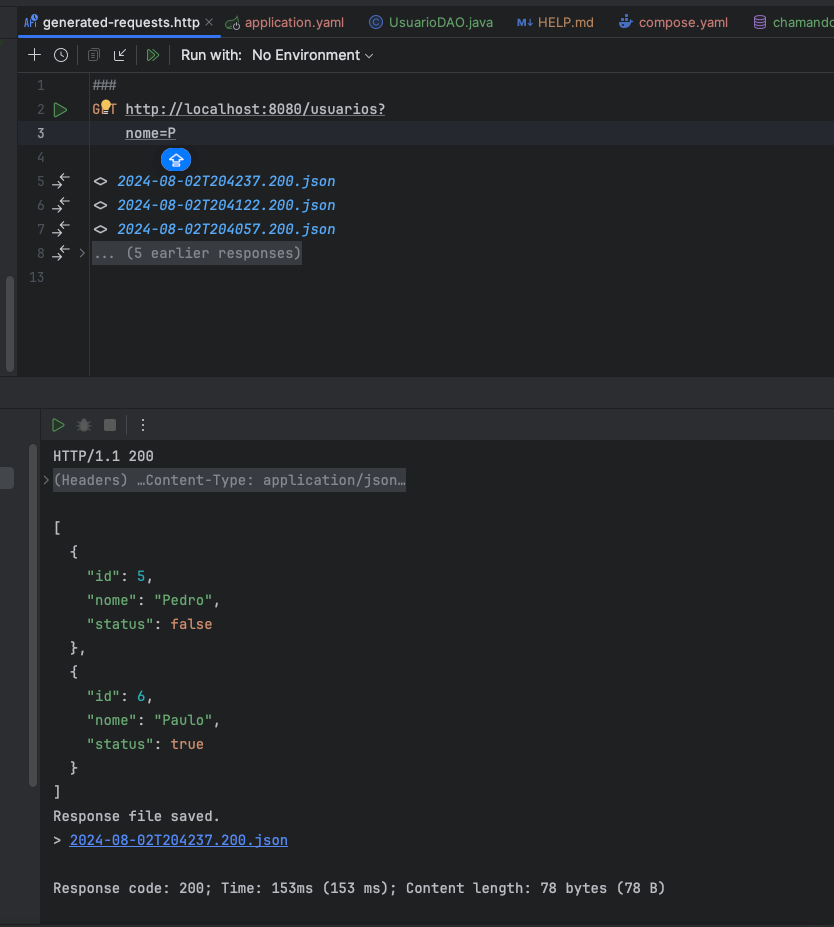

# Explorando chamada de procedures/funções no pgsql com Spring Boot (JDBCTemplate)

## Objetivo
O objetivo deste documento é apresentar um exemplo de chamada de procedures/funções no PostgreSQL utilizando Spring Boot e JDBCTemplate.

## Tecnologias
- Java 17
- Spring Boot
- PostgreSQL
- JDBCTemplate
- Maven
- Docker


## Criando o banco de dados
- Na pasta `code` temos os scripts para criação do banco de dados e das tabelas bem como a stored procedure/função que serão chamadas no exemplo.

## Exemplo de chamada no endpoint que retorna lista de usuários:



## Principais pontos do código
- Camada de Acesso a Dados (DAO)
- Utilização do JDBCTemplate para chamada de procedures/funções
```java
/*
 *Preste bem atenção:
 *quando usamos o nivel de isolamento
 *
 *READ_COMMITTED: Este é o nível de isolamento padrão no PostgreSQL.
 *Ele garante que uma transação só possa ver dados que foram commitados por outras transações.
 *O nivel de isolamento READ_COMMITTED não é pessimista, ele é otimista, porque
 *ele não trava as linhas que estão sendo lidas, ele apenas verifica se houve alguma alteração.
 *Em um SELECT, ele faz lock apenas na linha que está sendo lida, e não na tabela inteira.
 *
 *
 *SERIALIZABLE: Este é o nível de isolamento mais alto no PostgreSQL.
 *Ele garante que uma transação só possa ver dados que foram commitados por outras transações.
 *Esse nivel de isolamento é pessimista, porque ele trava as linhas que estão sendo lidas, podendo
 *causar deadlocks ou baixa performance na aplicação.
 *Em um select, ele faz lock na tabela inteira.
 *
 *READ_UNCOMMITTED: Este é o nível de isolamento mais baixo no PostgreSQL.
 *Ele permite que uma transação veja dados que foram modificados por outras transações, mas que ainda não foram commitados.
 *
 *
 *É simples entender se o spring esta adontando o nivel de isolamento correto conforme a configuração,
 *basta ligar o log em modo TRACE, e procurar por "Setting JDBC Connection [com.zaxxer.hikari.HikariProxyConnection@xxxxxx] transaction isolation to 2"
 *Caso seja READ_COMMITTED, o nivel de isolamento esta correto, caso contrario, o nivel de isolamento esta errado.
 *
 *Para SERIALIZABLE, o nivel de isolamento deve ser 8
 **/

@Repository
@RequiredArgsConstructor
public class UsuarioDAO implements IUsuarioDAO {

    private final JdbcTemplate jdbcTemplate;

    @Override
    @Transactional(isolation = Isolation.READ_COMMITTED)
    public List<UsuarioEntity> selecionarUsuarios(String nome) {
        return jdbcTemplate.query(
                SQL_SELECT_USUARIOS,
                new UsuarioResultSetExtractor(),
                nome);
    }


    private static final String SQL_SELECT_USUARIOS = "SELECT id_out," +
            "nome_out," +
            "status_out " +
            "FROM sp_seleciona_usuarios(?);";
}

```
## Criação da Procedure no PostgreSQL
```sql
DROP FUNCTION IF EXISTS sp_seleciona_usuarios(varchar);

CREATE
OR REPLACE FUNCTION sp_seleciona_usuarios(nome_in varchar)
         RETURNS TABLE (id_out integer, nome_out varchar, status_out boolean)
AS $$

BEGIN

--retorna os registros da tabela usuarios
RETURN QUERY
SELECT u.id,
       u.nome,
       u.status
FROM usuarios u
WHERE u.nome ILIKE '%' || nome_in || '%';
--commit
END;
$$ LANGUAGE plpgsql;
```

## Código do ResultSetExtractor
- O ResultSetExtractor é uma interface funcional que é usada para processar o ResultSet e retornar um objeto processado.
```java
public class UsuarioResultSetExtractor implements ResultSetExtractor<List<UsuarioEntity>> {
    @Override
    public List<UsuarioEntity> extractData(ResultSet rs) throws SQLException, DataAccessException {
        List<UsuarioEntity> usuarios = new ArrayList<>();
        while (rs.next()) {
            usuarios.add(new UsuarioEntity(
                    rs.getInt("id_out"),
                    rs.getString("nome_out"),
                    rs.getBoolean("status_out")));
        }
        return usuarios;
    }
}
```

### Configurando um JdbcTemplate customizado, com controle de transações explícito, para aplicações reais é importante ter controle dessas configurações e não deixar o spring fazer `auto-configure`.
```java
/*
 * Eu nem precisaria de definir um JdbcTemplate customizado, pois o Spring Boot já faz isso por mim.
 * Entretanto quero ter o controle de como as transações são gerenciadas, por isso estou definindo um
 * DataSourceTransactionManager.
 */

@Configuration
@EnableTransactionManagement
public class AppConfig {

    @Value("${spring.datasource.driver-class-name}")
    private String driverClassName;

    @Value("${spring.datasource.url}")
    private String url;

    @Value("${spring.datasource.username}")
    private String username;

    @Value("${spring.datasource.password}")
    private String password;


    @Bean
    public DataSource dataSource() {
        // Aqui eu poderia configurar um DataSource customizado, mas estou usando o HikariCP que é o padrão do Spring Boot.
        DriverManagerDataSource dataSource = new DriverManagerDataSource();
        //pega essas configurações do application.yaml
        dataSource.setDriverClassName(driverClassName);
        dataSource.setUrl(url);
        dataSource.setUsername(username);
        dataSource.setPassword(password);
        return dataSource;
    }

    @Bean
    public PlatformTransactionManager transactionManager() {
        return new DataSourceTransactionManager(dataSource());
    }

    @Bean
    public JdbcTemplate jdbcTemplate() {
        return new JdbcTemplate(dataSource());
    }

}
```

## Referências
- [Documentação Spring](https://docs.spring.io/spring-data/jdbc/docs/current/reference/html/#jdbc.core)
- Uso de IA para auxiliar na criação do documento: [GPT-3](https://www.openai.com/blog/openai-api/)