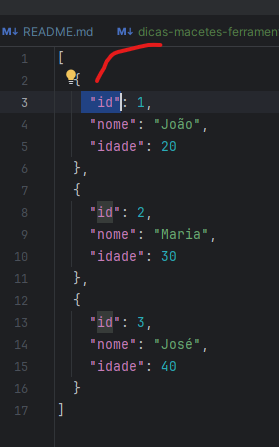

# dicas-macetes-ferramentas

> [!IMPORTANT]
> Lista de artigos/dicas:

- Dominando git
    - https://github.com/joshnh/Git-Commands
- Dicas IntelliJ
    - https://www.jetbrains.com/help/idea/mastering-keyboard-shortcuts.html
    - Selecionar todas as ocorrencias de uma palavra: `ctrl + shift + alt + j`

- Dicas Java e Frameworks:
    - [Dicas de como designar um tipo ENUM para deserializar uma string vazia (Spring Boot)](#dicas-de-como-designar-um-tipo-enum-para-deserializar-uma-string-vazia-spring-boot)
      - Cenários de uso:
        - Microserviços que consomem outros microserviços, e que por algum motivo, o microserviço consumido retorna uma
          string vazia, e o microserviço consumidor precisa deserializar essa string vazia para um tipo ENUM.

# Dicas IntelliJ - Manipulação de arquivos json por exemplo

> Pressupomos que precisamos extrair apenas o campo "id" do arquivo abaixo, com ajuda da IDE + Regex podemos fazer isso
> facilmente:

```json
[
  {
    "id": 1,
    "nome": "João",
    "idade": 20
  },
  {
    "id": 2,
    "nome": "Maria",
    "idade": 30
  },
  {
    "id": 3,
    "nome": "José",
    "idade": 40
  }
]
```

> Com arquivo acima aberto na IDE podemos fazer o seguinte:
> - selecione com mouse o campo "id" de um dos objetos, da seguinte forma:
    >
- 
>   - O segredo é, tem que ter um padrão, e esse padrão tem que se repetir em todos os objetos, no caso acima o padrão
      é: `"id".
>   - Caso esse padrão não se repita, não tem como fazer isso, pois a IDE não vai conseguir identificar o padrão.
> - pressione `ctrl + shift + alt + j` para selecionar todas as ocorrencias de "id"
> - Deve ficar da seguinte forma a seleção:
> - 
> - Macete:
    >
- Uma vez que o padrão de seleção foi identificado, então com `shift` pressionado, continue a seleção usando as setas do
  teclado, para cima ou para baixo, até que todas as ocorrencias sejam selecionadas.
> - pressione `ctrl + c` para copiar, e cole em outro arquivo, deve ficar da seguinte forma:
> - ```text
>   "id": 1
>   "id": 2
>   "id": 3
> - ```
> - Pressione `ctrl + r` para abrir a janela de substituição, e no campo "Text to find" digite: `$`, em expressão
    regular, esse caracter indica que a ocorrência está no final da linha e no campo "Replace with" digite por
    exemplo: `;`, ou seja vamos inserir virgula no final.
> - Deve ficar da seguinte forma:
> - ```text
>   "id": 1,
>   "id": 2,
>   "id": 3,
>   ```
    >   Finalmente, selecione todo texto e faça um "join" de linha, pressionando `ctrl + shift + j`, deve ficar da
    seguinte forma:
> - ```text
>   "id": 1, "id": 2, "id": 3,
>   ```
    >   Pronto, agora é só copiar e colar onde precisar.

### Dicas de como designar um tipo ENUM para deserializar uma string vazia (Spring Boot)

> 1. Primeiro crie um tipo ENUM com um atributo do tipo String, e um construtor que recebe esse atributo, exemplo:

```java
 public enum TipoEnum {
    TIPO_1("tipo_1"),
    EMPTY("");

    private String tipo;

    TipoEnum(String tipo) {
        this.tipo = tipo;
    }

    public String getTipo() {
        return tipo;
    }
}
 ```

> 2. Agora crie um deserializer para esse tipo ENUM, que espera uma string vazia da response, exemplo:

```java
@Component
public class TipoEnumDeserializer extends JsonDeserializer<TipoEnum> {
    @Override
    public TipoEnum deserialize(JsonParser jsonParser, DeserializationContext deserializationContext) throws IOException, JsonProcessingException {
        String tipo = jsonParser.getValueAsString();
        if (StringUtils.isEmpty(tipo)) {
            return TipoEnum.EMPTY;
        }
        return TipoEnum.valueOf(tipo);
    }
}
```

> 3. Agora vamos registrar esse deserializer ObjectMapper para ser injetado no contexto, exemplo:

```java
@Configuration
public class JacksonConfig {
    @Bean
    public ObjectMapper objectMapper() {
        ObjectMapper objectMapper = new ObjectMapper();
        SimpleModule module = new SimpleModule();
        module.addDeserializer(TipoEnum.class, new TipoEnumDeserializer());
        objectMapper.registerModule(module);
        return objectMapper;
    }
}
```

> 5. Pronto, agora é só usar o tipo ENUM no seu DTO que vai ser feito "binding" na `response`, exemplo:

```java
   public class MyDTO {
    @JsonDeserialize(using = TipoEnumDeserializer.class)
    private TipoEnum tipo;
}
```

> 6. E o tipo ENUM será deserializado corretamente, mesmo que a response venha com uma string vazia.
```json
{
  "tipo": ""
}
```
