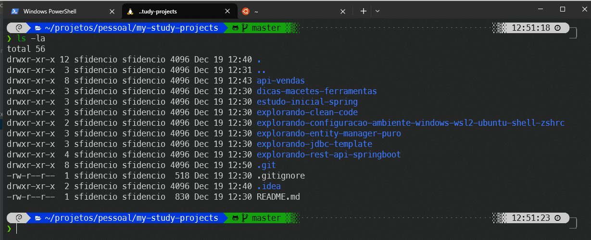

# explorando-configuracao-ambiente-wsl2-ubuntu-shell-zshrc
>[!IMPORTANT]
>Dicas sobre configuração do ambiente de desenvolvimento utilizando WSL2 + Linux/Ubuntu/Debian + GIT + shell -> zshrc

>[!TIP]
> Lista de artigos:

  - https://www.baeldung.com/linux/bash-prompt-git
    - Configuração simples do bash for linux para assumir o prompt git. 
  - https://github.com/deanbot/easy-wsl-oh-my-zsh-p10k
    - Este tutorial de instalação do zsh/oh-my-zsh-p10k, é o mais importante a ser seguido, pois da uma explicada de forma resumida como instalar o WSL2, e sobretudo a instalação e configuração do `Windows Terminal`. **(Recomendado)**
    - Instalação do `Windows Terminal`, que permite utilizar várias abas com diferentes interpretadores
    - Detalha a configuração via JSON do `Windows Terminal`, instalação da fonte apropriada para que o pacote de icones do tema `powerlevel10k` funcione corretamente.
  - https://github.com/codeedu/wsl2-docker-quickstart
    - Este explica sobre a instalação do Docker no WSL2, e aborda sobre a configuração do `Windows Terminal` também.
  - https://medium.com/@gutoinfo.ribeiro/instalando-e-configurando-o-zsh-no-ubuntu-20-04-4ef8a2499ed5
    - Utilize este tutorial como guia para instalação do zshrc, apenas se tiver problemas com o primeiro tutorial, mas lembre-se, este aqui só irá abordar a instalação e configuração do zshrc no Linux.
  - Configuração ajustada para o `MacOS`
    - https://v-char.medium.com/now-let-customize-your-native-macos-terminal-with-oh-my-zsh-and-powerlevel10k-b48b9c30d39f 

>[!WARNING]
>Resumindo, não existe uma único tutorial que resolva todos os problemas, veja o que melhor te atende, seguindo as dicas acima.

>[!TIP]
> O docker foi feito precipuamente e otimizado para executar no `Linux`, contudo a microsoft desenvolveu o `WSL(Windows Linux Subsystem)`, afim de facilitar a vida dos desenvolvedores que queriam continuar utilizando `Windows`, além de usar também o `Linux` para o desenvolvimento de aplicações, e poderem executar o `Docker` e suas ferramentas com uma performance mais elevada, foi ai que a microsoft resolveu o problema do `WSL(v1)`, que tinha baixa performance, e não integração total com `Docker`, acrescentou elementos de virtualização(`HyperVi`), permitindo o uso pleno do kernel do linux estando rodando na instância WSL2, e também vale ressaltar que o MacOS roda o docker, porém virtualizado, ou seja, ele cria uam `VM` por baixo dos panos, não rodando tão nativo, quanto `Linux`, e em segundo Windows com `WSL(v2)`.

>[!TIP]
>Tecla de atalho na autosugestão:
> - https://github.com/zsh-users/zsh-autosuggestions/issues/532
> - https://stackoverflow.com/questions/60087520/changing-the-acceptance-key-autosuggest-accept-zsh-shell-on-mac

>

>[!TIP]
>Realizando backup de uma VM do `WSL`, observe que nesse tutorial, é exemplificado o uso do "tar", no entanto, é possível gerar o backup no formato de disco do HyperVI, ou vhdx.
>Usado para backup de VMs do `WSL`, formato de disco `tar` ou `vhdx`.:

>O nome da distribuição pode ser obtido com o comando:
> `wsl --list --verbose`

>Exportando a VM, na hora de exportar, informe o nome da distribuição:

>`wsl --export Ubuntu-22.04 backup.tar`
>ou
>`wsl --export Ubuntu-22.04 backup.vhdx --vhd`
>
>https://www.xda-developers.com/how-back-up-restore-wsl/

>[!CAUTION]
>Caso tenha problemas com a instalação do do tema powerlevel10k no `Debian`, poderá seguir a instalação diretamente na página do projeto aqui.

> + https://github.com/romkatv/powerlevel10k/blob/master/README.md#oh-my-zsh
> + https://beebom.com/how-install-zsh-and-oh-my-zsh-linux/

>[!TIP]
> + Não esquecer de habilitar o docker para subir no boot do Debian/Ubuntu. https://docs.docker.com/engine/install/linux-postinstall/ 
