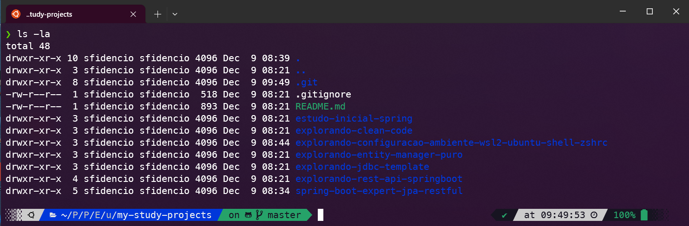

# 🚀 Explorando Configuração de Ambiente: WSL2 + Ubuntu + Shell + zshrc

> [!IMPORTANT]  
> 💡 **Dicas sobre configuração do ambiente de desenvolvimento utilizando WSL2 + Linux/Ubuntu/Debian + GIT + shell → zshrc**

---

## 📚 Lista de Artigos

- **Instalação do Oh My Zsh (atualizado):**  
  - [scottspence.com/posts/my-updated-zsh-config-2025](https://scottspence.com/posts/my-updated-zsh-config-2025)  
  - [spaceship-prompt.sh/getting-started/#Requirements](https://spaceship-prompt.sh/getting-started/#Requirements)
- **Instalação do Oh My Posh no PowerShell (Windows):**  
  - [ohmyposh.dev](https://ohmyposh.dev/)  
  - [Custom Prompt Setup - Microsoft Docs](https://learn.microsoft.com/pt-br/windows/terminal/tutorials/custom-prompt-setup)
- **Instalação WSL + ArchLinux:**  
  - [Configurando o ArchLinux no Windows com WSL 2](https://www.tabnews.com.br/dchueri/configurando-o-archlinux-no-windows-com-wsl-2)
- **Prompt Git no Bash Linux:**  
  - [baeldung.com/linux/bash-prompt-git](https://www.baeldung.com/linux/bash-prompt-git)
- **Tutorial Completo (Recomendado):**  
  - [easy-wsl-oh-my-zsh-p10k](https://github.com/deanbot/easy-wsl-oh-my-zsh-p10k)  
    - Explica instalação do WSL2, Windows Terminal, configuração via JSON, instalação de fontes para o tema powerlevel10k.
- **Instalação Docker no WSL2:**  
  - [wsl2-docker-quickstart](https://github.com/codeedu/wsl2-docker-quickstart)
- **Guia Alternativo para zshrc:**  
  - [Instalando e configurando o zsh no Ubuntu 20.04](https://medium.com/@gutoinfo.ribeiro/instalando-e-configurando-o-zsh-no-ubuntu-20-04-4ef8a2499ed5)
- **Configuração para MacOS:**  
  - [Customize seu terminal MacOS com Oh My Zsh e Powerlevel10k](https://v-char.medium.com/now-let-customize-your-native-macos-terminal-with-oh-my-zsh-and-powerlevel10k-b48b9c30d39f)
- **Instalação intellij WSL2**
  - https://jsonobject.hashnode.dev/how-to-install-intellij-idea-in-ubuntu-on-wsl-with-x410
  - https://dev.to/wesleyotio/configurando-wsl2-com-intellij-2pl7 

---

> [!WARNING]  
> ⚠️ **Não existe um único tutorial que resolva todos os problemas!**  
> Veja o que melhor te atende, seguindo as dicas acima.

---

## 🐳 Docker & WSL2

> [!TIP]  
> O Docker foi otimizado para Linux. O WSL2 permite rodar Docker no Windows com performance quase nativa, graças à virtualização (Hyper-V).  
> No MacOS, o Docker roda em uma VM, não tão nativo quanto no Linux ou Windows com WSL2.

---

## ⌨️ Atalhos e Autosugestão no Zsh

- [zsh-autosuggestions: Issue 532](https://github.com/zsh-users/zsh-autosuggestions/issues/532)
- [StackOverflow: Changing the acceptance key](https://stackoverflow.com/questions/60087520/changing-the-acceptance-key-autosuggest-accept-zsh-shell-on-mac)

---



---

## 💾 Backup de VM WSL

> [!TIP]  
> Para backup de VMs do WSL, use `tar` ou `vhdx`.  
> O nome da distribuição pode ser obtido com:  
> ```sh
> wsl --list --verbose
> ```
> Exportando a VM:  
> ```sh
> wsl --export Ubuntu-22.04 backup.tar
> # ou
> wsl --export Ubuntu-22.04 backup.vhdx --vhd
> ```
> [Como fazer backup e restore do WSL](https://www.xda-developers.com/how-back-up-restore-wsl/)

---

## 🎨 Problemas com Powerlevel10k no Debian?

- [Powerlevel10k README](https://github.com/romkatv/powerlevel10k/blob/master/README.md#oh-my-zsh)
- [Como instalar Zsh e Oh My Zsh no Linux](https://beebom.com/how-install-zsh-and-oh-my-zsh-linux/)

---

## ⚙️ Dicas Extras

- [Habilitar Docker no boot do Debian/Ubuntu](https://docs.docker.com/engine/install/linux-postinstall/)
- [Montando ambiente de desenvolvimento com WSL2 + Linux (FullCycle)](https://github.com/codeedu/wsl2-docker-quickstart)

---
