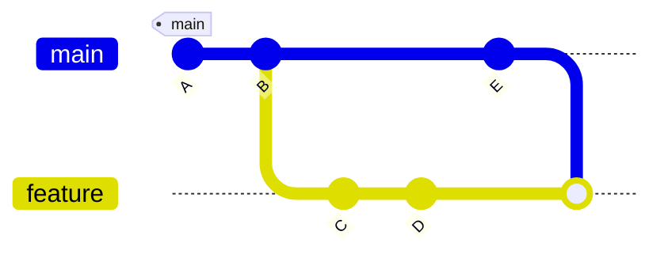
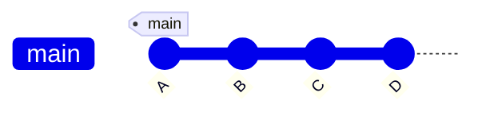
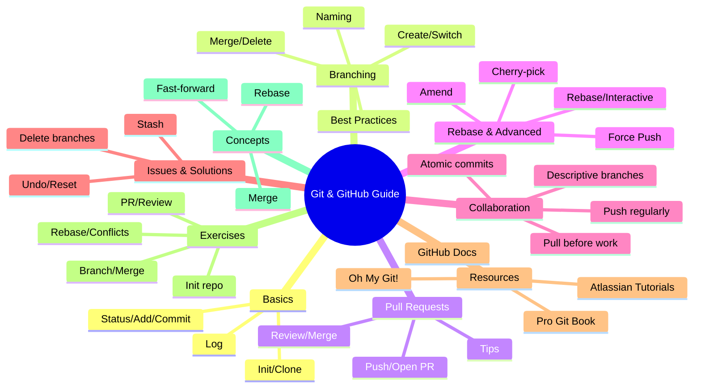

# 🟦 Git & GitHub Complete Guide

Welcome to your all-in-one guide for mastering **Git** and **GitHub**!  
This guide covers everything from basic commands to advanced workflows, with practical examples, tips, and best practices. 🚀

---

## 📋 Summary

- [Introduction](#introduction)
- [Git Basics](#git-basics)
- [Branching & Merging](#branching--merging)
- [Pull Requests & Code Review](#pull-requests--code-review)
- [Rebase & Advanced Workflows](#rebase--advanced-workflows)
- [Collaboration Tips](#collaboration-tips)
- [Common Issues & Solutions](#common-issues--solutions)
- [Recommended Resources](#recommended-resources)
- [Practice Exercises](#practice-exercises)

---

## 🏁 Introduction

**Git** is a distributed version control system for tracking changes in source code.  
**GitHub** is a platform for hosting and collaborating on Git repositories.

---

## 🟢 Git Basics

- Initialize a repository:  
  `git init`
- Clone a repository:  
  `git clone <url>`
- Check status:  
  `git status`
- Stage changes:  
  `git add <file>`
- Commit changes:  
  `git commit -m "message"`
- View history:  
  `git log`

**Example:**
```bash
git init
git add README.md
git commit -m "Initial commit"
```

---

## 🌿 Branching & Merging

- Create a branch:  
  `git branch feature-x`
- Switch branches:  
  `git checkout feature-x` or `git switch feature-x`
- Create & switch:  
  `git checkout -b feature-x`
- List branches:  
  `git branch` (local), `git branch -r` (remote), `git branch -a` (all)
- Rename a branch:  
  `git branch -m new-name`
- Merge branches:  
  `git checkout main && git merge feature-x`
- Delete branch:  
  `git branch -d feature-x` (safe), `git branch -D feature-x` (force)
- Push branch to remote:  
  `git push origin feature-x`
- Track remote branch:  
  `git checkout --track origin/feature-x`
- Delete remote branch:  
  `git push origin --delete feature-x`
- See merge history:  
  `git log --oneline --graph --all --decorate`

**Example:**
```bash
git checkout -b bugfix/login
# ...make changes...
git add .
git commit -m "Fix login bug"
git push origin bugfix/login
git checkout main
git pull origin main
git merge bugfix/login
git branch -d bugfix/login
git push origin --delete bugfix/login
```

**Best Practices:**
- Use descriptive branch names (`feature/login-form`, `bugfix/navbar`, `hotfix/security-patch`)
- Always pull latest changes before starting a new branch:  
  `git checkout main && git pull origin main`
- Keep branches focused on a single purpose (atomic changes)
- Delete merged branches locally and remotely to keep repo clean
- Avoid long-lived branches to reduce merge conflicts

---

## 🔄 Pull Requests & Code Review

- Push branch to GitHub:  
  `git push origin feature-x`
- Open a Pull Request (PR) on GitHub
- Request reviews, discuss, and resolve comments
- Merge PR after approval
- Update PR with latest main:  
  `git fetch origin && git rebase origin/main` (then force-push if needed)
- Close PR if not needed:  
  Use GitHub UI or `git push origin --delete branch-name`

**Tips:**
- Write clear PR titles and detailed descriptions
- Reference issues (e.g., `Fixes #42`)
- Use small, focused PRs for easier review
- Address all review comments before merging
- Use draft PRs for work in progress
- Prefer "Squash and Merge" for a clean history

---

## 🌀 Rebase & Advanced Workflows

- Rebase your branch onto main:  
  `git fetch origin && git rebase origin/main`
- Interactive rebase (squash, edit, reorder):  
  `git rebase -i HEAD~N`
- Abort a rebase:  
  `git rebase --abort`
- Continue after conflict:  
  `git add . && git rebase --continue`
- Force push after rebase:  
  `git push --force-with-lease`
- Cherry-pick a commit:  
  `git cherry-pick <commit-hash>`
- Amend last commit:  
  `git commit --amend`

**Best Practices:**
- Use rebase to keep history linear and clean
- Never rebase shared/public branches
- Always use `--force-with-lease` instead of `--force` to avoid overwriting others' work
- Communicate with your team before rewriting history

---

## 🤝 Collaboration Tips

- Pull latest changes before starting work:  
  `git pull origin main`
- Use descriptive branch names (`feature/`, `bugfix/`, `hotfix/`)
- Keep commits atomic and meaningful
- Regularly push your work

---

## 🛠️ Common Issues & Solutions

- **Undo last commit (keep changes):**  
  `git reset --soft HEAD~1`  
  *Moves the HEAD pointer to the previous commit (`HEAD~1`), but keeps all your changes staged (in the index).  
  - `reset`: The command to move HEAD and optionally modify the index and working directory.  
  - `--soft`: Only moves HEAD; the index and working directory are not changed.  
  - `HEAD~1`: Refers to the commit before the current HEAD (the last commit).*

- **Undo last commit (discard changes):**  
  `git reset --hard HEAD~1`  
  *Moves HEAD to the previous commit and discards all changes in the index and working directory.  
  - `--hard`: Resets HEAD, index, and working directory to match the target commit.  
  - All uncommitted changes are lost.*

- **Undo last commit (unstage changes, keep files):**  
  `git reset --mixed HEAD~1`  
  *Moves HEAD to the previous commit and resets the index (unstages changes), but keeps your working directory files unchanged.  
  - `--mixed`: The default; resets HEAD and index, but not the working directory.  
  - Useful if you want to edit or recommit the changes.*

- **Stash changes:**  
  `git stash` / `git stash pop`  
  *Temporarily saves (stashes) your uncommitted changes so you can work on something else, then restores them later.  
  - `stash`: Saves changes in tracked files to a new stash entry and reverts working directory to the last commit.  
  - `stash pop`: Applies the most recent stash and removes it from the stash list.*

- **See remote branches:**  
  `git branch -r`  
  *Lists all remote-tracking branches.  
  - `-r`: Shows only remote branches (those fetched from remotes like `origin`).*

- **Delete remote branch:**  
  `git push origin --delete branch-name`  
  *Deletes a branch from the remote repository.  
  - `push`: Sends changes to a remote repository.  
  - `origin`: The name of the remote (default for most repos).  
  - `--delete branch-name`: Instructs Git to delete the specified branch on the remote.*

---

## 📚 Recommended Resources

- [Pro Git Book](https://git-scm.com/book/en/v2)
- [GitHub Docs](https://docs.github.com/)
- [Atlassian Git Tutorials](https://www.atlassian.com/git/tutorials)
- [Oh My Git! (Game)](https://ohmygit.org/)

---

## 📝 Practice Exercises

1. **[Easy]** Initialize a new Git repository and make your first commit.
2. **[Easy]** Create a new branch, make a change, and merge it back to main.
3. **[Medium]** Open a Pull Request on GitHub and request a review.
4. **[Medium]** Rebase your feature branch onto the latest main and resolve any conflicts.
5. **[Hard]** Squash multiple commits into one before merging.
6. **[Expert]** Recover from a merge conflict and explain your steps.

---

## 🔍 Rebase vs Merge vs Fast-forward

Understanding the difference between **merge**, **rebase**, and **fast-forward** is key to mastering Git workflows.

### 🔀 Merge

- Combines histories of two branches, creating a new "merge commit".
- Preserves the exact history and context of both branches.
- Useful for preserving the context of feature integration.

### 🔁 Rebase

- Moves or "replays" your branch commits on top of another branch (usually `main`).
- Creates a linear history, as if your work was done after the latest changes on the target branch.
- Makes history cleaner but rewrites commit hashes.

### ⏩ Fast-forward

- Happens when the target branch has not diverged from the source branch.
- Git simply moves the branch pointer forward—no new commit is created.

---

### 🌳 Visualizing with Mermaid


**Merge:**  
- After merging, history shows both branches and a merge commit.


**Rebase:**  
- After rebasing, feature branch commits are replayed on top of main, resulting in a linear history.


**Fast-forward:**  
- If no new commits on main, merging feature is a fast-forward: main pointer moves ahead.

---

**Summary Table**

| Operation      | Commit History         | Merge Commit | Use Case                        |
|----------------|-----------------------|--------------|---------------------------------|
| Merge          | Non-linear (branches) | Yes          | Preserve context, team merges   |
| Rebase         | Linear                | No           | Clean history, solo work        |
| Fast-forward   | Linear                | No           | No divergence, simple updates   |

---

## 🧩 Mixed Strategies & Best Practices

### Mixed Strategies

- Sometimes teams use a mix of merge and rebase:
  - **Feature branches:** Use `rebase` to keep history linear and up-to-date with `main`.
  - **Integration to main:** Use `merge` (with merge commit) to preserve context of when features were integrated.
- This approach combines clean feature history with clear integration points.

### Other Best Practices

- **Always communicate** before rewriting history (rebasing or force-pushing).
- **Protect main/master branches** with branch protection rules (require PRs, reviews, CI).
- **Use draft PRs** for work in progress.
- **Prefer squash merges** for small, focused features to keep history tidy.
- **Document your workflow** in a CONTRIBUTING.md file for team consistency.
- **Automate checks** (CI/CD) to catch issues before merging.
- **Review commit messages** for clarity and context.

---

## 🧠 Mind Map: Git & GitHub Complete Guide

- **Git & GitHub**
  - Distributed version control
  - Collaboration platform
- **Git Basics**
  - `git init`, `git clone`, `git status`, `git add`, `git commit`, `git log`
- **Branching & Merging**
  - Create/switch/merge/delete branches
  - Naming conventions
  - Best practices (atomic, short-lived branches)
- **Pull Requests & Code Review**
  - Push branch, open PR, review, merge
  - Tips: clear titles, reference issues, squash & merge
- **Rebase & Advanced Workflows**
  - `git rebase`, interactive rebase, cherry-pick, amend
  - Use rebase for linear history
  - Never rebase shared branches
- **Collaboration Tips**
  - Pull before work, descriptive branches, atomic commits, push regularly
- **Common Issues & Solutions**
  - Undo/reset (`--soft`, `--mixed`, `--hard`)
  - Stash, delete branches
- **Recommended Resources**
  - Pro Git Book, GitHub Docs, Atlassian Tutorials, Oh My Git!
- **Practice Exercises**
  - Init repo, branch/merge, PR, rebase, squash, resolve conflicts
- **Rebase vs Merge vs Fast-forward**
  - Merge: non-linear, merge commit
  - Rebase: linear, no merge commit
  - Fast-forward: linear, pointer moves
- **Visualization**
  - Mermaid diagrams for merge, rebase, fast-forward
- **Summary Table**
  - Operation, history, merge commit, use case



---

Happy collaborating! 💙

[🔙 Back ](../README.md)

---