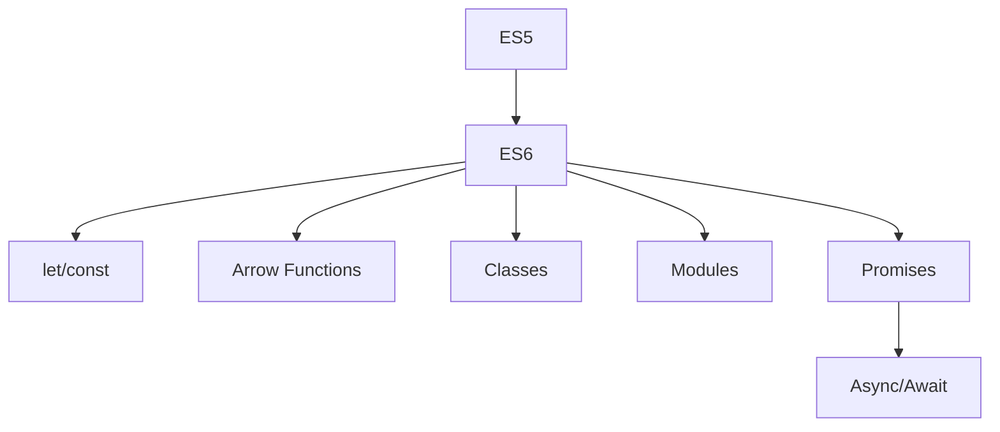

# 🟦 JavaScript (ES6+)

## 📑 Summary

- [Overview](#-overview)
- [Variables](#-variables)
- [Functions](#-functions)
- [Arrow Functions](#️-arrow-functions)
- [Classes](#️-classes)
- [Modules](#-modules)
- [Promises](#-promises)
- [Async/Await](#-asyncawait)
- [Evolution Chart](#-evolution-chart)
- [Exercises](#-exercises)
- [References](#-references)

---

## 👀 Overview

ECMAScript 2015 (ES6) brought major improvements to JavaScript, making it more powerful, readable, and modular.

---

## 📝 Variables

- `let`, `const`, and `var` for variable declaration. Prefer `let` and `const`.

```js
// let: value can be changed
let age = 25;
age = 26;

// const: value cannot be reassigned
const name = "Maria";
// name = "João"; // Error

// var: function scope (avoid using)
var city = "São Paulo";
```

---

## 🧑‍💻 Functions

- Traditional declaration and anonymous functions.

```js
// Traditional function
function sum(a, b) {
  return a + b;
}

// Anonymous function
const subtract = function(a, b) {
  return a - b;
};
```

---

## ➡️ Arrow Functions

- Short syntax for functions.
- Do not have their own `this`.

```js
// Basic arrow function
const multiply = (a, b) => a * b;

// With one parameter
const square = x => x * x;

// No parameter
const hello = () => console.log("Hello!");
```

---

## 🏛️ Classes

- Object-oriented syntax.
- Supports inheritance, methods, and constructors.

```js
class Animal {
  constructor(name) {
    this.name = name;
  }
  speak() {
    console.log(`${this.name} makes a noise.`);
  }
}

class Dog extends Animal {
  speak() {
    console.log(`${this.name} barks.`);
  }
}

const rex = new Dog("Rex");
rex.speak(); // Rex barks.
```

---

## 📦 Modules

- `import` and `export` for code modularization.

```js
// file: math.js
export function sum(a, b) {
  return a + b;
}

// file: app.js
import { sum } from './math.js';
console.log(sum(2, 3)); // 5
```

---

## ⏳ Promises

- Makes working with async operations easier.
- Methods: `.then()`, `.catch()`, `.finally()`

```js
function fetchData() {
  return new Promise((resolve, reject) => {
    setTimeout(() => {
      resolve("Data received!");
    }, 1000);
  });
}

fetchData()
  .then(res => console.log(res))
  .catch(err => console.error(err))
  .finally(() => console.log("Finished!"));
```

---

## 💤 Async/Await

- Modern syntax for handling Promises.
- Allows writing async code in a more readable way.

```js
async function execute() {
  try {
    const result = await fetchData();
    console.log(result);
  } catch (error) {
    console.error(error);
  } finally {
    console.log("Finished!");
  }
}

execute();
```

---

## 📊 Evolution Chart



---

## 📝 Exercises

### 1. What is the difference between `let`, `const`, and `var`?  
<details>
  <summary>Answer</summary>
  <ul>
    <li><b>let</b>: block scope, can be reassigned.</li>
    <li><b>const</b>: block scope, cannot be reassigned.</li>
    <li><b>var</b>: function scope, can be reassigned (avoid using).</li>
  </ul>
</details>

---

### 2. Write an arrow function that returns double a number.  
<details>
  <summary>Answer</summary>

```js
const double = x => x * 2;
```
</details>

---

### 3. How to import and export functions using ES6 modules?  
<details>
  <summary>Answer</summary>

```js
// math.js
export function sum(a, b) { return a + b; }

// app.js
import { sum } from './math.js';
```
</details>

---

### 4. Explain the difference between Promises and async/await.  
<details>
  <summary>Answer</summary>
  <ul>
    <li>Promises use <code>.then()</code> and <code>.catch()</code> for async handling.</li>
    <li>async/await allows writing async code in a more sequential and readable way.</li>
  </ul>
</details>

---

### 5. Create a class `Person` with a `speak` method.  
<details>
  <summary>Answer</summary>

```js
class Person {
  constructor(name) {
    this.name = name;
  }
  speak() {
    console.log(`${this.name} is speaking.`);
  }
}
```
</details>

---

## 📚 References

- [MDN JavaScript Guide](https://developer.mozilla.org/en-US/docs/Web/JavaScript/Guide)
- [ES6 Features](https://github.com/lukehoban/es6features)
- [JavaScript.info](https://javascript.info/)

---

> [⬅️ Back](./README.md)
