# 🐳 Docker for Developers

## 📜 Table of Contents
- [Introduction](#-introduction)
- [Installation](#️-installation)
  - [Linux](#️-linux)
  - [Windows/Mac](#️-windowsmac)
  - [WSL Ubuntu](#-wsl-ubuntu)
- [Basic Commands](#-basic-commands)
- [Working with Images](#️-working-with-images)
- [Working with Containers](#️-working-with-containers)
- [Volumes](#-volumes)
- [Networks](#-networks)
- [Docker Compose](#️-docker-compose)
- [Dockerfile](#-dockerfile)
- [Docker Hub](#-docker-hub)
- [Health Check](#-health-check)
- [Load Balancer](#️-load-balancer)
- [Useful Shell Scripts](#️-useful-shell-scripts)
- [Advanced Use Cases](#-advanced-use-cases)
- [Important Alerts](#-important-alerts)
- [Conclusion](#-conclusion)

---

## 🚀 Introduction
Docker is a powerful platform for building, shipping, and running applications in containers. It enables developers to create consistent and scalable environments.

### ❓ What's containers?
Containers are **lightweight**, **standalone**, and **executable** packages that include everything needed to run a piece of software, including the code, runtime, system tools, libraries, and settings. They ensure that applications run consistently across different computing environments.

#### ✨ Characteristics of containers:
- 🛡️ **Isolated** from the host system and other containers  
  Each container runs in its own isolated environment, with its own filesystem, processes, and network stack.  
  *Example:* A web server container cannot access files or processes from a database container unless explicitly allowed via volumes or networks.

- ⚡ **Lightweight** and fast to start or stop  
  Containers share the host OS kernel, making them much lighter than virtual machines. They can start or stop in seconds.  
  *Example:* `docker run nginx` starts an Nginx server almost instantly, compared to booting a VM.

- 🚚 **Portable** across different environments and platforms  
  Containers encapsulate all dependencies, so they run the same way on any system with Docker or compatible runtime.  
  *Example:* A container built on a developer's laptop can be deployed unchanged to a cloud server.

- 📦 **Include all dependencies** required by the application  
  Everything the app needs (libraries, binaries, configs) is packaged inside the container image.  
  *Example:* A Python app container can include a specific Python version and all required pip packages.

- 💾 **Use less resources** compared to virtual machines  
  Containers are more efficient because they don't need a full OS per instance, reducing CPU and memory usage.  
  *Example:* You can run dozens of containers on a laptop, but only a few VMs.

- 📈 **Easily scalable and manageable**  
  Containers can be started, stopped, replicated, and orchestrated easily using tools like Docker Compose or Kubernetes.  
  *Example:* `docker-compose up --scale web=5` runs five instances of a web service for load balancing.

- 🧊 **Immutable by design**: containers are created from images and should not be changed after they start  
  Containers are intended to be stateless and reproducible; any change should be made by building a new image.  
  *Example:* To update an app, build a new image and redeploy the container, rather than modifying a running one.

---

#### 🐧 **Why is Linux important for containers and Docker?**
Most container technologies, including Docker, are built on Linux features such as namespaces and cgroups. Knowing Linux helps you:
- Understand how containers isolate resources and processes.
- Troubleshoot issues inside containers, since most images are based on Linux distributions.
- Use command-line tools and scripts to automate and manage containers efficiently.
- Work with volumes, permissions, and networking, which often require Linux knowledge.
- Take advantage of advanced features and optimize your container environments.

> Even if you use Docker on Windows or Mac, containers typically run on a Linux kernel behind the scenes. Learning basic Linux commands and concepts will make you much more effective with Docker and containers.

```mermaid
graph TD
    A[Container Characteristics] 
    A --> B1[🛡️ Isolated]
    B1 --> C1[Own filesystem, processes, network]
    A --> B2[⚡ Lightweight]
    B2 --> C2[Shares host OS kernel]
    A --> B3[🚚 Portable]
    B3 --> C3[Runs anywhere with Docker]
    A --> B4[📦 All Dependencies]
    B4 --> C4[Includes libs, binaries, configs]
    A --> B5[💾 Less Resources]
    B5 --> C5[No full OS per container]
    A --> B6[📈 Scalable & Manageable]
    B6 --> C6[Easy to orchestrate]
    A --> B7[🧊 Immutable]
    B7 --> C7[Rebuild for changes]
```

<!-- Mermaid diagram: Container Characteristics -->


> **Note:** Docker is developed and maintained by [Docker Inc.](https://www.docker.com/), a company founded in 2013 focused on containerization solutions for developers and enterprises.

---

## 🛠️ Installation

### 🖥️ Linux
1. **Update Packages**:
   ```bash
   sudo apt update
   ```
2. **Install Dependencies**:
   ```bash
   sudo apt install apt-transport-https ca-certificates curl software-properties-common
   ```
3. **Add Docker Repository**:
   ```bash
   curl -fsSL https://download.docker.com/linux/ubuntu/gpg | sudo gpg --dearmor -o /usr/share/keyrings/docker-archive-keyring.gpg
   echo "deb [arch=$(dpkg --print-architecture) signed-by=/usr/share/keyrings/docker-archive-keyring.gpg] https://download.docker.com/linux/ubuntu $(lsb_release -cs) stable" | sudo tee /etc/apt/sources.list.d/docker.list > /dev/null
   ```
4. **Install Docker**:
   ```bash
   sudo apt update
   sudo apt install docker-ce docker-ce-cli containerd.io
   ```
5. **Check Installation**:
   ```bash
   docker --version
   ```

### 🖥️ Windows/Mac
- [Docker Desktop](https://www.docker.com/products/docker-desktop)

### 🐧 WSL Ubuntu
1. **Enable WSL 2**:
   ```powershell
   wsl --install
   ```
2. **Install Docker on Ubuntu**:
   ```bash
   sudo apt update
   sudo apt install docker.io
   sudo usermod -aG docker $USER
   ```
3. **Configure Docker for WSL**:
   - Install [Docker Desktop](https://www.docker.com/products/docker-desktop) and enable WSL integration.
4. **Test Integration**:
   ```bash
   docker run hello-world
   ```

---

## 📦 Basic Commands
### 🐳 Start Docker
```bash
sudo systemctl start docker
```

### 🐳 Check Version
```bash
docker --version
```

### 🐳 List Active Containers
```bash
docker ps
```

### 🐳 List All Containers
```bash
docker ps -a
```

---

## 🖼️ Working with Images
### 🔍 List Images
```bash
docker images
```

### 📥 Pull Image
```bash
docker pull nginx
```

### 🗑️ Remove Image
```bash
docker rmi <image_id>
```

---

## 🛠️ Working with Containers
### ▶️ Start Container
```bash
docker run -d --name my_nginx -p 8080:80 nginx
```

### ⏹️ Stop Container
```bash
docker stop my_nginx
```

### 🔄 Restart Container
```bash
docker restart my_nginx
```

### 🗑️ Remove Container
```bash
docker rm my_nginx
```

---

## 💾 Volumes and Bind Mounts

Volumes and bind mounts are essential for managing data in Docker containers:

- 📦 **Volumes**
  - Managed by Docker and stored in a special part of the filesystem.
  - Best for persistent data you want Docker to manage (e.g., databases).
  - Easy to back up, restore, and share between containers.
  - **Example:**
    ```bash
    # Create a Docker-managed volume
    docker volume create my_volume
    # Run a container using the volume for persistent data
    docker run -d --name mydb -v my_volume:/var/lib/mysql mysql:8
    ```
    - This creates a volume called `my_volume` and mounts it to `/var/lib/mysql` inside the container. All database data is stored in the volume, surviving container removal.

    ```mermaid
    graph LR
      A[Host] -- my_volume --> B[(Docker Volume)] -- /var/lib/mysql --> C[MySQL Container]
    ```

- 🔗 **Bind Mounts**
  - Link a specific file or directory from your host into the container.
  - Great for development: changes on your machine instantly appear in the container.
  - **Example:**
    ```bash
    # Mount the current directory's app folder into the container
    docker run -it --rm -v $(pwd)/app:/usr/src/app node:18 bash
    ```
    - This mounts your local `./app` folder to `/usr/src/app` in the container. Any code changes on your host are immediately visible inside the container—perfect for live development.

### 🚦 When to Use Each?
- Use **volumes** for production data and when you want Docker to manage storage.
- Use **bind mounts** for local development, sharing source code, or quick testing.

> Both methods allow you to persist and share data, but volumes are safer and more portable for production, while bind mounts are flexible for development.

---

## 🌐 Networks
### Create Network
```bash
docker network create my_network
```

### Connect Container to Network
```bash
docker network connect my_network my_nginx
```

---

## 🛠️ Docker Compose
### 📝 Example `docker-compose.yml`
```yaml
version: '3.8'
services:
  web:
    image: nginx
    ports:
      - "8080:80"
    volumes:
      - ./html:/usr/share/nginx/html
  db:
    image: postgres
    environment:
      POSTGRES_USER: user
      POSTGRES_PASSWORD: password
```

### ▶️ Compose Commands
```bash
docker-compose up -d
docker-compose down
```

---

## 📝 Dockerfile
### Example Dockerfile
```dockerfile
FROM node:14
WORKDIR /app
COPY package.json .
RUN npm install
COPY . .
CMD ["npm", "start"]
EXPOSE 3000
```

### Build and Run
```bash
docker build -t my_node_app .
docker run -p 3000:3000 my_node_app
```

---

## 🌐 Docker Hub
### Login
```bash
docker login
```

### Push Image
```bash
docker tag my_image username/my_image
docker push username/my_image
```

---

## 🩺 Health Check
### Add Health Check in Dockerfile
```dockerfile
HEALTHCHECK --interval=30s --timeout=10s \
  CMD curl -f http://localhost:80 || exit 1
```

---

## ⚖️ Load Balancer
### Using Docker Compose
```yaml
services:
  web:
    image: nginx
    deploy:
      replicas: 3
      update_config:
        parallelism: 2
      restart_policy:
        condition: on-failure
```

---

## 🛠️ Useful Shell Scripts

### 🗑️ Remove All Images and Containers
Use the script below to safely clean up unused images and containers:
```bash
#!/bin/bash
# Remove all stopped containers
docker container prune -f

# Remove all unused images
docker image prune -a -f

# Remove unused volumes
docker volume prune -f

# Remove unused networks
docker network prune -f

echo "🧹 Cleanup completed successfully!"
```

### 🗑️ Remove Specific Containers and Images
```bash
#!/bin/bash
# Remove specific containers
docker rm -f container1 container2 container3

# Remove specific images
docker rmi -f image1 image2 image3

echo "🧹 Containers and images removed successfully!"
```

### 🗑️ Remove Images Based on Docker Output
Use the script below to remove unused images listed by `docker images`:
```bash
#!/bin/bash
# Remove all unused images
for IMAGE_ID in $(docker images -q); do
  docker rmi -f "$IMAGE_ID" && echo "🗑️ Image $IMAGE_ID removed successfully!"
done

echo "🧹 All listed images have been removed!"
```

### 🗑️ Remove Containers Based on Docker Output
Use the script below to remove stopped containers listed by `docker ps -a`:
```bash
#!/bin/bash
# Remove all stopped containers
for CONTAINER_ID in $(docker ps -aq); do
  docker rm -f "$CONTAINER_ID" && echo "🗑️ Container $CONTAINER_ID removed successfully!"
done

echo "🧹 All listed containers have been removed!"
```

### 🛠️ Best Practices
- **⚠️ Always review containers and images before removing them.**
  ```bash
  docker ps -a
  docker images
  ```
- **⚠️ Use `docker system df` to check disk usage before running cleanup scripts.**
- **⚠️ Automate scripts with cron jobs to keep your environment clean.**
- **⚠️ Use scripts with loops to automate repetitive tasks.**
```bash
docker system df
```

--- 

## 🛠️ Advanced Use Cases

### 🏗️ Multi-Stage Builds
Use multi-stage builds to create optimized and lightweight images:
```dockerfile
# Stage 1: Build
FROM node:14 AS builder
WORKDIR /app
COPY package.json .
RUN npm install
COPY . .
RUN npm run build

# Stage 2: Production
FROM nginx:alpine
COPY --from=builder /app/build /usr/share/nginx/html
EXPOSE 80
CMD ["nginx", "-g", "daemon off;"]
```
**Commands**:
```bash
docker build -t my_optimized_app .
docker run -p 8080:80 my_optimized_app
```

---

### 🛠️ Docker Compose with Integrated Services
Example configuration with multiple services:
```yaml
version: '3.8'
services:
  web:
    image: nginx
    ports:
      - "8080:80"
    volumes:
      - ./html:/usr/share/nginx/html
    depends_on:
      - app
  app:
    build:
      context: ./app
      dockerfile: Dockerfile
    environment:
      - NODE_ENV=production
  db:
    image: postgres
    environment:
      POSTGRES_USER: user
      POSTGRES_PASSWORD: password
      POSTGRES_DB: mydb
    volumes:
      - db_data:/var/lib/postgresql/data
volumes:
  db_data:
```
**Commands**:
```bash
docker-compose up -d
docker-compose logs -f
docker-compose down --volumes
```

---

### 🌐 Reverse Proxy Configuration with Nginx
Use Nginx as a reverse proxy for multiple services:
```yaml
version: '3.8'
services:
  reverse-proxy:
    image: nginx
    ports:
      - "80:80"
    volumes:
      - ./nginx.conf:/etc/nginx/nginx.conf
  app1:
    image: my_app1
    environment:
      - PORT=3000
  app2:
    image: my_app2
    environment:
      - PORT=4000
```
**Example `nginx.conf`**:
```nginx
http {
  server {
    listen 80;
    location /app1 {
      proxy_pass http://app1:3000;
    }
    location /app2 {
      proxy_pass http://app2:4000;
    }
  }
}
```

---

### 🩺 Advanced Health Check
Add health checks to monitor services:
```dockerfile
HEALTHCHECK --interval=10s --timeout=5s --retries=3 \
  CMD curl -f http://localhost:3000/health || exit 1
```

---

### ⚖️ Load Balancer with Docker Swarm
Set up a load balancer with replicas:
```bash
docker swarm init
docker service create --name web --replicas 3 -p 8080:80 nginx
```
Check services:
```bash
docker service ls
docker service ps web
```

---

## ⚠️ Important Alerts
- **⚠️ Always keep Docker updated to avoid vulnerabilities.**
- **⚠️ Do not expose unnecessary ports to the public.**
- **⚠️ Use official or trusted images.**
- **⚠️ Monitor resource usage to avoid overload.**

---

## 🎯 Conclusion
Docker is an essential tool for developers and DevOps teams, enabling consistent, scalable, and easy-to-manage environments. Explore its features to maximize your productivity!

[🔙 Back ](../README.md)
