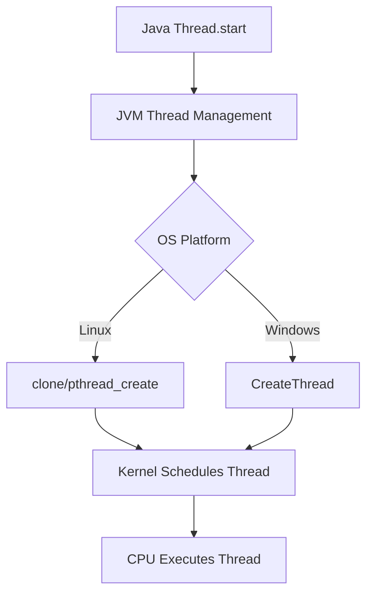
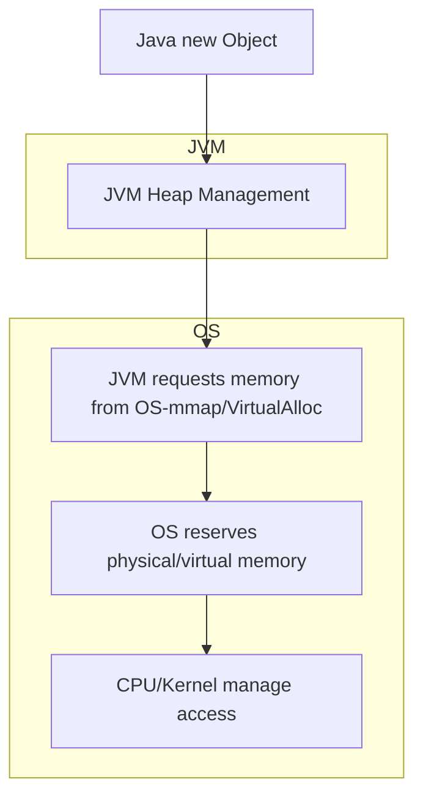

# 🐧 Linux Guide for DevOps

## 📋 Table of Contents
- [Introduction](#introduction)
- [Essential Commands](#essential-commands)
- [User and Permission Management](#user-and-permission-management)
- [Process Management](#process-management)
- [Package Management](#package-management)
- [Services and Daemons](#services-and-daemons)
- [Networking and Security](#networking-and-security)
- [Shell Scripting and Automation](#shell-scripting-and-automation)
- [Logs and Monitoring](#logs-and-monitoring)
- [Tips and Best Practices](#tips-and-best-practices)
- [Useful Links](#useful-links)
- [Advanced OS Topics](#-advanced-os-topics)

---

## 🚀 Introduction

Linux is the most used OS in server, cloud, and DevOps automation environments. Mastering Linux is essential for any DevOps professional.

---

## 💻 Essential Commands

- `ls` - List directory contents.
- `cd` - Change the current directory.
- `pwd` - Print the current working directory.
- `cp` - Copy files and directories.
- `mv` - Move or rename files and directories.
- `rm` - Remove files or directories.
- `mkdir` - Create new directories.
- `rmdir` - Remove empty directories.
- `cat` - Concatenate and display file contents.
- `less` - View file contents one page at a time.
- `more` - View file contents (similar to `less`).
- `head` - Display the first lines of a file.
- `tail` - Display the last lines of a file.
- `find` - Search for files and directories.
- `grep` - Search text using patterns.
- `awk` - Pattern scanning and processing language.
- `sed` - Stream editor for filtering and transforming text.
- `chmod` - Change file or directory permissions.
- `chown` - Change file or directory owner and group.
- `chgrp` - Change group ownership.
- `tar` - Archive files.
- `gzip` - Compress files.
- `zip` - Package and compress files.
- `unzip` - Extract compressed zip files.
- `df` - Report disk space usage.
- `du` - Estimate file and directory space usage.
- `free` - Display memory usage.
- `top` - Display running processes and resource usage.
- `htop` - Interactive process viewer (enhanced `top`).
- `ps` - Report a snapshot of current processes.
- `kill` - Send signals to processes (usually to terminate).
- `pkill` - Kill processes by name.
- `jobs` - List active jobs in the current shell.
- `bg` - Resume a job in the background.
- `fg` - Bring a background job to the foreground.

---

### 🧑‍💻 Common Usage Examples

#### 📂 Directory and File Management

- `ls`  
  List files in the current directory:
  ```sh
  ls -l
  ```
  **Output:**
  ```
  -rw-r--r-- 1 user user   0 Jun  1 10:00 file.txt
  drwxr-xr-x 2 user user 4096 Jun  1 10:00 folder
  ```
  Other options:
  ```sh
  ls -a        # Show hidden files
  ls -lh       # Human-readable sizes
  ```

- `cd`  
  Change to the /var/log directory:
  ```sh
  cd /var/log
  ```
  **Output:** (no output if successful, just changes directory)

- `pwd`  
  Show current directory:
  ```sh
  pwd
  ```
  **Output:**
  ```
  /home/user
  ```

- `cp`  
  Copy file.txt to backup.txt:
  ```sh
  cp file.txt backup.txt
  ```
  **Output:** (no output if successful)
  Other options:
  ```sh
  cp -r dir1 dir2   # Copy directories recursively
  cp -v file1 file2 # Verbose output
  ```

- `mv`  
  Rename or move a file:
  ```sh
  mv oldname.txt newname.txt
  ```
  **Output:** (no output if successful)
  Other options:
  ```sh
  mv file.txt /tmp/   # Move file to /tmp/
  mv -v a.txt b.txt   # Verbose output
  ```

- `rm`  
  Remove a file:
  ```sh
  rm unwanted.txt
  ```
  **Output:** (no output if successful)
  Other options:
  ```sh
  rm -r folder/   # Remove directory recursively
  rm -f file.txt  # Force remove
  ```

- `mkdir`  
  Create a new directory:
  ```sh
  mkdir new_folder
  ```
  **Output:** (no output if successful)
  Other options:
  ```sh
  mkdir -p a/b/c  # Create nested directories
  ```

- `rmdir`  
  Remove an empty directory:
  ```sh
  rmdir old_folder
  ```
  **Output:** (no output if successful)
  Other options:
  ```sh
  rmdir -v old_folder  # Verbose output
  ```

#### 📖 Viewing and Searching Files

- `cat`  
  Show contents of a file:
  ```sh
  cat notes.txt
  ```
  **Output:**
  ```
  Meeting notes:
  - Discuss project timeline
  - Assign tasks
  ```
- `less`  
  View a file page by page:
  ```sh
  less bigfile.log
  ```
  **Output:** (interactive pager, use `q` to quit)
- `more`  
  Another pager:
  ```sh
  more bigfile.log
  ```
  **Output:** (interactive pager, use `q` to quit)
- `head`  
  Show first 10 lines:
  ```sh
  head file.txt
  ```
  **Output:**
  ```
  Line 1
  Line 2
  ...
  Line 10
  ```
  Other options:
  ```sh
  head -n 5 file.txt  # Show first 5 lines
  ```
- `tail`  
  Show last 10 lines:
  ```sh
  tail file.txt
  ```
  **Output:**
  ```
  ...
  Line 91
  Line 92
  Line 93
  Line 94
  Line 95
  Line 96
  Line 97
  Line 98
  Line 99
  Line 100
  ```
  Other options:
  ```sh
  tail -f app.log  # Follow new lines as file grows (live log)
  ```
- `find`  
  Find all .log files in /var/log:
  ```sh
  find /var/log -name "*.log"
  ```
  **Output:**
  ```
  /var/log/syslog.log
  /var/log/app.log
  ```
  Other options:
  ```sh
  find . -type d    # Find directories
  find . -size +1M  # Files larger than 1MB
  ```
- `grep`  
  Search for "error" in a file:
  ```sh
  grep "error" app.log
  ```
  **Output:**
  ```
  [2024-06-01 10:00] error: failed to connect
  ```
  Other options:
  ```sh
  grep -i "error" app.log   # Case-insensitive
  grep -r "TODO" .          # Recursive search
  ```
- `awk`  
  Print the second column of a CSV:
  ```sh
  awk -F, '{print $2}' data.csv
  ```
  **Output:**
  ```
  Name
  Alice
  Bob
  ```
  Other options:
  ```sh
  awk '{print $1, $3}' file.txt  # Print 1st and 3rd columns
  ```
- `sed`  
  Replace "foo" with "bar" in a file:
  ```sh
  sed 's/foo/bar/g' file.txt
  ```
  **Output:** (prints modified lines to stdout)
  Other options:
  ```sh
  sed -i 's/foo/bar/g' file.txt  # Edit file in place
  ```

#### 🔒 Permissions and Ownership

- `chmod`  
  Make a script executable:
  ```sh
  chmod +x script.sh
  ```
  **Output:** (no output if successful)
  Other options:
  ```sh
  chmod 644 file.txt   # Set permissions to rw-r--r--
  chmod -R 755 dir/    # Recursive
  ```
- `chown`  
  Change owner to user "alice":
  ```sh
  chown alice file.txt
  ```
  **Output:** (no output if successful)
  Other options:
  ```sh
  chown alice:devs file.txt  # Change owner and group
  ```
- `chgrp`  
  Change group to "devs":
  ```sh
  chgrp devs file.txt
  ```
  **Output:** (no output if successful)

#### 📦 Archiving and Compression

- `tar`  
  Create a tar archive:
  ```sh
  tar -cvf archive.tar folder/
  ```
  **Output:**
  ```
  folder/
  folder/file1.txt
  folder/file2.txt
  ```
  Other options:
  ```sh
  tar -xvf archive.tar      # Extract
  tar -czvf archive.tar.gz folder/  # Create gzipped tar
  ```
- `gzip`  
  Compress a file:
  ```sh
  gzip file.txt
  ```
  **Output:** (file.txt becomes file.txt.gz)
  Other options:
  ```sh
  gzip -d file.txt.gz  # Decompress
  ```
- `zip`  
  Create a zip archive:
  ```sh
  zip archive.zip file1.txt file2.txt
  ```
  **Output:**
  ```
  adding: file1.txt (deflated 12%)
  adding: file2.txt (deflated 10%)
  ```
  Other options:
  ```sh
  unzip -l archive.zip  # List contents
  ```
- `unzip`  
  Extract a zip file:
  ```sh
  unzip archive.zip
  ```
  **Output:**
  ```
  extracting: file1.txt
  extracting: file2.txt
  ```

#### 💾 Disk and Memory

- `df`  
  Show disk usage:
  ```sh
  df -h
  ```
  **Output:**
  ```
  Filesystem      Size  Used Avail Use% Mounted on
  /dev/sda1        50G   20G   28G  42% /
  ```
- `du`  
  Show size of a directory:
  ```sh
  du -sh /home/user
  ```
  **Output:**
  ```
  2.1G    /home/user
  ```
- `free`  
  Show memory usage:
  ```sh
  free -m
  ```
  **Output:**
  ```
                total        used        free      shared  buff/cache   available
  Mem:           7972        3120        1200         150        3652        4300
  Swap:          2047           0        2047
  ```

#### 🖥️ Processes and Jobs

- `top`  
  Interactive process viewer:
  ```sh
  top
  ```
  **Output:** (interactive, shows CPU/memory usage, press `q` to quit)
- `htop`  
  Enhanced process viewer (if installed):
  ```sh
  htop
  ```
  **Output:** (interactive, colorized, press `F10` to quit)
- `ps`  
  List running processes:
  ```sh
  ps aux
  ```
  **Output:**
  ```
  USER       PID %CPU %MEM    VSZ   RSS TTY      STAT START   TIME COMMAND
  root         1  0.0  0.1  22560  4100 ?        Ss   10:00   0:01 /sbin/init
  user      1234  0.1  0.2  50000  8000 pts/0    S+   10:01   0:00 bash
  ```
  Other options:
  ```sh
  ps -ef    # Alternate format
  ```
- `kill`  
  Kill process with PID 1234:
  ```sh
  kill 1234
  ```
  **Output:** (no output if successful)
  Other options:
  ```sh
  kill -9 1234  # Force kill
  ```
- `pkill`  
  Kill all processes named "firefox":
  ```sh
  pkill firefox
  ```
  **Output:** (no output if successful)
  Other options:
  ```sh
  pkill -u alice bash  # Kill all bash for user alice
  ```
- `jobs`  
  List background jobs:
  ```sh
  jobs
  ```
  **Output:**
  ```
  [1]+  Running                 sleep 100 &
  ```
- `bg`  
  Resume a stopped job in the background:
  ```sh
  bg %1
  ```
  **Output:**
  ```
  [1]+ sleep 100 &
  ```
- `fg`  
  Bring a background job to the foreground:
  ```sh
  fg %1
  ```
  **Output:**
  ```
  sleep 100
  ```

---

## 👤 User and Permission Management

- `useradd`, `usermod`, `userdel`
- `passwd`
- `groups`, `groupadd`, `groupdel`
- Permissions: `rwx`, `chmod`, `chown`, `umask`
- Sudo and administrative privileges

---

## ⚙️ Process Management

- View processes: `ps`, `top`, `htop`
- Manage processes: `kill`, `pkill`, `nice`, `renice`
- Background/Foreground: `bg`, `fg`, `jobs`
- Resource monitoring: `free`, `vmstat`, `iostat`

---

## 📦 Package Management

- **Debian/Ubuntu**: `apt`, `dpkg`
- **RedHat/CentOS**: `yum`, `dnf`, `rpm`
- **Others**: `snap`, `flatpak`
- Install, update, and remove packages

---

## 🔄 Services and Daemons

- `systemctl`, `service`, `init.d`
- Manage services: start, stop, restart, status
- Enable/disable services at startup

---

## 🌐 Networking and Security

- IP configuration: `ip`, `ifconfig`, `nmcli`
- Firewall: `ufw`, `firewalld`, `iptables`
- SSH: `ssh`, `sshd`, public/private keys
- Diagnostics: `ping`, `netstat`, `ss`, `traceroute`, `curl`, `wget`
- Basic hardening: updates, permissions, fail2ban

---

## 📝 Shell Scripting and Automation

- Bash scripting: variables, loops, conditionals, functions
- Task scheduling: `cron`, `at`
- Example scripts for automating common tasks

---

## 📊 Logs and Monitoring

- Log locations: `/var/log`
- Viewing: `tail`, `less`, `grep`
- System logs: `syslog`, `journalctl`
- Monitoring: `top`, `htop`, `iotop`, `dstat`

---

## 💡 Tips and Best Practices

- Document important commands and scripts
- Use aliases for frequent commands
- Automate repetitive tasks
- Keep the system updated
- Regularly backup critical files

---

## 🧠 Advanced OS Topics

### Context with Low-Level Languages (C/C++)

Most interactions between applications and the operating system occur through low-level libraries, such as libc (C Standard Library), which provide functions for file, process, memory, and thread manipulation. These libraries are wrappers for system calls (syscalls) to the Linux kernel.

#### Example: Process Creation in C

```c
// Creating a process using fork()
#include <stdio.h>
#include <unistd.h>

int main() {
    pid_t pid = fork();
    if (pid == 0) {
        printf("Child process!\n");
    } else {
        printf("Parent process!\n");
    }
    return 0;
}
```

#### Example: Thread Handling in C (POSIX Threads)

```c
#include <pthread.h>
#include <stdio.h>

void* thread_func(void* arg) {
    printf("Hello from the thread!\n");
    return NULL;
}

int main() {
    pthread_t tid;
    pthread_create(&tid, NULL, thread_func, NULL);
    pthread_join(tid, NULL);
    return 0;
}
```

### Thread Scheduling

The Linux kernel manages the scheduling of threads and processes, deciding which thread/process will run on each CPU core. The programmer can influence behavior using functions like `nice`, `sched_setscheduler`, or POSIX thread attributes.

- **Preemptive scheduling:** The kernel can interrupt a thread/process to give way to another, ensuring responsiveness.
- **Priorities:** Threads can have different priorities, affecting the CPU time received.

### RAM Memory Management

The OS abstracts physical memory using mechanisms like virtual memory, swap, and mmap. In C, functions like `malloc`, `free`, `mmap`, and `brk` are used to allocate and free memory, but behind them are kernel syscalls.

#### Example: Memory Allocation

```c
#include <stdlib.h>
#include <stdio.h>

int main() {
    int* arr = malloc(10 * sizeof(int));
    if (arr) {
        arr[0] = 42;
        printf("%d\n", arr[0]);
        free(arr);
    }
    return 0;
}
```

### Abstractions and Communication with the OS

- **File Descriptors:** Integers representing files, sockets, pipes, etc.
- **Syscalls:** Functions like `read`, `write`, `open`, `close` are wrappers for system calls.
- **Low-Level Libraries:** Many modern languages (Python, Go, Rust) use bindings to C libraries to access OS resources.

#### Example: Direct System Call (Linux)

```c
#include <unistd.h>
#include <sys/syscall.h>
#include <stdio.h>

int main() {
    long pid = syscall(SYS_getpid);
    printf("PID via syscall: %ld\n", pid);
    return 0;
}
```

### ☕🧵 Parallel: Java Abstractions vs. Operating System

Java provides high-level abstractions for threads, memory, and synchronization, but under the hood, everything is translated into operating system calls, whether Linux or Windows.

#### 🗂️ Top Down View



#### 🧵 Java Thread Example

```java
// Java: Thread creation and synchronization
class ExampleThread extends Thread {
    public void run() {
        System.out.println("Running in the thread!");
    }
    public static void main(String[] args) throws InterruptedException {
        ExampleThread t = new ExampleThread();
        t.start(); // JVM creates native thread via OS
        t.join();  // Waits for thread to finish (blocking)
    }
}
```

- `t.start()` → JVM calls native functions (JNI) that, on Linux, use `pthread_create()` or `clone()`. On Windows, use `CreateThread()`.
- `t.join()` → JVM blocks the main thread until the child thread finishes, using OS synchronization primitives.

#### 🔒 Synchronization and Locks

```java
// Java: synchronization with synchronized
class Counter {
    private int value = 0;
    public synchronized void increment() {
        value++;
    }
}
```
- `synchronized` in Java uses internal JVM mutexes, which are implemented with OS mutexes (`pthread_mutex` on Linux, `CRITICAL_SECTION` on Windows).

#### 💾 Memory Allocation

- Java does not use `malloc`/`free` directly, but the JVM allocates large memory blocks using calls like `mmap` (Linux) or `VirtualAlloc` (Windows).
- The Garbage Collector manages memory within these blocks, but the interface with the OS is done via syscalls.

##### Example: Memory Allocation in Java (Heap and Stack)

```java
// Local variables (stack) and objects (heap)
public class MemoryExample {
    public static void main(String[] args) {
        int x = 10; // primitive variable on stack
        Person p = new Person(); // object allocated on heap
        p.name = "Maria";
        System.out.println(p.name);
    }
}
class Person {
    String name;
}
```
- Primitive local variables (`int x`) are allocated on the thread stack.
- Objects (`Person p`) are allocated on the JVM heap, which is a large memory block obtained from the OS.

##### How JVM Allocates Memory from the OS

- On startup, the JVM requests a large memory block for the heap (by default, controlled by `-Xms` and `-Xmx`).
- This request is made via syscalls like `mmap` (Linux) or `VirtualAlloc` (Windows).
- The Garbage Collector manages allocation and release of objects within this block.

##### Heap vs Stack Example in Java

```java
public class HeapStackDemo {
    public static void main(String[] args) {
        int a = 5; // stack
        int[] arr = new int[100]; // arr on heap, reference on stack
        arr[0] = a;
    }
}
```
- `a` is on the stack.
- `arr` (reference) is on the stack, but the actual array is on the heap.

#### 🗂️ Diagram: Java Memory Allocation to OS



| Memory Type          | Where Allocated     | Who Manages           | OS Interface             |
|----------------------|--------------------|-----------------------|--------------------------|
| Stack (variables)    | Thread stack       | JVM/CPU               | Thread stack (OS)        |
| Heap (objects)       | JVM heap           | JVM/GC                | mmap/VirtualAlloc        |
| Metaspace/Class Data | JVM Metaspace      | JVM                   | mmap/VirtualAlloc        |

---

> 🤹‍♂️ **Summary:** Every high-level abstraction (Java, Python, Go) relies on native implementations and OS system calls to actually work!

### References

- [Linux System Programming (O'Reilly)](https://www.oreilly.com/library/view/linux-system-programming/9781449341527/)
- [The Linux Programming Interface](https://man7.org/tlpi/)
- [man 2 syscalls](https://man7.org/linux/man-pages/man2/syscalls.2.html)

---

> 🧑‍💻 Understanding how the OS works under the hood is essential to optimize applications, diagnose problems, and create robust solutions in DevOps environments!

---

> 🏁 Mastering Linux is an essential step to become a Senior DevOps!

## 🔗 Useful Links

- [Linux Journey](https://linuxjourney.com/)
- [The Linux Command Line](http://linuxcommand.org/)
- [Explainshell](https://explainshell.com/)
- [Awesome Linux](https://github.com/aleksandar-todorovic/awesome-linux)
- [DevDocs Linux](https://devdocs.io/linux/)

---

[🔙 Back ](../README.md)
