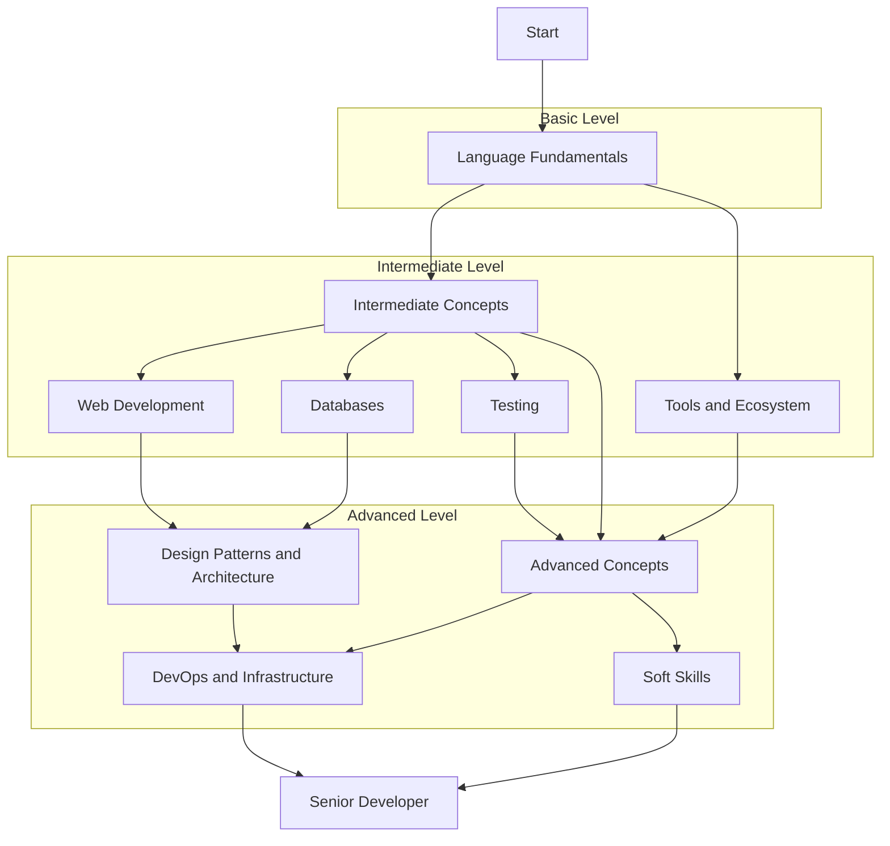

# 🐹 Roadmap for Senior Golang Developers

This document presents a comprehensive guide to the skills and knowledge that a senior Golang developer should possess.

## 📋 Summary

- [🧱 Language Fundamentals](#-language-fundamentals)
- [📚 Intermediate Concepts](#-intermediate-concepts)
- [🚀 Advanced Concepts](#-advanced-concepts)
- [🏗️ Design Patterns and Architecture](#️-design-patterns-and-architecture)
- [🔧 Tools and Ecosystem](#-tools-and-ecosystem)
- [💾 Databases](#-databases)
- [🌐 Web Development](#-web-development)
- [✅ Testing and Code Quality](#-testing-and-code-quality)
- [☁️ DevOps and Infrastructure](#️-devops-and-infrastructure)
- [🤝 Soft Skills](#-soft-skills)
- [🧠 Go Developer Mindset](#-go-developer-mindset)

## 🔄 Visual Roadmap

## 🧱 Language Fundamentals

- [ ] [Basic syntax and data types](basic/README.md)
- [ ] [Control structures (if, switch, for)](controlstruct/control-structures.md)
- [ ] [Pointers and memory](pointersmemory/pointers-memory.md)
- [ ] Functions and methods
- [ ] Structs and interfaces
- [ ] Arrays, slices and maps
- [ ] Packages and imports
- [ ] Error handling
- [ ] Dependency management with Go Modules
- [ ] GOPATH vs Go Modules

## 📚 Intermediate Concepts

- [ ] Concurrency with goroutines
- [ ] Channels and communication between goroutines
- [ ] Select statement
- [ ] Context package
- [ ] Reflection
- [ ] Type assertions and type switches
- [ ] Generics
- [ ] Embedding vs inheritance
- [ ] Closures and anonymous functions
- [ ] Defer, panic and recover

## 🚀 Advanced Concepts

- [ ] Advanced concurrency patterns
- [ ] Sync package (Mutex, WaitGroup, etc.)
- [ ] Profiling and performance optimization
- [ ] Memory management and garbage collection
- [ ] CGO and integration with C code
- [ ] Unsafe package
- [ ] Metaprogramming
- [ ] Plugins and dynamic loading
- [ ] Assembly in Go
- [ ] Build constraints and conditional tags

## 🏗️ Design Patterns and Architecture

- [ ] SOLID principles
- [ ] Clean Architecture
- [ ] DDD (Domain-Driven Design)
- [ ] Hexagonal Architecture
- [ ] Microservices
- [ ] Event-driven architecture
- [ ] Factory pattern
- [ ] Dependency injection
- [ ] Repository pattern
- [ ] CQRS and Event Sourcing

## 🔧 Tools and Ecosystem

- [ ] Go CLI tools (go build, go test, go mod, etc.)
- [ ] Linters (golangci-lint, staticcheck)
- [ ] Go tools (guru, godoc, etc.)
- [ ] Delve (debugger)
- [ ] Mocks and testing tools
- [ ] Go workspaces
- [ ] Code generators
- [ ] Editors and IDEs (VS Code, GoLand)
- [ ] Code formatting and gofmt
- [ ] Go.dev and official resources

## 💾 Databases

- [ ] SQL with database/sql
- [ ] ORMs (GORM, etc.)
- [ ] Migrations
- [ ] NoSQL (MongoDB, Redis)
- [ ] Elasticsearch and advanced search
- [ ] Transactions and ACID
- [ ] Connection pooling
- [ ] Caching strategies
- [ ] Data modeling
- [ ] Sharding and partitioning

## 🌐 Web Development

- [ ] Net/HTTP package
- [ ] Routers and web frameworks (Gin, Echo, etc.)
- [ ] Middlewares
- [ ] RESTful API
- [ ] GraphQL
- [ ] WebSockets
- [ ] gRPC and Protocol Buffers
- [ ] Authentication and authorization
- [ ] Rate limiting
- [ ] CORS and web security

## ✅ Testing and Code Quality

- [ ] Unit testing
- [ ] Table-driven tests
- [ ] Benchmarking
- [ ] Integration testing
- [ ] Mocking and stubbing
- [ ] Test coverage
- [ ] BDD and Behavior tests
- [ ] Fuzz testing
- [ ] CI/CD for Go
- [ ] Code reviews

## ☁️ DevOps and Infrastructure

- [ ] Docker and containerization
- [ ] Kubernetes
- [ ] Application configuration
- [ ] Logs and monitoring
- [ ] Metrics and observability
- [ ] Cloud providers (AWS, GCP, Azure)
- [ ] IaC (Terraform, Pulumi)
- [ ] Serverless
- [ ] Security and vulnerabilities
- [ ] Deployment strategies

## 🤝 Soft Skills

- [ ] Technical communication
- [ ] Technical leadership
- [ ] Mentoring
- [ ] Team collaboration
- [ ] Planning and estimation
- [ ] Project management
- [ ] Problem solving
- [ ] Documentation
- [ ] Constructive code reviews
- [ ] Continuous learning

## 🧠 Go Developer Mindset

Beyond technical skills, developing a mindset aligned with Go philosophy is essential.

- [ ] **Simplicity over Complexity**
  - Value straightforward solutions instead of excessive abstractions

- [ ] **Pragmatism**
  - Focus on code that works, is readable, and can be maintained by others

- [ ] **Clarity over Elegance**
  - Prefer explicit code that clearly communicates intent

- [ ] **Composition over Inheritance**
  - Build complex systems by composing smaller, well-defined parts

- [ ] **Concurrency as a Tool**
  - Understand when and how to effectively apply concurrency

- [ ] **Explicit Side Effects**
  - Make code side effects visible and predictable

- [ ] **Deliberate Optimization**
  - Write clear code first, optimize only when necessary and with metrics

- [ ] **Compatibility and Stability**
  - Value stable APIs and backward compatibility

- [ ] **Consistent Conventions** 
  - Follow Go community conventions for code and design

- [ ] **Collective Thinking**
  - Consider how code will be read and maintained by other developers

## 📋 Recommended Projects

To apply your knowledge, consider developing the following projects:

1. 🏗️ Microservice with clean architecture
2. 💻 CLI tool with cobra/viper
3. 🔐 REST API with authentication and authorization
4. 📨 Distributed system with messaging
5. 🕷️ Concurrent web crawler
6. 📊 Monitoring tool
7. 📦 Reusable library
8. ⚡ Serverless application
9. 🖥️ Backend for SPA frontend application
10. 🔍 GraphQL API

## 📚 Learning Resources

### 📖 Books
- The Go Programming Language - Alan A. A. Donovan, Brian W. Kernighan
- Concurrency in Go - Katherine Cox-Buday
- Go in Action - William Kennedy
- Go Programming Blueprints - Mat Ryer
- Let's Go - Alex Edwards

### 🌐 Websites
- [Go by Example](https://gobyexample.com/)
- [Go Dev](https://go.dev/)
- [Go Tour](https://tour.golang.org/)
- [Effective Go](https://golang.org/doc/effective_go)
- [Go 101](https://go101.org/)

### 📝 Blogs & Newsletters
- [Go Blog](https://blog.golang.org/)
- [Ardan Labs Blog](https://www.ardanlabs.com/blog/)
- [Dave Cheney's Blog](https://dave.cheney.net/)
- [golangweekly.com](https://golangweekly.com/)
- [Alex Edwards' Blog](https://www.alexedwards.net/blog/)

---

**Note**: This roadmap is a guide and not a definitive list. Practical experience and application of concepts are essential for professional growth.
