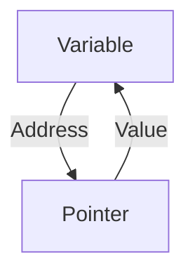

# 🧠 Pointers and Memory

Pointers are one of the most powerful and fundamental features of Go. They allow direct memory manipulation, providing efficiency and flexibility.

---

## 📋 What are Pointers?

A pointer is a variable that stores the memory address of another variable.

### 🛠️ Basic Syntax

```go
var x int = 10
var p *int = &x // 'p' is a pointer to 'x'
fmt.Println(*p) // Accesses the value of 'x' through the pointer
```

### 🖼️ Visualization

- **Variable `x`**: Stores the value `10`.
- **Pointer `p`**: Points to the memory address where `x` is stored.

```
x: [10]  (address: 0x1234)
p: [0x1234]
```

---

## 🔄 Comparison with Java

Although Java does not have explicit pointers like Go, it uses references for objects, which work similarly.

### Example in Java:
```java
String str = "Hello";
String ref = str; // 'ref' is a reference to 'str'
```

### Differences:
- **Go**: Pointers can be used for primitive and composite types.
- **Java**: References are used only for objects, not for primitive types.

---

## 🧪 Practical Examples

### 1️⃣ Changing Values with Pointers
```go
func changeValue(p *int) {
    *p = 20
}

func main() {
    x := 10
    changeValue(&x)
    fmt.Println(x) // Output: 20
}
```

### 2️⃣ Avoiding Unnecessary Copies
```go
func main() {
    arr := [3]int{1, 2, 3}
    modifyArray(&arr)
}

func modifyArray(arr *[3]int) {
    arr[0] = 42
}
```

---

## ⚠️ Pointer Pitfalls

- **Nil pointers**: Always initialize pointers before using them.
- **Memory leaks**: Avoid holding unnecessary references.

---

## 📚 Visual Resources



---

## 🛠️ Recommended Exercises

1. Create a function that swaps the values of two variables using pointers.
2. Implement a simple linked list using pointers.

---

**Note**: Understanding pointers is essential for working efficiently in Go, especially in low-level systems and concurrency.
