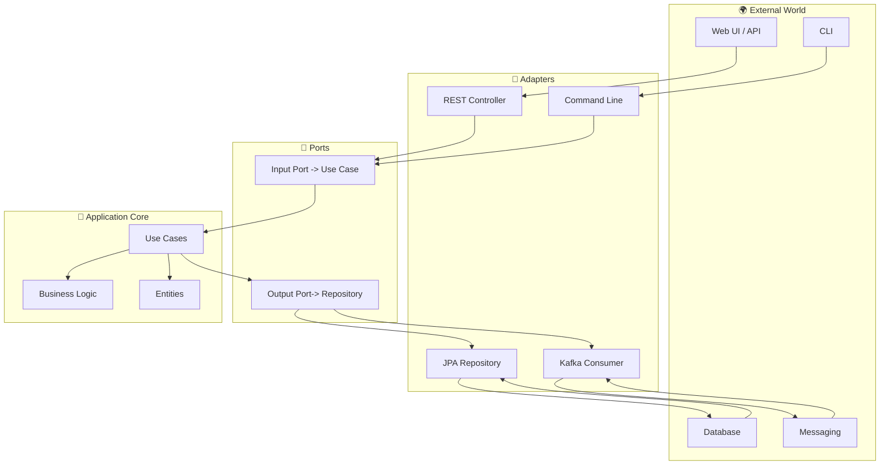

# 🛡️ Hexagonal Architecture (Ports & Adapters) - Deep Dive

Hexagonal Architecture, also known as Ports and Adapters, is a software architectural pattern that aims to isolate the core logic of an application from external concerns (like databases, web frameworks, messaging systems, etc). This separation increases testability, maintainability, and adaptability.

---

## 📚 Table of Contents

- [✨ Key Concepts](#-key-concepts)
- [🗺️ Diagram](#️-diagram)
- [🏛️ Layers Explained](#-layers-explained)
- [💡 Example in Java](#-example-in-java)
  - [1️⃣ Domain Model](#1-domain-model)
  - [2️⃣ Ports](#2-ports)
  - [3️⃣ Core Application Logic](#3-core-application-logic)
  - [4️⃣ Adapters](#4-adapters)
- [🔄 More Usage Examples](#-more-usage-examples)
  - [REST Adapter Example](#rest-adapter-example)
  - [CLI Adapter Example](#cli-adapter-example)
  - [Testing the Core](#testing-the-core)
- [🎯 Benefits](#-benefits)
- [📖 Further Reading](#-further-reading)

---

## ✨ Key Concepts

Imagine you are building a house. The **core** is your living space (rooms, kitchen, etc). The **ports** are the doors and windows—ways to interact with the house. The **adapters** are the actual doors, windows, and even the keys—how you connect the inside to the outside.

- **Domain/Core**: The business logic, independent of external technologies.
- **Ports**: Interfaces that define how the core interacts with the outside world.
- **Adapters**: Implementations of ports, connecting the core to external systems (e.g., database, web, messaging).
- **Dependency Rule**: The core never depends on external frameworks; dependencies point inward.

---

## 🗺️ Diagram

Let's visualize Hexagonal Architecture using a [Mermaid](https://mermaid-js.github.io/) diagram:



---

## 🏛️ Layers Explained

Let's break down each layer, as if you were learning in class:

- **Core (Domain/Application)**:  
  This is the "heart" of your application. It contains your business rules, entities, and use cases. It knows nothing about the outside world—no frameworks, no databases, no web.

- **Ports**:  
  Think of ports as *contracts* or *interfaces*.  
  - **Input Ports**: Define what your application can do (e.g., transfer money, create user).
  - **Output Ports**: Define what your application needs from the outside (e.g., save an account, send an email).

- **Adapters**:  
  These are the "plugs" that connect your application to the outside world.  
  - **Primary (Driving) Adapters**: Receive input from users or systems (REST controllers, CLI, schedulers).
  - **Secondary (Driven) Adapters**: Provide output to external systems (database repositories, message brokers).

**Didactic Tip:**  
*If you want to swap your database, you only need to change the adapter, not your core logic!*

---

## 💡 Example in Java

Suppose we have a simple banking application with a use case: transfer money between accounts.

### 1️⃣ Domain Model

```java
// Account.java
public class Account {
    private String id;
    private BigDecimal balance;

    // ...constructor, getters, business methods...
    public void withdraw(BigDecimal amount) {
        if (balance.compareTo(amount) < 0) throw new IllegalArgumentException("Insufficient funds");
        balance = balance.subtract(amount);
    }
    public void deposit(BigDecimal amount) {
        balance = balance.add(amount);
    }
}
```

### 2️⃣ Ports

#### Input Port (Use Case)

```java
// TransferMoneyUseCase.java
public interface TransferMoneyUseCase {
    void transfer(String fromAccountId, String toAccountId, BigDecimal amount);
}
```

#### Output Port (Repository)

```java
// AccountRepository.java
public interface AccountRepository {
    Account findById(String accountId);
    void save(Account account);
}
```

### 3️⃣ Core Application Logic

```java
// TransferMoneyService.java
public class TransferMoneyService implements TransferMoneyUseCase {
    private final AccountRepository accountRepository;

    public TransferMoneyService(AccountRepository accountRepository) {
        this.accountRepository = accountRepository;
    }

    @Override
    public void transfer(String fromAccountId, String toAccountId, BigDecimal amount) {
        Account from = accountRepository.findById(fromAccountId);
        Account to = accountRepository.findById(toAccountId);
        from.withdraw(amount);
        to.deposit(amount);
        accountRepository.save(from);
        accountRepository.save(to);
    }
}
```

### 4️⃣ Adapters

#### Primary Adapter (REST Controller)

```java
// TransferController.java
@RestController
public class TransferController {
    private final TransferMoneyUseCase transferMoneyUseCase;

    public TransferController(TransferMoneyUseCase transferMoneyUseCase) {
        this.transferMoneyUseCase = transferMoneyUseCase;
    }

    @PostMapping("/transfer")
    public ResponseEntity<Void> transfer(@RequestBody TransferRequest request) {
        transferMoneyUseCase.transfer(request.getFrom(), request.getTo(), request.getAmount());
        return ResponseEntity.ok().build();
    }
}
```

#### Secondary Adapter (JPA Repository)

```java
// JpaAccountRepository.java
@Repository
public class JpaAccountRepository implements AccountRepository {
    private final SpringDataAccountRepository springRepo;

    public JpaAccountRepository(SpringDataAccountRepository springRepo) {
        this.springRepo = springRepo;
    }

    @Override
    public Account findById(String accountId) {
        return springRepo.findById(accountId).orElseThrow();
    }

    @Override
    public void save(Account account) {
        springRepo.save(account);
    }
}
```

---

## 🔄 More Usage Examples

### REST Adapter Example

```java
// UserController.java
@RestController
@RequestMapping("/users")
public class UserController {
    private final CreateUserUseCase createUserUseCase;

    public UserController(CreateUserUseCase createUserUseCase) {
        this.createUserUseCase = createUserUseCase;
    }

    @PostMapping
    public ResponseEntity<Void> create(@RequestBody CreateUserRequest req) {
        createUserUseCase.create(req.getName(), req.getEmail());
        return ResponseEntity.status(HttpStatus.CREATED).build();
    }
}
```

### CLI Adapter Example

```java
// CommandLineApp.java
public class CommandLineApp {
    private final TransferMoneyUseCase transferMoneyUseCase;

    public CommandLineApp(TransferMoneyUseCase transferMoneyUseCase) {
        this.transferMoneyUseCase = transferMoneyUseCase;
    }

    public void run(String[] args) {
        // args: fromId, toId, amount
        transferMoneyUseCase.transfer(args[0], args[1], new BigDecimal(args[2]));
        System.out.println("Transfer completed!");
    }
}
```

### Testing the Core

```java
// TransferMoneyServiceTest.java
public class TransferMoneyServiceTest {
    @Test
    void transferShouldMoveFundsBetweenAccounts() {
        AccountRepository repo = mock(AccountRepository.class);
        when(repo.findById("A")).thenReturn(new Account("A", new BigDecimal("100")));
        when(repo.findById("B")).thenReturn(new Account("B", new BigDecimal("50")));

        TransferMoneyService service = new TransferMoneyService(repo);
        service.transfer("A", "B", new BigDecimal("30"));

        // verify repo.save called, balances updated, etc.
    }
}
```

---

## 🎯 Benefits

- ✅ **Testability**: Core logic can be tested without infrastructure.
- 🔄 **Flexibility**: Swap adapters without changing the core.
- 🧹 **Maintainability**: Clear separation of concerns.
- 🚀 **Scalability**: Easy to add new adapters (APIs, CLI, messaging, etc).

---

## 📖 Further Reading

- [Alistair Cockburn's original article](https://alistair.cockburn.us/hexagonal-architecture/)
- [Hexagonal Architecture on Martin Fowler's site](https://martinfowler.com/bliki/HexagonalArchitecture.html)

---

[⬅️ Back ](../README.md)