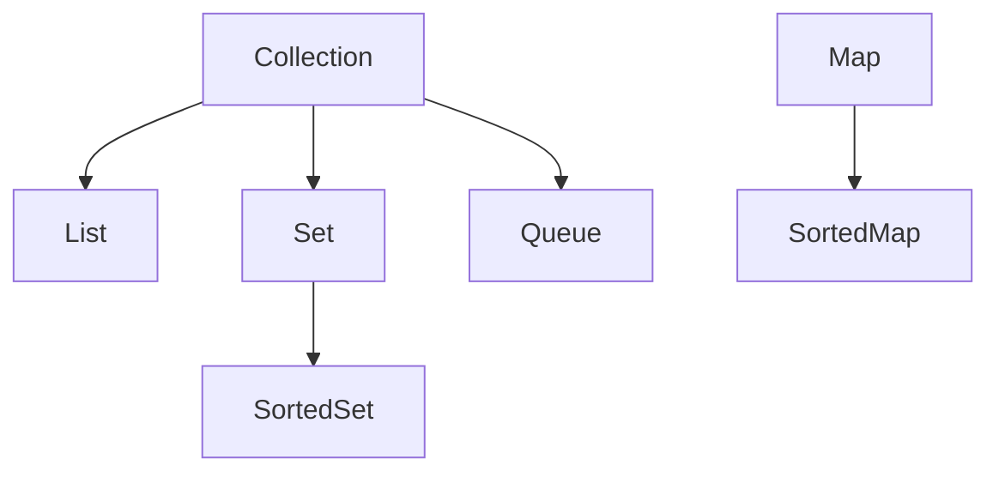

# 🧱 Java Collections Framework

## 📜 Summary

- [Overview](#-overview)
- [Hierarchy Diagram](#-hierarchy-diagram)
- [Key Interfaces and Classes](#-key-interfaces-and-classes)
- [Exploring Each Collection Type](#-exploring-each-collection-type)
- [Quick Comparison Table](#-quick-comparison-table)
- [General Best Practices](#-general-best-practices)
- [Usage Examples (HackerRank Style)](#-usage-examples-hackerrank-style)
- [Performance & Use Cases](#-performance--use-cases)
- [In-Depth Theoretical Study](#-in-depth-theoretical-study-of-java-collections-components)
- [Best Practices](#-best-practices)
- [Advanced Features](#-advanced-features)
- [Advanced Collections API Usage (Streams, Lambdas, etc.)](#-advanced-collections-api-usage-streams-lambdas-etc)
- [HackerRank-Style Exercises](#-java-collections-framework-hackerrank-style-exercises)

---

## 📚 Overview

The Java Collections Framework (JCF) is a unified architecture for representing and manipulating collections of objects. It provides essential interfaces and classes for storing, retrieving, and processing data efficiently. Mastery of JCF is fundamental for every Java developer, as it underpins most real-world Java applications.

- **Purpose:** Simplifies data manipulation, improves code reusability, and provides ready-to-use data structures.
- **Main Interfaces:** `Collection`, `List`, `Set`, `Map`, `Queue`
- **Why Important:** Enables efficient data handling, searching, sorting, and more.

---

## 🗺️ Hierarchy Diagram



---

## 🗝️ Key Interfaces and Classes

| Interface | Description | Common Implementations |
|-----------|-------------|------------------------|
| `List`    | Ordered collection, allows duplicates | `ArrayList`, `LinkedList`, `Vector` |
| `Set`     | No duplicates, unordered or sorted    | `HashSet`, `LinkedHashSet`, `TreeSet` |
| `Map`     | Key-value pairs, no duplicate keys    | `HashMap`, `LinkedHashMap`, `TreeMap` |
| `Queue`   | FIFO structure, for processing tasks  | `LinkedList`, `PriorityQueue`, `ArrayDeque` |

---

## 🔍 Exploring Each Collection Type

### 1️⃣ List

- **Implementations:** `ArrayList`, `LinkedList`, `Vector`
- **Differences:**
  - `ArrayList`: Backed by a dynamic array. Fast random access (`get`), slow inserts/removes in the middle.
  - `LinkedList`: Doubly-linked list. Fast inserts/removes at ends, slow random access.
  - `Vector`: Like `ArrayList` but synchronized (thread-safe, but slower).
- **Benefits:**
  - Maintains insertion order.
  - Allows duplicates and nulls.
  - Random access (except `LinkedList`).
- **Limitations:**
  - Not thread-safe by default (`ArrayList`, `LinkedList`).
  - `LinkedList` uses more memory per element.
- **Best Practices:**
  - Prefer `ArrayList` for most cases.
  - Use `LinkedList` for frequent insertions/removals at ends.
  - Use interface (`List`) in variable declarations.
  - For thread safety, use `Collections.synchronizedList()` or `CopyOnWriteArrayList`.

---

### 2️⃣ Set

- **Implementations:** `HashSet`, `LinkedHashSet`, `TreeSet`
- **Differences:**
  - `HashSet`: Unordered, fast operations, uses hash table.
  - `LinkedHashSet`: Maintains insertion order, slightly slower than `HashSet`.
  - `TreeSet`: Sorted order, uses red-black tree, slower than `HashSet`.
- **Benefits:**
  - No duplicates.
  - Fast add/search/remove (`HashSet`).
  - Sorted (`TreeSet`) or ordered (`LinkedHashSet`) options.
- **Limitations:**
  - No access by index.
  - `TreeSet` requires elements to be `Comparable` or a `Comparator`.
- **Best Practices:**
  - Use `HashSet` for uniqueness and performance.
  - Use `TreeSet` for sorted unique elements.
  - Use `EnumSet` for enums (very efficient).
  - Avoid mutating elements that affect equality/hashcode while in set.

---

### 3️⃣ Map

- **Implementations:** `HashMap`, `LinkedHashMap`, `TreeMap`
- **Differences:**
  - `HashMap`: Unordered, fast key lookup.
  - `LinkedHashMap`: Maintains insertion order.
  - `TreeMap`: Sorted by key, slower than `HashMap`.
- **Benefits:**
  - Key-value association.
  - No duplicate keys.
  - Fast lookup (`HashMap`).
  - Sorted keys (`TreeMap`).
- **Limitations:**
  - Not thread-safe by default.
  - `TreeMap` requires keys to be `Comparable` or a `Comparator`.
- **Best Practices:**
  - Use `HashMap` for general-purpose mapping.
  - Use `LinkedHashMap` for predictable iteration order.
  - Use `TreeMap` for sorted maps.
  - Use `ConcurrentHashMap` for thread safety.
  - Never use mutable objects as keys.

---

### 4️⃣ Queue

- **Implementations:** `LinkedList`, `PriorityQueue`, `ArrayDeque`
- **Differences:**
  - `LinkedList`: FIFO queue, also implements `Deque`.
  - `PriorityQueue`: Elements ordered by priority (natural order or comparator).
  - `ArrayDeque`: Resizable array, fast for queue/stack operations.
- **Benefits:**
  - FIFO processing.
  - Priority-based processing (`PriorityQueue`).
  - Double-ended operations (`Deque`).
- **Limitations:**
  - `PriorityQueue` does not allow nulls and is not thread-safe.
  - `ArrayDeque` does not allow nulls.
- **Best Practices:**
  - Use `ArrayDeque` for stack/queue (better than `Stack`/`LinkedList`).
  - Use `PriorityQueue` for scheduling/prioritization.
  - For thread safety, use `ConcurrentLinkedQueue` or `BlockingQueue`.

---

### 5️⃣ Deque

- **Implementations:** `ArrayDeque`, `LinkedList`
- **Differences:**
  - `ArrayDeque`: Fast, resizable, no capacity restrictions.
  - `LinkedList`: More memory per element, supports all `Deque` operations.
- **Benefits:**
  - Add/remove from both ends.
  - Can be used as stack (LIFO) or queue (FIFO).
- **Limitations:**
  - `ArrayDeque` does not allow nulls.
- **Best Practices:**
  - Prefer `ArrayDeque` for stack/queue use cases.
  - Avoid legacy `Stack` class.

---

## ⚡ Quick Comparison Table

| Feature         | ArrayList | LinkedList | HashSet | TreeSet | HashMap | TreeMap | ArrayDeque | PriorityQueue |
|-----------------|-----------|------------|---------|---------|---------|---------|------------|--------------|
| Order           | Yes       | Yes        | No      | Yes     | No      | Yes     | Yes        | No           |
| Duplicates      | Yes       | Yes        | No      | No      | Keys: No| Keys: No| Yes        | Yes          |
| Nulls Allowed   | Yes       | Yes        | Yes     | Yes     | Yes     | Yes     | No         | No           |
| Sorted          | No        | No         | No      | Yes     | No      | Yes     | No         | Yes (by prio)|
| Thread-safe     | No        | No         | No      | No      | No      | No      | No         | No           |
| Random Access   | Fast      | Slow       | -       | -       | -       | -       | -          | -            |
| Insert/Remove   | Mid: Slow | Fast       | Fast    | Slow    | Fast    | Slow    | Fast       | Fast         |

---

## 💡 General Best Practices

- Always program to interfaces (`List`, `Set`, `Map`), not implementations.
- Use generics for type safety.
- Prefer immutable collections when possible.
- For concurrency, use concurrent collections (`ConcurrentHashMap`, etc.).
- Avoid legacy classes (`Vector`, `Stack`, `Hashtable`).
- Use `Collections.unmodifiableList()` for read-only needs.
- Choose the right structure for your use case (see table above).

---

## 💻 Usage Examples (HackerRank Style)

### 1️⃣ List Example
```java
List<String> names = new ArrayList<>();
names.add("Alice");
names.add("Bob");
names.remove("Alice");
for (String name : names) {
    System.out.println(name);
}
```

### 2️⃣ Set Example
```java
Set<Integer> numbers = new HashSet<>();
numbers.add(1);
numbers.add(2);
numbers.add(1); // Duplicate, will not be added
System.out.println(numbers.contains(2)); // true
```

### 3️⃣ Map Example
```java
Map<String, Integer> scores = new HashMap<>();
scores.put("Alice", 90);
scores.put("Bob", 85);
System.out.println(scores.get("Alice")); // 90
for (String key : scores.keySet()) {
    System.out.println(key + ": " + scores.get(key));
}
```

---

## ⚡ Performance & Use Cases

| Type         | Fastest For         | Slower For         | Use Case Example |
|--------------|--------------------|--------------------|-----------------|
| ArrayList    | Random access      | Insert/delete mid  | Read-heavy lists |
| LinkedList   | Insert/delete mid  | Random access      | Queues, stacks   |
| HashSet      | Add/search/remove  | Sorted order       | Unique items     |
| TreeSet      | Sorted order       | Add/search/remove  | Sorted unique    |
| HashMap      | Key lookup         | Sorted keys        | Dictionaries     |
| TreeMap      | Sorted keys        | Key lookup         | Sorted maps      |

---

## 🧠 In-Depth Theoretical Study of Java Collections Components

### 1️⃣ `Collection<E>`
- 🏛️ **Root interface** for most collections in Java.
- Defines the basic contract for adding, removing, and querying elements.
- **Key Methods:** `add(E e)`, `remove(Object o)`, `contains(Object o)`, `size()`, `isEmpty()`, `iterator()`
- **Not implemented directly**—serves as a foundation for more specific types like `List`, `Set`, and `Queue`.
- **Why important?** Provides a unified way to work with different types of collections.

---

### 2️⃣ `List<E>`
- 📋 **Ordered** collection (elements have a position/index).
- Allows **duplicates** and null elements.
- **Key Methods:** `get(int index)`, `set(int index, E element)`, `add(int index, E element)`, `remove(int index)`, `subList(int from, int to)`
- **Common Implementations:**
  - `ArrayList` 🗂️ (dynamic array, fast random access, resizable)
  - `LinkedList` 🔗 (doubly-linked list, fast insert/remove at ends, slower random access)
  - `Vector` (legacy, synchronized, rarely used in new code)
- **When to use?** When you need to maintain order, allow duplicates, or access by index.
- **Real-world example:** Shopping cart items, playlist tracks.

---

### 3️⃣ `Set<E>`
- 🚫 **No duplicates** allowed.
- Unordered (except `LinkedHashSet`), or sorted (`TreeSet`).
- **Key Methods:** `add(E e)`, `remove(Object o)`, `contains(Object o)`, `size()`
- **Common Implementations:**
  - `HashSet` 🧩 (fast, unordered, uses hash table)
  - `LinkedHashSet` 🧩➡️ (remembers insertion order)
  - `TreeSet` 🌳 (sorted, uses `Comparable`/`Comparator`)
- **When to use?** When you need unique elements, e.g., unique usernames, tags.
- **Real-world example:** Unique coupon codes, unique product SKUs.

---

### 4️⃣ `Map<K, V>`
- 🗺️ **Key-value pairs** (dictionary structure).
- No duplicate keys; each key maps to one value.
- **Key Methods:** `put(K key, V value)`, `get(Object key)`, `remove(Object key)`, `containsKey(Object key)`, `keySet()`, `values()`, `entrySet()`
- **Common Implementations:**
  - `HashMap` 🗝️ (fast, unordered)
  - `LinkedHashMap` 🗝️➡️ (remembers insertion order)
  - `TreeMap` 🌳 (sorted by key)
- **When to use?** When you need to associate keys with values, e.g., userId → user profile.
- **Real-world example:** Phone book, product price list, configuration settings.

---

### 5️⃣ `Queue<E>`
- 🛤️ **FIFO** (First-In-First-Out) structure.
- Used for processing tasks, scheduling, buffering.
- **Key Methods:** `offer(E e)`, `poll()`, `peek()`, `remove()`, `element()`
- **Common Implementations:**
  - `LinkedList` 🔗 (also implements `List`)
  - `PriorityQueue` ⭐ (elements ordered by priority)
  - `ArrayDeque` 🔄 (double-ended queue)
- **When to use?** When you need to process elements in order or by priority, e.g., print jobs, task scheduling.

---

### 6️⃣ `Deque<E>`
- 🔄 **Double-ended queue** (add/remove from both ends).
- **Key Methods:** `addFirst(E e)`, `addLast(E e)`, `removeFirst()`, `removeLast()`, `peekFirst()`, `peekLast()`
- **Common Implementations:**
  - `ArrayDeque` (recommended for stack/queue operations)
  - `LinkedList`
- **When to use?** When you need both stack (LIFO) and queue (FIFO) operations.
- **Real-world example:** Browser history (back/forward), undo/redo stacks.

---

### 7️⃣ `SortedSet<E>` & `NavigableSet<E>`
- 🌳 **SortedSet:** Maintains elements in sorted order (`TreeSet`).
- 🧭 **NavigableSet:** Adds navigation methods (e.g., `lower`, `floor`, `ceiling`, `higher`).
- **When to use?** When you need sorted, unique elements and need to navigate by value.

---

### 8️⃣ `SortedMap<K, V>` & `NavigableMap<K, V>`
- 🌳 **SortedMap:** Keys are sorted (`TreeMap`).
- 🧭 **NavigableMap:** Adds navigation methods for keys (e.g., `lowerKey`, `floorKey`, `ceilingKey`, `higherKey`).
- **When to use?** When you need a map with sorted keys and advanced navigation.

---

### 9️⃣ Legacy Collections
- 🏺 **Vector, Stack, Hashtable**
- Synchronized by default, but less efficient than modern alternatives.
- Use only for maintaining legacy code.

---

### 🔬 Advanced & Specialized Collections
- **Concurrent Collections:** `ConcurrentHashMap`, `CopyOnWriteArrayList`, `BlockingQueue` for thread-safe operations in multi-threaded environments.
- **EnumSet/EnumMap:** Highly efficient for enums.
- **WeakHashMap:** Keys are weakly referenced, useful for caches.
- **IdentityHashMap:** Uses reference equality instead of `equals()`.
- **BitSet:** Efficient storage for bits/flags.

---

### 🧑‍💻 Pro Tips & Gotchas (Expanded)
- Always use generics for type safety: `List<String> names = new ArrayList<>();`
- Prefer interfaces (`List`, `Set`, `Map`) in variable declarations for flexibility.
- Use `Collections.unmodifiableList()` for read-only collections.
- Use `Collections.synchronizedList()` or concurrent collections for thread safety.
- Avoid modifying collections while iterating (unless using `Iterator.remove()`).
- For large data, prefer `ArrayList` over `LinkedList` for better cache locality.
- Use `EnumSet`/`EnumMap` for enums—very fast and memory efficient.
- For multi-threaded code, use concurrent collections or explicit synchronization.
- Use `Collections.emptyList()`, `Collections.singletonList()` for immutable collections.
- Understand fail-fast vs. fail-safe iterators.

---

## 🏆 Best Practices

- Choose the right collection for your use case (e.g., `ArrayList` for fast access, `LinkedList` for frequent inserts/removes).
- Prefer interfaces (`List`, `Set`, `Map`) over concrete classes.
- Use generics to avoid `ClassCastException` and improve type safety.
- Avoid using raw types.
- Use `Collections.unmodifiableList()` for read-only lists.
- Use `Collections.synchronizedList()` for thread safety if needed.

---

## 🚀 Advanced Features

- **Synchronized Collections:**
  ```java
  List<String> syncList = Collections.synchronizedList(new ArrayList<>());
  ```
- **Unmodifiable Collections:**
  ```java
  List<String> readOnly = Collections.unmodifiableList(names);
  ```
- **Streams API (Java 8+):**
  ```java
  List<String> upper = names.stream().map(String::toUpperCase).collect(Collectors.toList());
  ```


## 🧪 Advanced Collections API Usage (Streams, Lambdas, etc.)

### 1. Filter, Map, and Collect
```java
List<String> names = Arrays.asList("Ana", "Bruno", "Carlos", "Amanda");
List<String> result = names.stream()
    .filter(n -> n.startsWith("A"))
    .map(String::toLowerCase)
    .collect(Collectors.toList());
System.out.println(result); // [ana, amanda]
```

### 2. Grouping and Counting
```java
List<String> words = Arrays.asList("apple", "banana", "apple", "orange", "banana", "apple");
Map<String, Long> counts = words.stream()
    .collect(Collectors.groupingBy(w -> w, Collectors.counting()));
System.out.println(counts); // {orange=1, banana=2, apple=3}
```

### 3. Partitioning
```java
List<Integer> nums = Arrays.asList(1,2,3,4,5,6,7,8,9,10);
Map<Boolean, List<Integer>> partitioned = nums.stream()
    .collect(Collectors.partitioningBy(n -> n % 2 == 0));
System.out.println(partitioned); // {false=[1, 3, 5, 7, 9], true=[2, 4, 6, 8, 10]}
```

### 4. Sorting with Comparator and Lambdas
```java
List<String> list = Arrays.asList("pear", "apple", "orange");
list.sort((a, b) -> b.compareTo(a)); // Descending order
System.out.println(list); // [pear, orange, apple]
```

### 5. Remove If (Predicate)
```java
List<Integer> numbers = new ArrayList<>(Arrays.asList(1,2,3,4,5,6));
numbers.removeIf(n -> n % 2 == 0);
System.out.println(numbers); // [1, 3, 5]
```

### 6. Using Optional with Collections
```java
List<String> list = Arrays.asList("a", "b", "c");
Optional<String> first = list.stream().filter(s -> s.equals("b")).findFirst();
first.ifPresent(System.out::println); // b
```

### 7. FlatMap Example
```java
List<List<String>> nested = Arrays.asList(
    Arrays.asList("a", "b"),
    Arrays.asList("c", "d"));
List<String> flat = nested.stream()
    .flatMap(Collection::stream)
    .collect(Collectors.toList());
System.out.println(flat); // [a, b, c, d]
```

### 8. Immutable Collections (Java 9+)
```java
List<String> immutable = List.of("a", "b", "c");
Set<Integer> immutableSet = Set.of(1, 2, 3);
Map<String, Integer> immutableMap = Map.of("a", 1, "b", 2);
```


---

## 🧩 Java Collections Framework HackerRank-Style Exercises

### 🟢 Basic

#### 1. Add and Print Elements
```java
List<String> fruits = new ArrayList<>();
fruits.add("Apple");
fruits.add("Banana");
fruits.add("Orange");
// Print all elements, one per line
```
<details>
<summary>Show Solution</summary>

```java
for (String fruit : fruits) {
    System.out.println(fruit);
}
```
</details>

#### 2. Check for Existence in Set
```java
Set<Integer> numbers = new HashSet<>(Arrays.asList(1, 2, 3, 4, 5));
// Check if 3 exists in the set and print "Found" or "Not Found"
```
<details>
<summary>Show Solution</summary>

```java
System.out.println(numbers.contains(3) ? "Found" : "Not Found");
```
</details>

#### 3. Map Key-Value Retrieval
```java
Map<String, Integer> ages = new HashMap<>();
ages.put("Ana", 25);
ages.put("Bruno", 30);
// Print Ana's age
```
<details>
<summary>Show Solution</summary>

```java
System.out.println(ages.get("Ana"));
```
</details>

---

### 🟡 Medium

#### 4. Remove Duplicates from List
```java
List<Integer> nums = Arrays.asList(1, 2, 2, 3, 4, 4, 5);
// Print unique elements in ascending order
```
<details>
<summary>Show Solution</summary>

```java
Set<Integer> unique = new TreeSet<>(nums);
for (int n : unique) System.out.println(n);
```
</details>

#### 5. Frequency Count with Map
```java
List<String> words = Arrays.asList("apple", "banana", "apple", "orange", "banana", "apple");
// Print the frequency of each word
```
<details>
<summary>Show Solution</summary>

```java
Map<String, Integer> freq = new HashMap<>();
for (String w : words) freq.put(w, freq.getOrDefault(w, 0) + 1);
System.out.println(freq);
```
</details>

#### 6. Queue Simulation
```java
Queue<String> queue = new LinkedList<>();
queue.offer("A");
queue.offer("B");
queue.offer("C");
queue.poll();
// Print the element at the front of the queue
```
<details>
<summary>Show Solution</summary>

```java
System.out.println(queue.peek());
```
</details>

---

### 🔴 Advanced

#### 7. Filter and Transform with Streams
```java
List<String> names = Arrays.asList("alice", "bob", "anna", "mike");
// Print names starting with 'a', in uppercase, sorted
```
<details>
<summary>Show Solution</summary>

```java
names.stream()
    .filter(n -> n.startsWith("a"))
    .map(String::toUpperCase)
    .sorted()
    .forEach(System.out::println);
```
</details>

#### 8. Grouping with Streams
```java
List<String> items = Arrays.asList("apple", "banana", "apricot", "blueberry", "avocado");
// Group items by first letter and print the map
```
<details>
<summary>Show Solution</summary>

```java
Map<Character, List<String>> grouped = items.stream()
    .collect(Collectors.groupingBy(s -> s.charAt(0)));
System.out.println(grouped);
```
</details>

#### 9. Parallel Stream Sum
```java
List<Integer> bigList = IntStream.rangeClosed(1, 1_000_000).boxed().collect(Collectors.toList());
// Use parallelStream to sum all numbers
```
<details>
<summary>Show Solution</summary>

```java
int sum = bigList.parallelStream().mapToInt(Integer::intValue).sum();
System.out.println(sum);
```
</details>

---


[⬅️ Back ](./README.md)
