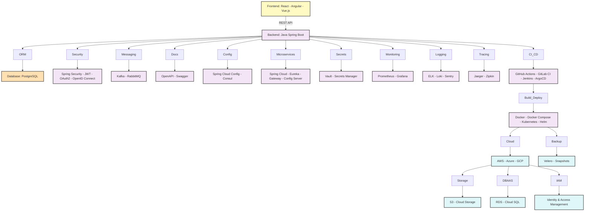

# Digital Bank Mini-MVP – Technologies & Business Rules

## 🗺️ Global Roadmap (Mermaid)

## Suggested Technologies

- **Backend:** Java (Spring Boot) | ☕
- **Database:** PostgreSQL | 🐘
- **ORM:** JPA/Hibernate | 🗄️
- **Testing:** JUnit, Mockito, TestContainers | 🧪
- **API:** RESTful (OpenAPI/Swagger) | 🌐
- **Security:** Spring Security, JWT, OAuth2, OpenID Connect | 🔒
- **Messaging:** Kafka or RabbitMQ (optional) | 📨
- **Documentation:** OpenAPI/Swagger | 📄
- **Frontend:** React, Angular or Vue.js (optional) | ⚛️
- **Microservices:** Spring Cloud (Eureka, Gateway, Config Server, Feign, Sleuth, etc.) | ☁️🧩
- **DevOps & Cloud:**
  - **Containerization:** Docker, Docker Compose | 🐳
  - **Orchestration:** Kubernetes (K8s) | ☸️
  - **Infrastructure as Code:** Terraform, Ansible, Helm | 📦
  - **CI/CD:** GitHub Actions, GitLab CI, Jenkins, ArgoCD | 🔁
  - **Monitoring:** Prometheus, Grafana, ELK Stack (Elasticsearch, Logstash, Kibana), Loki, Jaeger, Zipkin | 📈
  - **Observability:** Logging, Metrics, Distributed Tracing, Sentry, Datadog, New Relic | 📊
  - **Security:** Vault, Trivy, Snyk, SonarQube, OPA (Open Policy Agent) | 🛡️
  - **Cloud-Native Deploy:** AWS (EKS, RDS, S3, IAM), Azure, GCP | ☁️
  - **Secrets Management:** HashiCorp Vault, AWS Secrets Manager | 🔑
  - **Configuration Management:** Spring Cloud Config, Consul | ⚙️
  - **Cloud Messaging:** AWS SQS/SNS, Google Pub/Sub (optional) | ☁️
  - **Backup & Disaster Recovery:** Velero, Cloud-native snapshots | 💾

## Essential Business Rules

- Customer registration (individual/legal entity) 👤
- Account opening (checking/savings) 🏦
- User authentication and authorization 🔑
- Balance inquiry 💰
- Transaction statement 📄
- Transfers between accounts (TED, PIX, DOC) 🔄
- Deposit and withdrawal 💵
- Bill payment 🧾
- Receipt generation 🧾
- Transaction and balance limits 🚦
- Audit and operation history 🕵️
- Notifications (email/SMS, optional) 📧
- Card management (optional) 💳
- Integration with external systems (optional) 🔗

## Notes

- Implement proper validations and error handling. ⚠️
- Ensure data security and LGPD (Brazilian GDPR) compliance. 🔐
- Consider scalability and modularity of the solution. 📈

---
[⬅️ Back](../README.md)
