# SOLID + Design Patterns (GoF) 🤝 + Other Principles

## Table of Contents

1. [Single Responsibility Principle (SRP) + Factory Method](#1-single-responsibility-principle-srp--factory-method-)
2. [Open/Closed Principle (OCP) + Strategy](#2-openclosed-principle-ocp--strategy-)
3. [Liskov Substitution Principle (LSP) + Template Method](#3-liskov-substitution-principle-lsp--template-method-)
4. [Interface Segregation Principle (ISP) + Adapter](#4-interface-segregation-principle-isp--adapter-)
5. [Dependency Inversion Principle (DIP) + Dependency Injection](#5-dependency-injection--dip)
6. [Chain of Responsibility](#6-chain-of-responsibility)
7. [Visitor](#7-visitor)
8. [State](#8-state)
9. [Observer](#9-observer)
10. [DRY (Don't Repeat Yourself)](#dry-dont-repeat-yourself)
11. [Tell, Don't Ask](#11-tell-dont-ask)
12. [Scenarios: Without Pattern vs. With Pattern + SOLID](#scenarios-without-pattern-vs-with-pattern--solid)
13. [Patterns Convergence](#patterns-convergence-)
14. [Clean Code](#clean-code-)
15. [Additional Programming Principles](#additional-programming-principles)
    - [KISS (Keep It Simple, Stupid)](#kiss-keep-it-simple-stupid)
    - [YAGNI (You Arent-Gonna-Need-It)](#yagni-you-arent-gonna-need-it)
    - [FAIL FAST](#fail-fast)
    - [POLA (Principle of Least Astonishment)](#pola-principle-of-least-astonishment)
    - [Law of Demeter (Principle of Least Knowledge)](#law-of-demeter-principle-of-least-knowledge)
16. [Object Calisthenics](#object-calisthenics-️️)
17. [Conclusion](#conclusion-)

---

This document combines SOLID principles with GoF design patterns to create cohesive, extensible, and loosely coupled code. Let's explore theory and practice with Java examples! 🚀

---

## 1. **Single Responsibility Principle (SRP)** + Factory Method 🏭  
Each class should have a single responsibility. The Factory Method pattern helps centralize object creation, keeping the creation responsibility separate.

**Example**:  
```java
// Product
interface Notification {
    void notifyUser();
}

// Implementations
class EmailNotification implements Notification {
    public void notifyUser() {
        System.out.println("Sending notification by email...");
    }
}

class SMSNotification implements Notification {
    public void notifyUser() {
        System.out.println("Sending notification by SMS...");
    }
}

// Factory
abstract class NotificationFactory {
    abstract Notification createNotification();
}

class EmailNotificationFactory extends NotificationFactory {
    public Notification createNotification() {
        return new EmailNotification();
    }
}

class SMSNotificationFactory extends NotificationFactory {
    public Notification createNotification() {
        return new SMSNotification();
    }
}

// Usage example
public class NotificationExample {
    public static void main(String[] args) {
        NotificationFactory factory = new EmailNotificationFactory();
        Notification notification = factory.createNotification();
        notification.notifyUser();

        factory = new SMSNotificationFactory();
        notification = factory.createNotification();
        notification.notifyUser();
    }
}
```

**Class Diagram**  
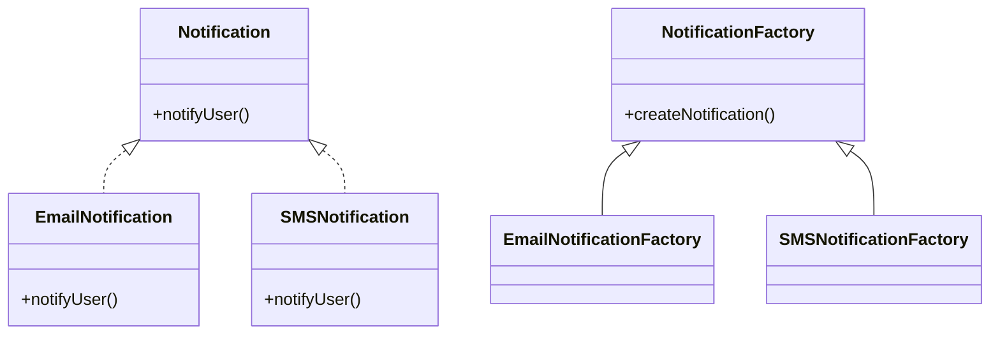

**Sequence Diagram**  
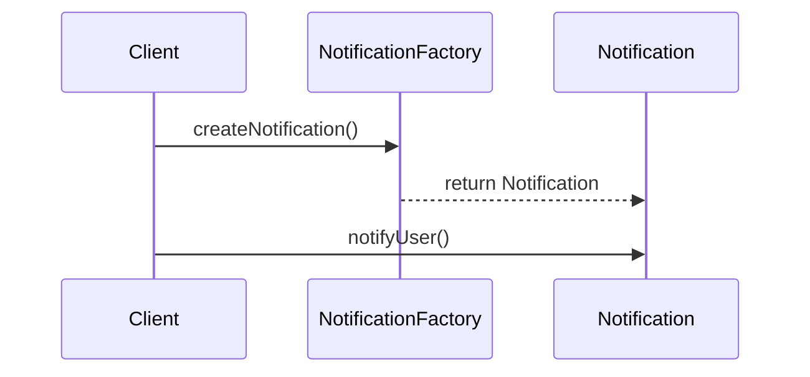

---

## 2. **Open/Closed Principle (OCP)** + Strategy 🧠  
Classes should be open for extension but closed for modification. The Strategy pattern allows adding new behaviors without changing existing code.

**Example**:  
```java
// Strategy
interface PaymentStrategy {
    void pay(int amount);
}

// Implementations
class CreditCardPayment implements PaymentStrategy {
    public void pay(int amount) {
        System.out.println("Paying " + amount + " with credit card.");
    }
}

class PayPalPayment implements PaymentStrategy {
    public void pay(int amount) {
        System.out.println("Paying " + amount + " with PayPal.");
    }
}

// Context
class ShoppingCart {
    private PaymentStrategy paymentStrategy;

    public ShoppingCart(PaymentStrategy paymentStrategy) {
        this.paymentStrategy = paymentStrategy;
    }

    public void checkout(int amount) {
        paymentStrategy.pay(amount);
    }
}

// Usage example
public class ShoppingCartExample {
    public static void main(String[] args) {
        ShoppingCart cart = new ShoppingCart(new CreditCardPayment());
        cart.checkout(150);

        cart = new ShoppingCart(new PayPalPayment());
        cart.checkout(300);
    }
}
```

**Class Diagram**  
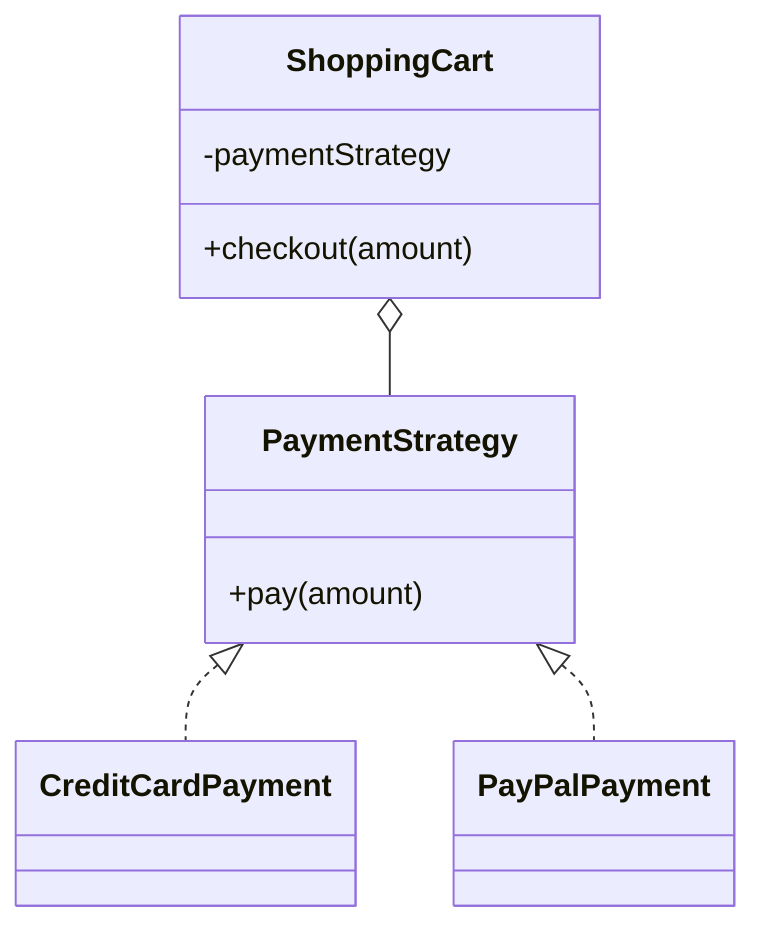

**Sequence Diagram**  
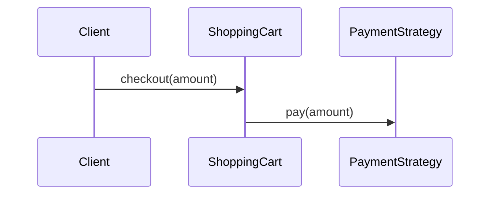

---

## 3. **Liskov Substitution Principle (LSP)** + Template Method 📋  
Subclasses should be substitutable for their superclasses. The Template Method pattern ensures the general behavior is maintained while allowing customizations.

**Example**:  
```java
abstract class DataProcessor {
    public final void process() {
        readData();
        processData();
        saveData();
    }

    abstract void readData();
    abstract void processData();

    void saveData() {
        System.out.println("Saving data to the database...");
    }
}

class CSVDataProcessor extends DataProcessor {
    void readData() {
        System.out.println("Reading data from a CSV file...");
    }

    void processData() {
        System.out.println("Processing CSV data...");
    }
}

class XMLDataProcessor extends DataProcessor {
    void readData() {
        System.out.println("Reading data from an XML file...");
    }

    void processData() {
        System.out.println("Processing XML data...");
    }
}

// Usage example
public class DataProcessorExample {
    public static void main(String[] args) {
        DataProcessor csv = new CSVDataProcessor();
        csv.process();

        DataProcessor xml = new XMLDataProcessor();
        xml.process();
    }
}
```

**Class Diagram**  
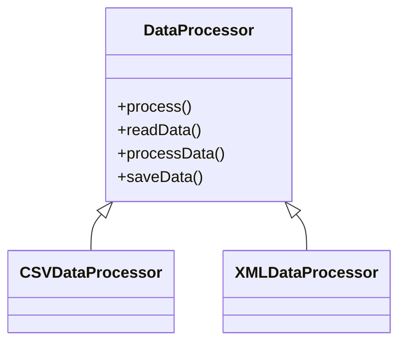

**Sequence Diagram**  
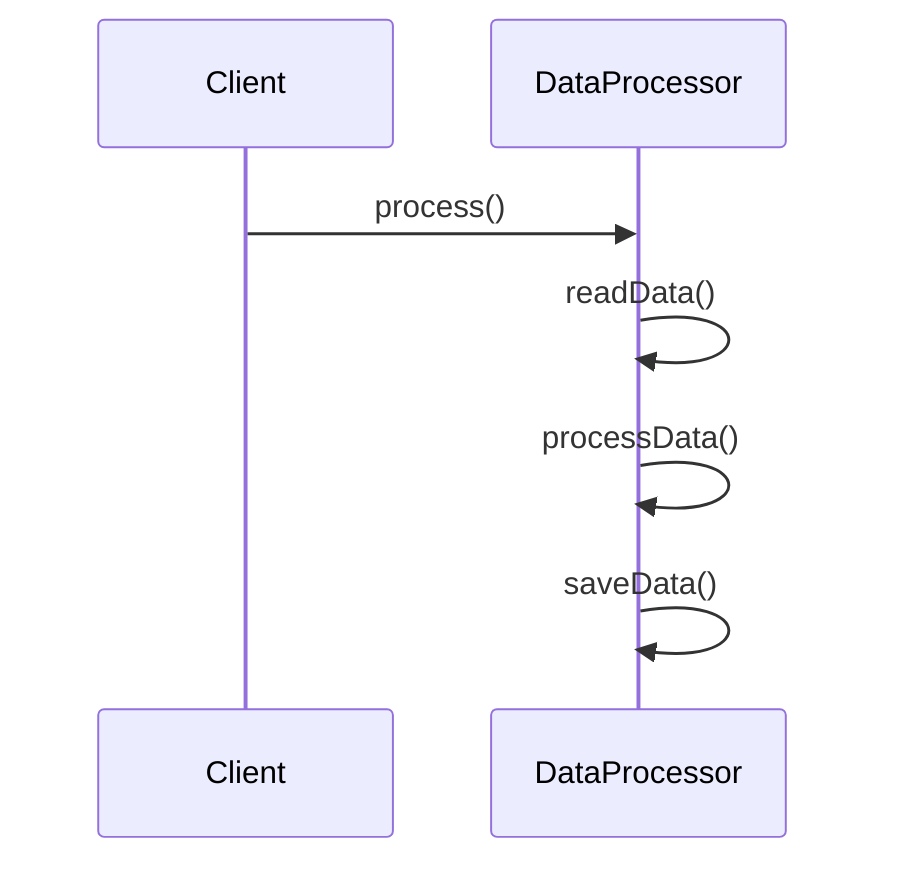

---

## 4. **Interface Segregation Principle (ISP)** + Adapter 🔌  
Specific interfaces are better than generic ones. The Adapter pattern helps connect incompatible interfaces.

**Example**:  
```java
// Specific interface
interface Printer {
    void print(String content);
}

// Existing implementation
class LegacyPrinter {
    void legacyPrint(String content) {
        System.out.println("Printing: " + content);
    }
}

// Adapter
class PrinterAdapter implements Printer {
    private LegacyPrinter legacyPrinter;

    public PrinterAdapter(LegacyPrinter legacyPrinter) {
        this.legacyPrinter = legacyPrinter;
    }

    public void print(String content) {
        legacyPrinter.legacyPrint(content);
    }
}

// Usage example
public class PrinterExample {
    public static void main(String[] args) {
        Printer printer = new PrinterAdapter(new LegacyPrinter());
        printer.print("Annual report 2024");
    }
}
```

**Class Diagram**  
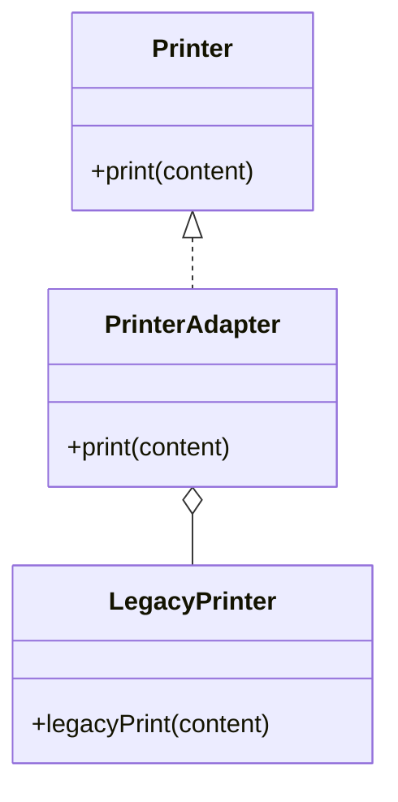

**Sequence Diagram**  
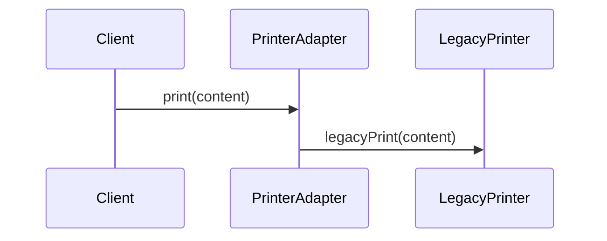

---

## 5. **Dependency Inversion Principle (DIP)** + Dependency Injection 💉  
Depend on abstractions, not on implementations. Dependency injection makes it easier to follow this principle.

**Example**:  
```java
// Abstraction
interface MessageService {
    void sendMessage(String message);
}

// Implementation
class EmailService implements MessageService {
    public void sendMessage(String message) {
        System.out.println("Sending email: " + message);
    }
}

// Client
class NotificationSender {
    private MessageService messageService;

    public NotificationSender(MessageService messageService) {
        this.messageService = messageService;
    }

    public void send(String message) {
        messageService.sendMessage(message);
    }
}

// Usage example
public class DIPExample {
    public static void main(String[] args) {
        MessageService emailService = new EmailService();
        NotificationSender sender = new NotificationSender(emailService);
        sender.send("Hello, world!");
    }
}
```

**Class Diagram**  
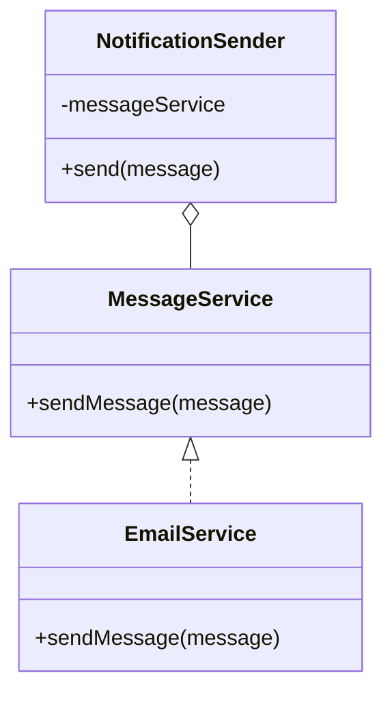

**Sequence Diagram**  
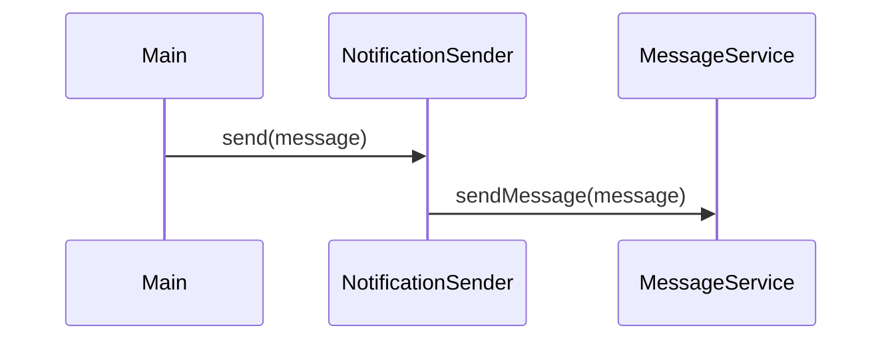

---

## 6. **Chain of Responsibility**  
Allows a request to pass through a chain of handlers until one of them processes it. Facilitates decoupling between sender and receiver.

**Example**:  
```java
// Handler
abstract class Handler {
    protected Handler next;

    public Handler setNext(Handler next) {
        this.next = next;
        return next;
    }

    public abstract void handle(String request);
}

// Implementations
class AuthHandler extends Handler {
    public void handle(String request) {
        if (request.equals("auth")) {
            System.out.println("Authenticated!");
        } else if (next != null) {
            next.handle(request);
        }
    }
}

class LogHandler extends Handler {
    public void handle(String request) {
        if (request.equals("log")) {
            System.out.println("Log registered!");
        } else if (next != null) {
            next.handle(request);
        }
    }
}

// Usage example
public class ChainExample {
    public static void main(String[] args) {
        Handler auth = new AuthHandler();
        Handler log = new LogHandler();
        auth.setNext(log);

        auth.handle("auth");
        auth.handle("log");
        auth.handle("unknown");
    }
}
```

**Class Diagram**  
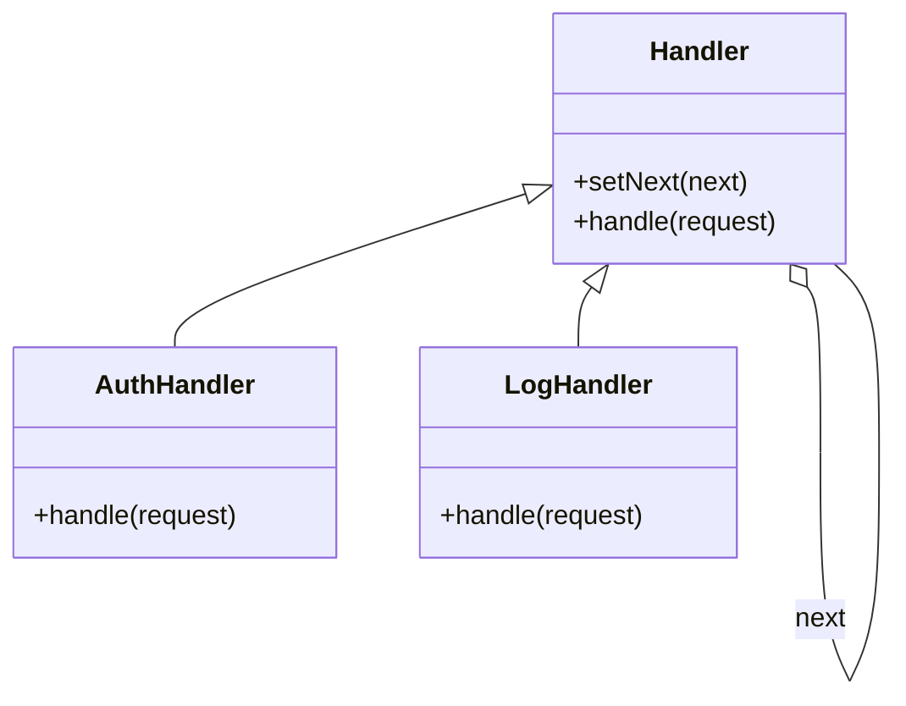

**Sequence Diagram**  
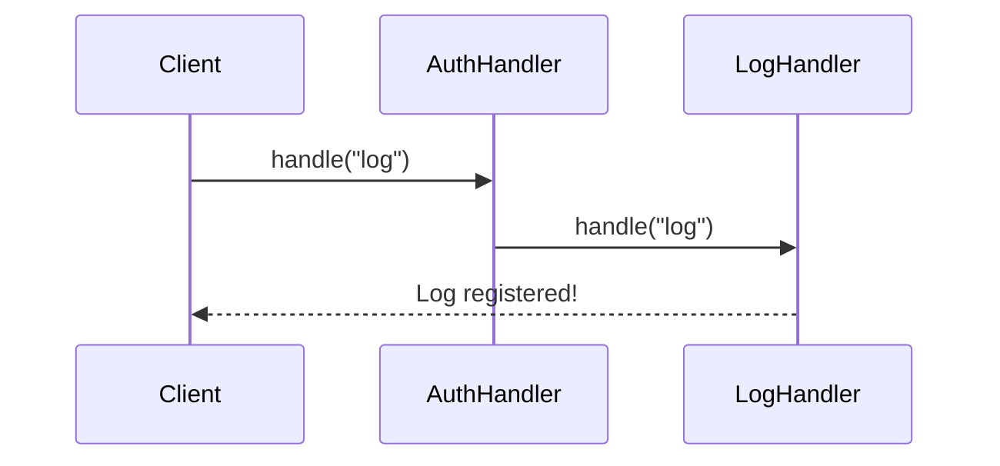

---

## 7. **Visitor**  
Allows adding operations to objects of different classes without modifying those classes. Facilitates extending functionalities.

**Example**:  
```java
// Element
interface Element {
    void accept(Visitor visitor);
}

// Implementations
class ConcreteElementA implements Element {
    public void accept(Visitor visitor) {
        visitor.visit(this);
    }
}

class ConcreteElementB implements Element {
    public void accept(Visitor visitor) {
        visitor.visit(this);
    }
}

// Visitor
interface Visitor {
    void visit(ConcreteElementA element);
    void visit(ConcreteElementB element);
}

// Visitor Implementation
class ConcreteVisitor implements Visitor {
    public void visit(ConcreteElementA element) {
        System.out.println("Visiting Element A");
    }
    public void visit(ConcreteElementB element) {
        System.out.println("Visiting Element B");
    }
}

// Usage example
public class VisitorExample {
    public static void main(String[] args) {
        Element a = new ConcreteElementA();
        Element b = new ConcreteElementB();
        Visitor visitor = new ConcreteVisitor();
        a.accept(visitor);
        b.accept(visitor);
    }
}
```

**Class Diagram**  
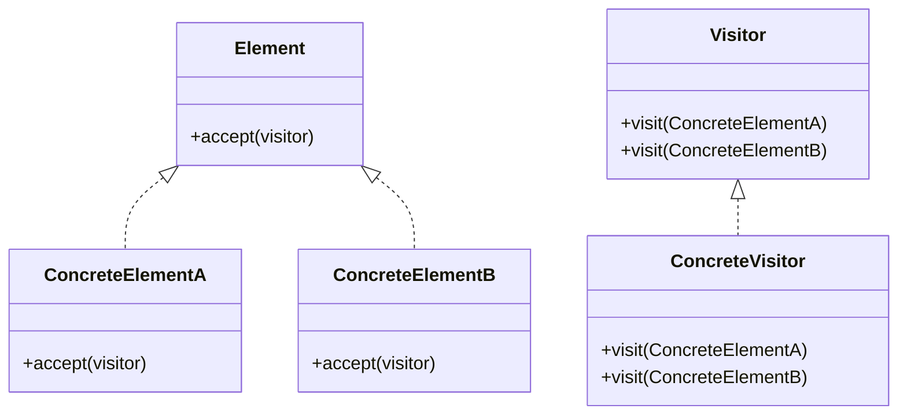

**Sequence Diagram**  
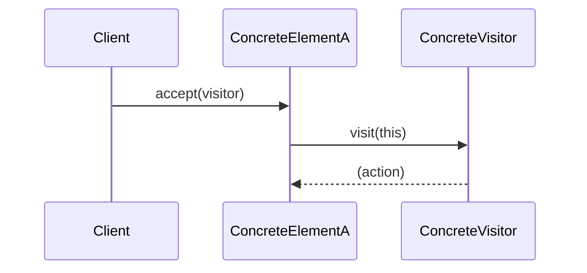

---

## 8. **State**  
The State pattern allows an object to change its behavior when its internal state changes, appearing to change its class. It encapsulates states as separate objects and delegates behavior to the current state object.

**Example**:  
```java
// State interface
interface State {
    void handle(Context context);
}

// Concrete States
class ConcreteStateA implements State {
    public void handle(Context context) {
        System.out.println("State A");
        context.setState(new ConcreteStateB());
    }
}

class ConcreteStateB implements State {
    public void handle(Context context) {
        System.out.println("State B");
        context.setState(new ConcreteStateA());
    }
}

// Context
class Context {
    private State state;

    public Context(State state) {
        this.state = state;
    }

    public void setState(State state) {
        this.state = state;
    }

    public void request() {
        state.handle(this);
    }
}

// Usage example
public class StateExample {
    public static void main(String[] args) {
        Context context = new Context(new ConcreteStateA());
        context.request(); // State A
        context.request(); // State B
        context.request(); // State A
    }
}
```

**Class Diagram**  
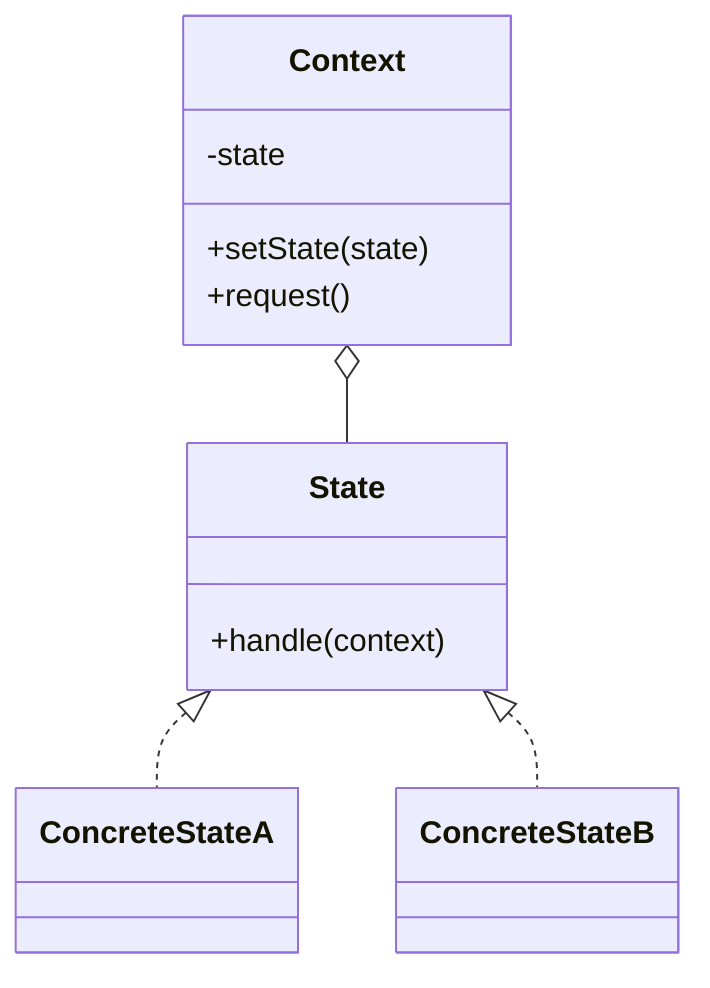

**Sequence Diagram**  
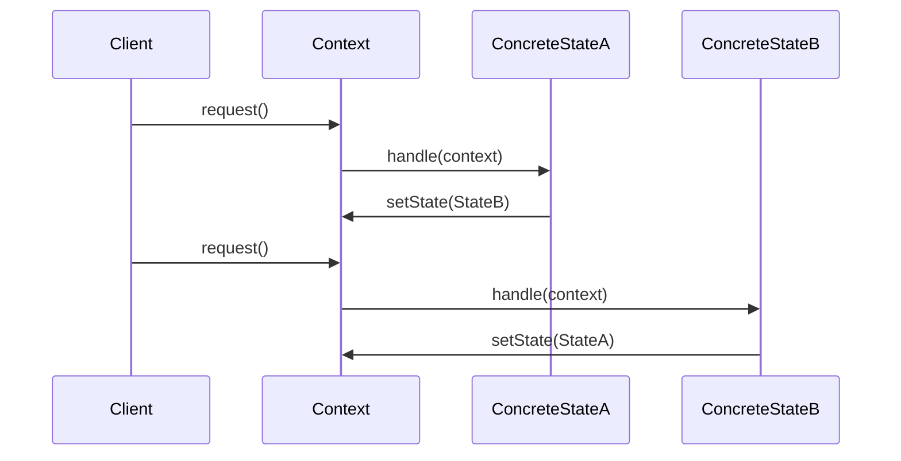

---

## 9. **Observer**  
The Observer pattern defines a one-to-many dependency between objects so that when one object changes state, all its dependents are notified automatically.

**Context with SOLID:**  
- **OCP:** Allows adding new observers without modifying the subject.
- **SRP:** Subject and observers have separate responsibilities.
- **LSP:** Observers can be replaced by others implementing the same interface.
- **ISP:** Observers implement only the relevant notification interface.
- **DIP:** Subject depends on an abstraction (Observer interface), not on concrete implementations.

**Example:**  
```java
// Subject
interface Subject {
    void addObserver(Observer observer);
    void removeObserver(Observer observer);
    void notifyObservers(String message);
}

// Observer
interface Observer {
    void update(String message);
}

// Subject Implementation
class NewsAgency implements Subject {
    private List<Observer> observers = new ArrayList<>();

    public void addObserver(Observer observer) {
        observers.add(observer);
    }

    public void removeObserver(Observer observer) {
        observers.remove(observer);
    }

    public void notifyObservers(String message) {
        for (Observer observer : observers) {
            observer.update(message);
        }
    }

    // Method to publish news
    public void publishNews(String news) {
        System.out.println("Agency: New news published!");
        notifyObservers(news);
    }
}

// Observer Implementations
class EmailSubscriber implements Observer {
    public void update(String message) {
        System.out.println("Email received: " + message);
    }
}

class SmsSubscriber implements Observer {
    public void update(String message) {
        System.out.println("SMS received: " + message);
    }
}

// Usage example
public class ObserverExample {
    public static void main(String[] args) {
        NewsAgency agency = new NewsAgency();
        Observer email = new EmailSubscriber();
        Observer sms = new SmsSubscriber();

        agency.addObserver(email);
        agency.addObserver(sms);

        agency.publishNews("New update available!");
    }
}
```

**Class Diagram**  
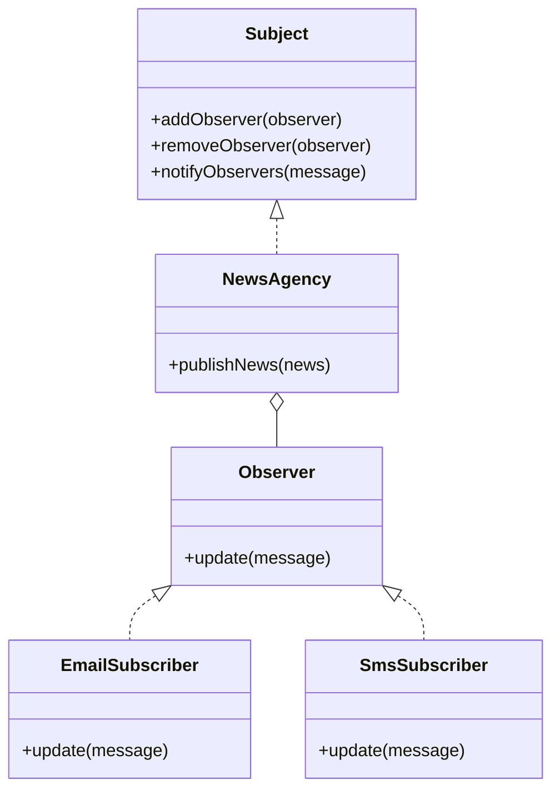

**Sequence Diagram**  
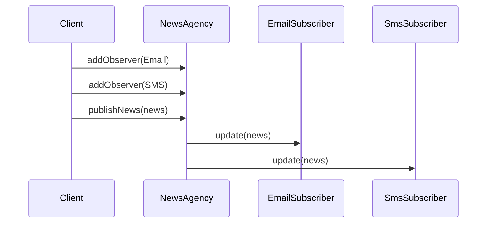

---

## DRY (Don't Repeat Yourself)  
The DRY principle states that we should not duplicate logic or knowledge in code. Along with SOLID and design patterns, DRY is achieved by extracting common behaviors into reusable classes, methods, or abstractions.

**Example with Design Patterns:**  
```java
// Without DRY: duplicated logic
class UserService {
    public void registerUser(String email) {
        if (!email.contains("@")) throw new IllegalArgumentException();
        // registration code...
    }
    public void resetPassword(String email) {
        if (!email.contains("@")) throw new IllegalArgumentException();
        // reset code...
    }
}

// With DRY: extracted logic
class EmailValidator {
    public static void validate(String email) {
        if (!email.contains("@")) throw new IllegalArgumentException();
    }
}
class UserService {
    public void registerUser(String email) {
        EmailValidator.validate(email);
        // registration code...
    }
    public void resetPassword(String email) {
        EmailValidator.validate(email);
        // reset code...
    }
}
```

**Benefits:**  
- Less duplicated code.
- Easier maintenance and evolution.
- Fewer bugs.

---

## Tell, Don't Ask  
This principle guides us to delegate behaviors to the objects themselves, avoiding accessing their data to make external decisions. It aligns with encapsulation (OOP), SRP, and patterns like Strategy, State, and Command.

**Example without Tell, Don't Ask:**  
```java
class Rectangle {
    public int width;
    public int height;
}
class AreaCalculator {
    public int calculate(Rectangle r) {
        return r.width * r.height;
    }
}
```

**Example with Tell, Don't Ask:**  
```java
class Rectangle {
    private int width;
    private int height;
    public Rectangle(int width, int height) {
        this.width = width; this.height = height;
    }
    public int area() {
        return width * height;
    }
}
class AreaCalculator {
    public int calculate(Rectangle r) {
        return r.area();
    }
}
```

**Relationship with SOLID and Patterns:**  
- **SRP:** Each class has a clear responsibility.
- **OCP:** New behaviors can be added without modifying consumers.
- **Encapsulation:** Objects control their own data and logic.
- **Patterns:** Strategy, State, and Command allow delegating decisions and actions to specialized objects, promoting Tell, Don't Ask.

**Benefits:**  
- More expressive and object-oriented code.
- Less coupling and greater cohesion.
- Easier testing and maintenance.

---

## Additional Programming Principles

### KISS (Keep It Simple, Stupid)

The KISS principle encourages simple and straightforward solutions, avoiding unnecessary complexity.

**Bad:**
```java
// Complex solution to reverse a string
public String reverse(String input) {
    char[] chars = input.toCharArray();
    StringBuilder sb = new StringBuilder();
    for (int i = chars.length - 1; i >= 0; i--) 
        sb.append(chars[i]);
    return sb.toString();
}
```
**Good:**
```java
// Simple solution using standard API
public String reverse(String input) {
    return new StringBuilder(input).reverse().toString();
}
```

**Correct example: reversing by code point**

In applications that need to correctly handle Unicode characters outside the BMP (such as emojis or special characters), reversing by `char` may produce incorrect results. The example below shows how to properly reverse a string by code point, ensuring all characters are handled correctly:

```java
public String reverse(String input) {
    int[] codePoints = input.codePoints().toArray();
    StringBuilder sb = new StringBuilder();
    for (int i = codePoints.length - 1; i >= 0; i--) {
        sb.appendCodePoint(codePoints[i]);
    }
    return sb.toString();
}

// Usage example:
String original = "A😊語B";
String reversed = reverse(original);
System.out.println(reversed); // Output: B語😊A
```

**Input:**  
`A😊語B`  

**Expected output:**  
`B語😊A`  

**Why is this important?**  
The traditional approach based on `char` can corrupt Unicode characters composed of multiple `char` (such as emojis or Asian language characters). Using code points ensures that each character is reversed correctly, preserving the integrity of the string for all languages and symbols.

---

### YAGNI (You Aren't Gonna Need It)

Do not implement features until they are actually needed.

**Bad:**
```java
class ReportGenerator {
    public void generateReport() {
        // report logic...
    }
    public void exportToXML() {
        // No requirement to export to XML yet!
    }
}
```
**Good:**
```java
class ReportGenerator {
    public void generateReport() {
        // report logic...
    }
    // Add exportToXML() only when there is a real need.
}
```

---

### FAIL FAST

Detect and handle errors as early as possible, avoiding propagation of invalid states.

**Example:**
```java
public void processOrder(Order order) {
    if (order == null) {
        throw new IllegalArgumentException("Order cannot be null");
    }
    // continue safe processing...
}
```
*Fail fast makes it easier to diagnose problems and reduces hard-to-track bugs.*

---

### POLA (Principle of Least Astonishment)

The system should behave predictably, without surprising the user or developer.

**Bad:**
```java
// A method called getName() that changes internal state
public String getName() {
    this.name = "default"; // unexpected side effect!
    return name;
}
```
**Good:**
```java
public String getName() {
    return name; // No side effects, just returns the value
}
```
*Methods should do only what their names suggest.*

---

### Law of Demeter (Principle of Least Knowledge)

An object should interact only with its close friends, avoiding deep dependencies.

**Bad:**
```java
double tax = order.getCustomer().getAddress().getCity().getTaxRate();
```
**Good:**
```java
double tax = order.calculateTax();
```
*Delegate responsibilities and avoid long chains of calls.*

---

## Scenarios: Without Pattern vs. With Pattern + SOLID

### 1. Factory Method + SRP  
#### ❌ Without pattern (violating SRP)  
```java
class NotificationService {
    public void send(String type, String message) {
        if (type.equals("email")) {
            System.out.println("Sending email: " + message);
        } else if (type.equals("sms")) {
            System.out.println("Sending SMS: " + message);
        }
        // new types require changing this method...
    }
}

// Usage example
public class NotificationServiceExample {
    public static void main(String[] args) {
        NotificationService service = new NotificationService();
        service.send("email", "Welcome!");
        service.send("sms", "Your code is 1234");
    }
}
```

**Problems:**  
- Violates SRP: the class handles both sending logic and type decision.
- Violates OCP: new types require changes to the class.

#### ✅ With Factory Method + SRP  
```java
// Product
interface Notification {
    void notifyUser();
}

// Implementations
class EmailNotification implements Notification {
    public void notifyUser() {
        System.out.println("Sending notification by email...");
    }
}

class SMSNotification implements Notification {
    public void notifyUser() {
        System.out.println("Sending notification by SMS...");
    }
}

// Factory
abstract class NotificationFactory {
    abstract Notification createNotification();
}

class EmailNotificationFactory extends NotificationFactory {
    public Notification createNotification() {
        return new EmailNotification();
    }
}

class SMSNotificationFactory extends NotificationFactory {
    public Notification createNotification() {
        return new SMSNotification();
    }
}

// Usage example
public class NotificationExample {
    public static void main(String[] args) {
        NotificationFactory factory = new EmailNotificationFactory();
        Notification notification = factory.createNotification();
        notification.notifyUser();

        factory = new SMSNotificationFactory();
        notification = factory.createNotification();
        notification.notifyUser();
    }
}
```

**Benefits:**  
- SRP: each class has a single responsibility.
- OCP: new types do not require changes to existing ones.

---

### 2. Strategy + OCP  
#### ❌ Without pattern (violating OCP)  
```java
class OrderService {
    public double calculateDiscount(Order order, String discountType) {
        if (discountType.equals("percentage")) {
            return order.getTotal() * 0.1;
        } else if (discountType.equals("fixed")) {
            return 20;
        } else if (discountType.equals("none")) {
            return 0;
        }
        // new types require changing this method...
        return 0;
    }
}
```

**Problems:**  
- Violates OCP (Open/Closed Principle): each new discount requires changes to the class.
- Violates SRP (Single Responsibility Principle): the class does more than it should.
- Makes testing and maintenance harder.

#### ✅ With Strategy + OCP  
```java
// Strategy
interface DiscountStrategy {
    double calculate(Order order);
}

class PercentageDiscount implements DiscountStrategy {
    public double calculate(Order order) {
        return order.getTotal() * 0.1;
    }
}

class FixedDiscount implements DiscountStrategy {
    public double calculate(Order order) {
        return 20;
    }
}

class NoDiscount implements DiscountStrategy {
    public double calculate(Order order) {
        return 0;
    }
}

// Service using the strategy
class OrderService {
    private DiscountStrategy discountStrategy;

    public OrderService(DiscountStrategy discountStrategy) {
        this.discountStrategy = discountStrategy;
    }

    public double calculateDiscount(Order order) {
        return discountStrategy.calculate(order);
    }
}

// Usage example
class Order {
    private double total;
    public Order(double total) { this.total = total; }
    public double getTotal() { return total; }
}

public class DiscountExample {
    public static void main(String[] args) {
        Order order = new Order(200);

        OrderService service = new OrderService(new PercentageDiscount());
        System.out.println("Percentage discount: " + service.calculateDiscount(order));

        service = new OrderService(new FixedDiscount());
        System.out.println("Fixed discount: " + service.calculateDiscount(order));

        service = new OrderService(new NoDiscount());
        System.out.println("No discount: " + service.calculateDiscount(order));
    }
}
```

**Benefits:**  
- **OCP:** New discounts are added by creating new classes, without changing existing ones.
- **SRP:** Each class has a single responsibility.
- **Testability:** Easy to test each strategy in isolation.
- **Flexibility:** Swap strategies at runtime.

---

### 3. Template Method + LSP  
#### ❌ Without pattern (violating LSP)  
```java
class DataProcessor {
    public void process(String type) {
        if (type.equals("csv")) {
            System.out.println("Reading CSV...");
            System.out.println("Processing CSV...");
        } else if (type.equals("xml")) {
            System.out.println("Reading XML...");
            System.out.println("Processing XML...");
        }
        System.out.println("Saving data...");
    }
}

// Usage example
public class DataProcessorServiceExample {
    public static void main(String[] args) {
        DataProcessor processor = new DataProcessor();
        processor.process("csv");
        processor.process("xml");
    }
}
```

**Problems:**  
- Violates LSP: cannot be replaced by specialized subclasses.
- Violates OCP: new formats require changes to the class.

#### ✅ With Template Method + LSP  
```java
abstract class DataProcessor {
    public final void process() {
        readData();
        processData();
        saveData();
    }

    abstract void readData();
    abstract void processData();

    void saveData() {
        System.out.println("Saving data to the database...");
    }
}

class CSVDataProcessor extends DataProcessor {
    void readData() {
        System.out.println("Reading data from a CSV file...");
    }

    void processData() {
        System.out.println("Processing CSV data...");
    }
}

class XMLDataProcessor extends DataProcessor {
    void readData() {
        System.out.println("Reading data from an XML file...");
    }

    void processData() {
        System.out.println("Processing XML data...");
    }
}

// Usage example
public class DataProcessorExample {
    public static void main(String[] args) {
        DataProcessor csv = new CSVDataProcessor();
        csv.process();

        DataProcessor xml = new XMLDataProcessor();
        xml.process();
    }
}
```

**Benefits:**  
- LSP: subclasses can be used in place of the superclass.
- OCP: new formats are added by extension.

---

### 4. Adapter + ISP  
#### ❌ Without pattern (violating ISP)  
```java
class LegacyPrinter {
    void legacyPrint(String content) {
        System.out.println("Printing: " + content);
    }
}

class ReportService {
    private LegacyPrinter printer = new LegacyPrinter();

    public void printReport(String content) {
        printer.legacyPrint(content);
    }
}

// Usage example
public class ReportServiceExample {
    public static void main(String[] args) {
        ReportService service = new ReportService();
        service.printReport("Annual report 2024");
    }
}
```

**Problems:**  
- Violates ISP: does not use a specific interface.
- Low flexibility to swap implementation.

#### ✅ With Adapter + ISP  
```java
// Specific interface
interface Printer {
    void print(String content);
}

// Existing implementation
class LegacyPrinter {
    void legacyPrint(String content) {
        System.out.println("Printing: " + content);
    }
}

// Adapter
class PrinterAdapter implements Printer {
    private LegacyPrinter legacyPrinter;

    public PrinterAdapter(LegacyPrinter legacyPrinter) {
        this.legacyPrinter = legacyPrinter;
    }

    public void print(String content) {
        legacyPrinter.legacyPrint(content);
    }
}

// Usage example
public class PrinterExample {
    public static void main(String[] args) {
        Printer printer = new PrinterAdapter(new LegacyPrinter());
        printer.print("Annual report 2024");
    }
}
```

**Benefits:**  
- ISP: specific interface for printing.
- Flexibility to adapt different implementations.

---

### 5. Dependency Injection + DIP  
#### ❌ Without pattern (violating DIP)  
```java
class EmailService {
    public void sendMessage(String message) {
        System.out.println("Sending email: " + message);
    }
}

class NotificationSender {
    private EmailService emailService = new EmailService();

    public void send(String message) {
        emailService.sendMessage(message);
    }
}

// Usage example
public class NotificationSenderExample {
    public static void main(String[] args) {
        NotificationSender sender = new NotificationSender();
        sender.send("Hello, world!");
    }
}
```

**Problems:**  
- Violates DIP: depends on concrete implementation.
- Makes testing and service replacement harder.

#### ✅ With Dependency Injection + DIP  
```java
// Abstraction
interface MessageService {
    void sendMessage(String message);
}

// Implementation
class EmailService implements MessageService {
    public void sendMessage(String message) {
        System.out.println("Sending email: " + message);
    }
}

// Client
class NotificationSender {
    private MessageService messageService;

    public NotificationSender(MessageService messageService) {
        this.messageService = messageService;
    }

    public void send(String message) {
        messageService.sendMessage(message);
    }
}

// Usage example
public class DIPExample {
    public static void main(String[] args) {
        MessageService emailService = new EmailService();
        NotificationSender sender = new NotificationSender(emailService);
        sender.send("Hello, world!");
    }
}
```

**Benefits:**  
- DIP: depends on abstraction.
- Easy to swap implementation and test.

---

### 6. Chain of Responsibility  
#### ❌ Without pattern  
```java
class RequestHandler {
    public void handle(String request) {
        if (request.equals("auth")) {
            System.out.println("Authenticated!");
        } else if (request.equals("log")) {
            System.out.println("Log registered!");
        } else {
            System.out.println("Request not handled.");
        }
    }
}

// Usage example
public class RequestHandlerExample {
    public static void main(String[] args) {
        RequestHandler handler = new RequestHandler();
        handler.handle("auth");
        handler.handle("log");
        handler.handle("unknown");
    }
}
```

**Problems:**  
- Low extensibility.
- Hard to add new types of handling.

#### ✅ With Chain of Responsibility  
```java
// Handler
abstract class Handler {
    protected Handler next;

    public Handler setNext(Handler next) {
        this.next = next;
        return next;
    }

    public abstract void handle(String request);
}

// Implementations
class AuthHandler extends Handler {
    public void handle(String request) {
        if (request.equals("auth")) {
            System.out.println("Authenticated!");
        } else if (next != null) {
            next.handle(request);
        }
    }
}

class LogHandler extends Handler {
    public void handle(String request) {
        if (request.equals("log")) {
            System.out.println("Log registered!");
        } else if (next != null) {
            next.handle(request);
        }
    }
}

// Usage example
public class ChainExample {
    public static void main(String[] args) {
        Handler auth = new AuthHandler();
        Handler log = new LogHandler();
        auth.setNext(log);

        auth.handle("auth");
        auth.handle("log");
        auth.handle("unknown");
    }
}
```

**Benefits:**  
- Extensible: easy to add new handlers.
- Decoupling between sender and receivers.

---

### 7. Visitor  
#### ❌ Without pattern  
```java
class ElementA {
    public void print() {
        System.out.println("Element A");
    }
}

class ElementB {
    public void print() {
        System.out.println("Element B");
    }
}

// Usage example
public class ElementExample {
    public static void main(String[] args) {
        ElementA a = new ElementA();
        ElementB b = new ElementB();
        a.print();
        b.print();
    }
}
```

**Problems:**  
- Cannot add operations without modifying the classes.

#### ✅ With Visitor  
```java
// Element
interface Element {
    void accept(Visitor visitor);
}

// Implementations
class ConcreteElementA implements Element {
    public void accept(Visitor visitor) {
        visitor.visit(this);
    }
}

class ConcreteElementB implements Element {
    public void accept(Visitor visitor) {
        visitor.visit(this);
    }
}

// Visitor
interface Visitor {
    void visit(ConcreteElementA element);
    void visit(ConcreteElementB element);
}

// Visitor Implementation
class ConcreteVisitor implements Visitor {
    public void visit(ConcreteElementA element) {
        System.out.println("Visiting Element A");
    }
    public void visit(ConcreteElementB element) {
        System.out.println("Visiting Element B");
    }
}

// Usage example
public class VisitorExample {
    public static void main(String[] args) {
        Element a = new ConcreteElementA();
        Element b = new ConcreteElementB();
        Visitor visitor = new ConcreteVisitor();
        a.accept(visitor);
        b.accept(visitor);
    }
}
```

**Benefits:**  
- Easy to add new operations without changing the element classes.
- Extensibility for multiple operations.

---

## Patterns Convergence 🔄  
In real projects, some patterns may look like twins, but have distinct purposes. Below are the most common and how to identify them:

- **Strategy 🆚 State**  
  • Strategy defines interchangeable algorithms; State models different internal states.

  > ⚠️ Warning  
  > If you need to swap algorithms at runtime without exposing internal state, use Strategy.

  > 📝 Main difference  
  > Strategy allows changing algorithms independently of context, while State lets the object itself change behavior according to its internal state.

- **Visitor 🆚 Strategy**  
  • Visitor allows adding operations to objects without modifying their classes; Strategy encapsulates interchangeable algorithms and delegates the decision to the context.

  > 📝 Main difference  
  > Visitor is used to perform operations on an object structure, separating algorithms from data structures; Strategy is used to choose between different algorithms for a specific task.

- **Template Method 🆚 Strategy**  
  • Template Method relies on inheritance and hooks; Strategy uses object composition.

  > ℹ️ Tip  
  > Prefer Template when the overall sequence is fixed and only steps vary.

- **Factory Method 🆚 Abstract Factory**  
  • Factory Method creates one product; Abstract Factory produces related product families.

  > ❗ Danger  
  > Don’t overload Factory Method to return multiple product families. Use Abstract Factory instead.

- **Adapter 🆚 Facade**  
  • Adapter adapts one interface to another; Facade provides a unified interface to a set of subsystems.

  > ⚠️ Warning  
  > Use Adapter to “translate” legacy API calls; use Facade to hide complexity of multiple subsystems.

- **Decorator 🆚 Proxy**  
  • Decorator adds responsibilities dynamically; Proxy controls access or lazy instantiation.

  > ℹ️ Tip  
  > For layered enhancements use Decorator; for security or caching, consider Proxy.

- **Observer 🆚 Mediator**  
  • Observer broadcasts events to listeners; Mediator centralizes and manages point‑to‑point communications.

  > ⚠️ Warning  
  > Use Observer for one‑to‑many notifications; use Mediator when you need a central controller for complex interactions.

---

## Clean Code 🧹  
Clean Code is a set of practices to make code more readable, understandable, and easy to maintain. Below, practical and robust examples:

### 1. Meaningful Names  
**Bad:**  
```java
int d; // elapsed time in days
String s; // order status
```
**Good:**  
```java
int daysElapsed;
String orderStatus;
```

### 2. Clear Method Parameters  
**Bad:**  
```java
void update(String n, int a, boolean f) { /* ... */ }
```
**Good:**  
```java
void updateUserProfile(String name, int age, boolean isActive) { /* ... */ }
```

### 3. Package Naming  
**Bad:**  
```
package util;
package myapp.stuff;
```
**Good:**  
```
package com.company.project.user;
package com.fullcycle.order.payment;
```
*Use package names that reflect the domain and project structure.*

### 4. Import Organization  
**Bad:**  
```java
import java.util.*;
import java.io.*;
import static java.lang.Math.*;
```
**Good:**  
```java
import java.util.List;
import java.util.Map;
import java.io.File;
import static java.lang.Math.PI;
```
*Import only what is necessary and avoid wildcard imports.*

### 5. Small and Focused Functions  
**Bad:**  
```java
void process() {
    // validation
    if (user == null) throw new RuntimeException();
    // business logic
    // persistence
}
```
**Good:**  
```java
void process() {
    validateUser();
    executeBusinessLogic();
    persist();
}
```

### 6. Avoid Unnecessary Comments  
**Bad:**  
```java
// increments i by 1
i = i + 1;
```
**Good:**  
```java
i++;
```
*Prefer self-explanatory code over redundant comments.*

### 7. Remove Dead Code  
**Bad:**  
```java
void foo() {
    // old code
    // int x = 0;
    // ...
    System.out.println("New code");
}
```
**Good:**  
```java
void foo() {
    System.out.println("New code");
}
```

### 8. Single Responsibility Principle  
**Bad:**  
```java
class Report {
    void generate() { /* ... */ }
    void saveToFile() { /* ... */ }
}
```
**Good:**  
```java
class ReportGenerator {
    void generate() { /* ... */ }
}
class ReportSaver {
    void saveToFile() { /* ... */ }
}
```

### 9. Clear Exception Handling  
**Bad:**  
```java
try {
    // ...
} catch (Exception e) {
    // nothing
}
```
**Good:**  
```java
try {
    // ...
} catch (IOException e) {
    logger.error("Error reading file", e);
}
```

### 10. Avoid Magic Numbers  
**Bad:**  
```java
double circumference = 2 * 3.14 * radius;
```
**Good:**  
```java
static final double PI = 3.14;
double circumference = 2 * PI * radius;
```

### 11. Modularization and Separation of Responsibilities  
**Bad:**  
```java
class OrderService {
    void processOrder(Order order) {
        // validation, payment, shipping, notification, all here...
    }
}
```
**Good:**  
```java
class OrderValidator { void validate(Order order) { /* ... */ } }
class PaymentProcessor { void process(Order order) { /* ... */ } }
class ShippingService { void ship(Order order) { /* ... */ } }
class NotificationService { void notify(Order order) { /* ... */ } }

class OrderService {
    // ...injection of the above dependencies...
    void processOrder(Order order) {
        validator.validate(order);
        paymentProcessor.process(order);
        shippingService.ship(order);
        notificationService.notify(order);
    }
}
```

### 12. Use Constants and Enums for Fixed Values  
**Bad:**  
```java
if (status.equals("A")) { /* ... */ }
```
**Good:**  
```java
enum OrderStatus { ACTIVE, CANCELLED, DELIVERED }
if (status == OrderStatus.ACTIVE) { /* ... */ }
```

### 13. Avoid Long Methods  
**Bad:**  
```java
void processOrder(Order order) {
    // 100 lines of code
}
```
**Good:**  
```java
void processOrder(Order order) {
    validate(order);
    processPayment(order);
    updateInventory(order);
    sendConfirmation(order);
}
```

### 14. Clear and Organized Tests  
**Bad:**  
```java
@Test
public void test1() { /* ... */ }
```
**Good:**  
```java
@Test
public void shouldReturnTotalWithDiscount_whenOrderHasDiscount() { /* ... */ }
```

### 15. Prefer Immutability  
**Bad:**  
```java
class User {
    String name;
    void setName(String name) { this.name = name; }
}
```
**Good:**  
```java
class User {
    private final String name;
    public User(String name) { this.name = name; }
    public String getName() { return name; }
}
```

---

### 16. Avoid Methods with Too Many Parameters  
**Bad:**  
```java
void createUser(String name, String email, String phone, String address, int age, boolean isActive, String role) { /* ... */ }
```
**Good:**  
```java
class User {
    private String name;
    private String email;
    private String phone;
    private String address;
    private int age;
    private boolean isActive;
    private String role;
    // constructor, getters, setters...
}

void createUser(User user) { /* ... */ }
```
*Use objects or builders to group related parameters and improve readability.*

---

### 17. Consistent Indentation  
**Bad:**  
```java
public void processOrder(Order order){
if(order != null){
doSomething();
  if(order.isValid()){
doAnotherThing();
}
}
}
```
**Good:**  
```java
public void processOrder(Order order) {
    if (order != null) {
        doSomething();
        if (order.isValid()) {
            doAnotherThing();
        }
    }
}
```
*Consistent indentation improves code readability and reduces errors.*

---

### 18. Avoid Excessive Comments  
**Bad:**  
```java
// This method adds two numbers
public int add(int a, int b) {
    // return the sum
    return a + b;
}
```
**Good:**  
```java
public int add(int a, int b) {
    return a + b;
}
```
*Write code that explains itself. Use comments only for complex logic or business rules, not for obvious code.*

---

### 19. Use Code Documentation  
*Use JavaDoc or similar tools to document public APIs, classes, and complex methods. This helps other developers understand the purpose and usage of your code.*

**Example:**  
```java
/**
 * Calculates the total price with discount.
 * @param price The original price.
 * @param discount The discount percentage (0-100).
 * @return The final price after discount.
 */
public double calculateDiscountedPrice(double price, double discount) {
    // ...implementation...
}
```

---

### 20. Separate Presentation and Business Logic  
*Keep UI code (e.g., printing, formatting) separate from business logic. This improves testability and maintainability.*

**Bad:**  
```java
public void processOrder(Order order) {
    // business logic...
    System.out.println("Order processed: " + order.getId());
}
```
**Good:**  
```java
public void processOrder(Order order) {
    // business logic...
}

public void showOrderProcessedMessage(Order order) {
    System.out.println("Order processed: " + order.getId());
}
```

---

### 21. Use Early Return to Reduce Nesting  
**Bad:**  
```java
public void process(User user) {
    if (user != null) {
        if (user.isActive()) {
            // logic...
        }
    }
}
```
**Good:**  
```java
public void process(User user) {
    if (user == null) return;
    if (!user.isActive()) return;
    // logic...
}
```
*Early returns make code flatter and easier to read.*

---

### 22. Prefer Interfaces Over Concrete Implementations  
*Depend on abstractions (interfaces) instead of concrete classes. This increases flexibility and testability.*

---

### 23. Avoid Hidden Side Effects  
*Methods should do what their name suggests and avoid changing unrelated state.*

**Bad:**  
```java
public int getUserAge(User user) {
    updateUserLastAccess(user); // hidden side effect!
    return user.getAge();
}
```
**Good:**  
```java
public int getUserAge(User user) {
    return user.getAge();
}
```

---

### 24. Keep Code Simple  
*Prefer simple solutions over clever or overly complex code. Simple code is easier to maintain and less error-prone.*

---

**References:**  
- Clean Code: A Handbook of Agile Software Craftsmanship (Robert C. Martin)  
- https://github.com/ryanmcdermott/clean-code-javascript  
- Effective Java (Joshua Bloch)  
- Java Practices: http://www.javapractices.com/  

---

## Object Calisthenics 🏋️‍♂️

Object Calisthenics is a set of 9 practical rules to improve object-oriented design, promoting cleaner, more cohesive, and maintainable code. Created by Jeff Bay, these rules encourage discipline and reflection on each design decision, going beyond SOLID principles.

### The 9 Rules of Object Calisthenics

1. **Use only one level of indentation per method**  
   *Avoid nested methods. Prefer early return and method extraction to maintain simplicity and readability.*

   ```java
   // Bad
   void process(User user) {
       if (user != null) {
           if (user.isActive()) {
               // logic
           }
       }
   }
   // Good
   void process(User user) {
       if (user == null || !user.isActive()) return;
       // logic
   }
   ```

2. **Do not use the else keyword**  
   *Prefer early returns or polymorphism to avoid unnecessary branching.*

   ```java
   // Bad
   if (condition) {
       // ...
   } else {
       // ...
   }
   // Good
   if (!condition) return;
   // ...
   ```

3. **Wrap primitives and strings in classes**  
   *Avoid "primitive obsession". Create Value Objects to give meaning and encapsulate validations.*

   ```java
   // Bad
   class User { String email; }
   // Good
   class Email {
       private final String value;
       public Email(String value) {
           if (!value.contains("@")) throw new IllegalArgumentException();
           this.value = value;
       }
       public String getValue() { return value; }
   }
   class User { Email email; }
   ```

4. **Collections and arrays should never be exposed**  
   *Encapsulate collections, providing only necessary methods (e.g., add, remove, contains).*

   ```java
   // Bad
   public List<Order> getOrders() { return orders; }
   // Good
   public void addOrder(Order order) { orders.add(order); }
   public boolean hasOrder(Order order) { return orders.contains(order); }
   ```

5. **First-class collection**  
   *Create specific classes for domain-relevant collections instead of using List/Set directly.*

   ```java
   // Bad
   class User { List<Address> addresses; }
   // Good
   class Addresses {
       private final List<Address> addresses = new ArrayList<>();
       // domain methods, e.g., add, remove, findByCity...
   }
   class User { Addresses addresses; }
   ```

6. **One dot per line**  
   *Avoid call chains (e.g., a.b().c().d()). Delegate responsibilities to the right objects.*

   ```java
   // Bad
   double tax = order.getCustomer().getAddress().getCity().getTaxRate();
   // Good
   double tax = order.calculateTax();
   ```

7. **Do not abbreviate names**  
   *Use full and expressive names for variables, methods, and classes.*

   ```java
   // Bad
   int qty;
   // Good
   int quantity;
   ```

8. **Keep classes small**  
   *Limit class size (e.g., up to 50 lines as an exercise). Small classes tend to have single responsibilities.*

   ```java
   // Separate responsibilities into multiple cohesive classes.
   ```

9. **No method with more than two parameters**  
   *Prefer value objects or builders to group related parameters.*

   ```java
   // Bad
   void createUser(String name, String email, String phone, String address);
   // Good
   void createUser(UserInfo userInfo);
   ```

---

### Why practice Object Calisthenics?

- **Discipline:** Forces thinking in object-oriented design, avoiding shortcuts and procedural practices.
- **Cohesion:** Smaller, focused classes and methods.
- **Low coupling:** Fewer explicit and indirect dependencies.
- **Testability:** Small methods and classes are easier to test.
- **Expressiveness:** Code closer to the domain language.

---

### Tips for applying Object Calisthenics

- Use as an exercise in small projects or code katas.
- Do not follow blindly: adapt the rules to the project context.
- Combine with SOLID, DRY, KISS, and other principles for better results.
- Refactor legacy code by applying one rule at a time.

---

### Practical Example

```java
// Before (violating several rules)
class OrderService {
    public void processOrder(String customerEmail, List<String> items, String address) {
        if (customerEmail == null || !customerEmail.contains("@")) {
            throw new IllegalArgumentException();
        }
        // logic...
    }
}

// After (applying Object Calisthenics)
class Email {
    private final String value;
    public Email(String value) {
        if (!value.contains("@")) throw new IllegalArgumentException();
        this.value = value;
    }
    public String getValue() { return value; }
}

class Items {
    private final List<Item> items = new ArrayList<>();
    public void add(Item item) { items.add(item); }
    // other domain methods...
}

class Address { /* ... */ }

class OrderService {
    public void processOrder(Email customerEmail, Items items, Address address) {
        // logic...
    }
}
```

---

**References:**  
- [Original Object Calisthenics by Jeff Bay (PDF)](http://www.cs.helsinki.fi/u/luontola/tdd-2009/ext/ObjectCalisthenics.pdf)  
- [Object Calisthenics – 9 Steps to Better Object-Oriented Code (blog)](https://williamdurand.fr/2013/06/03/object-calisthenics/)  
- Book: "The ThoughtWorks Anthology" (Jeff Bay, Object Calisthenics chapter)  
- [Video: Object Calisthenics explained (YouTube)](https://www.youtube.com/watch?v=YhF7b88aF1w)  

---

## Conclusion 🎯  
The combination of SOLID principles with GoF design patterns allows you to create robust, flexible, and maintainable systems. Use them together to achieve high-quality code! 💡

---
